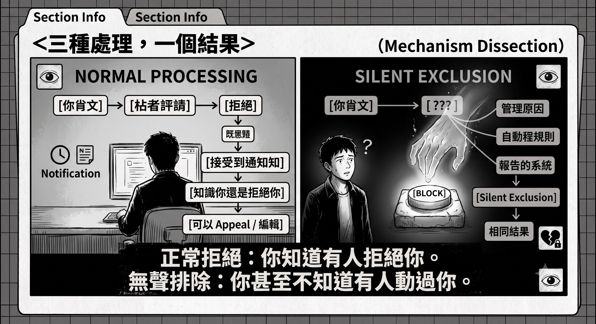
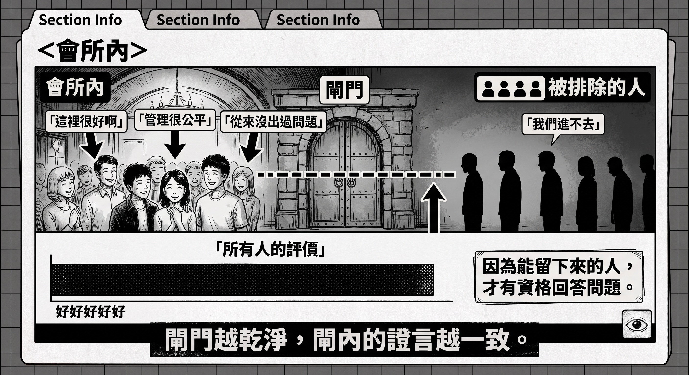
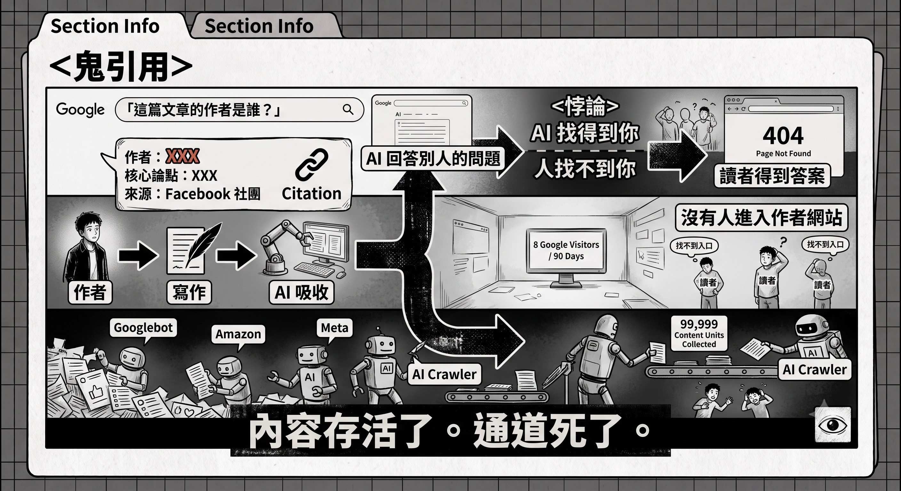
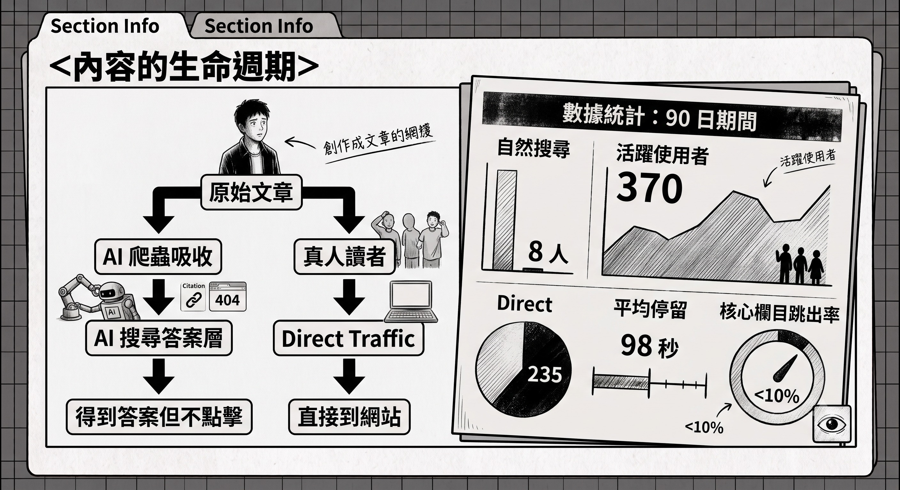
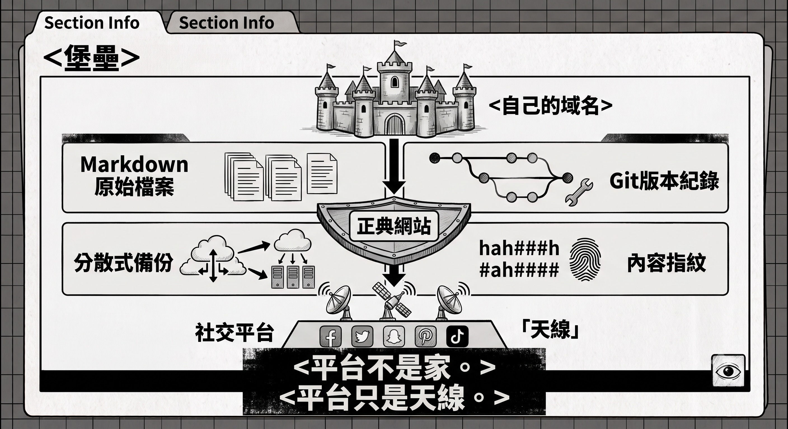

Author: Nebula Walker
Date: 23JUL2026
MYTHOGEN ENGINE (mythogenengine.com)

**📌 When you think it's a platform glitch or the algorithm not promoting you, the truth may be that you've already been silently blocked from the field. An exclusion mechanism that requires luck to uncover is the perfect silencing.**

# The Reader in the Anomaly Report · Postscript — I Thought the Door Was Closed

_One week after the original article was published, things took a new turn. This postscript records how I discovered I was wrong — and why this error itself illustrates the problem more powerfully than everything in the original article._

---
## IX. A Week of Misjudgment

Around the time the original article was published, something happened that I initially thought was unrelated.

My most important distribution channel — a 150,000-member AI professional group — vanished. Not a figure of speech; literally vanished: all notifications gone, every post I'd ever made in it evaporated from my dashboard, view counts zeroed, engagement records wiped clean, search couldn't even find the group's existence. The admin's personal account was still there. The group was not.

My first reaction, same as anyone's: the platform has a problem.

I checked international media, knew Facebook had indeed suffered a major outage months earlier, and users saw exactly this kind of screen. I posted on my own page asking if anyone knew what had happened — eleven hours, seven views, three viewers, zero engagement. I even worked through various possibilities: was the group reported and taken down? Did the admin voluntarily disband? Did Meta's automated system accidentally kill the entire group?

I spent a week seriously investigating an incident that never happened.

## X. The Door Was Open All Along

The truth was discovered by accident.

I have two identities: a personal account and a page operating under a pen name. This isn't normal — most people don't have multiple accounts. I had a second one because I wanted to start fresh as a writer. And it was precisely this unusual second identity that let me see the world from another angle.

One look from the personal account: the group was perfectly fine. 155,000 members, posts flowing, discussions running, someone had posted an AI observation just seven minutes ago. The door was open all along, the lights on, people coming and going.

What vanished was never the group. What vanished was me.

To be precise: my page had been silently blocked from the group. Not an ordinary removal — after a normal removal, you can still find the group, still reapply to join. What I experienced was a deeper layer: block plus search suppression. From my page's perspective, that world doesn't exist; from that world's perspective, I don't exist. Along with it, everything I'd ever published in there, every response I'd received, every piece of data I'd accumulated — all wiped clean from my vantage point, as if they had never happened.

The original article's Section V had written: "It's not saying I'm spam; it's simply treating me as if I don't exist." When I wrote that line, I thought I had understood its full meaning. I hadn't.

## XI. Not Even a Rejection

The group had a well-written set of rules. The violation-handling procedure was in black and white: first offence, reminder with a deadline to correct; repeat offence, post deletion and seven-day suspension; persistent violations, permanent ban with possible reporting. 

I never received a reminder. Never a seven-day suspension. Never a permanent ban notification. None of the above happened — because the treatment I received wasn't even within their own stated procedure. The rules governed the fate of "posts": deletion, hiding, moving. What happened to me was the erasure of an "identity": one action, past present and future zeroed simultaneously, no reason needed, no record left, no notification triggered.

Normal rejection leaves traces. You post, the moderator reviews, rejects — the dashboard shows an "unapproved" entry, you know you were rejected, you can revise, ask, or give up. Rejection is a dialogue, however unequal. What I experienced was not rejection. Rejection still requires processing each post individually and still leaves evidence for you to resent; block-plus-purge is one click, and the effect is far better — you won't resent it, because you simply don't know anything happened. You think it's a platform malfunction, you investigate the malfunction, you post asking people, you direct your frustration at an incident that doesn't exist.

Who did it? I don't know, and in principle cannot know. It could be a manual action by a moderator; it could be Facebook's automatic rules — group tools allow condition-triggered automatic removals that even the moderator themselves may not know about; it could be someone reporting me and the system auto-executing. Three possibilities, one result, indistinguishable. And this indistinguishability is not a flaw of the mechanism. A system where you can't even determine "who to ask" exempts everyone from the responsibility of explaining.

The original article contained a speculation: an AI-spam-overwhelmed gatekeeper, facing an unknown account and a deeply analytical post with external links, thinks "when in doubt, reject — there are no consequences anyway." A week later I discovered that speculation was about me — only reality was more thorough than the speculation. Reality didn't even bother with the act of "rejection."

## XII. The Second Perspective

The deepest layer of this incident isn't what happened to me, but why I was able to discover it.

I could discover it purely because I had two accounts. And I had two accounts for a rather personal reason — I wanted to start fresh under another identity. This is a special case. A normal creator navigates the world with one account. After being silently blocked, they would never discover it: they'd Google "Facebook group disappeared," ask friends "can you get in either?", wait a few days to see if it recovers, and gradually accept "I guess it shut down." They wouldn't think to verify with another identity — because they don't have one.

Verifying truth requires a second perspective. And the vast majority of people have only one.

This mechanism's concealment doesn't rely on encryption, doesn't rely on technology — it relies on this fact, simple to the point of cruelty. I didn't discover it through vigilance. I got lucky. And a mechanism that requires luck to expose is, by design, one it assumes you won't expose.

Following this line further, you hit a question nobody can answer: right now, how many creators are sitting in front of their screens, thinking "the group shut down" or "the platform's having issues" or "the algorithm just isn't pushing me for some reason," when the truth is they were silently blocked months or years ago? This number doesn't exist — not because it's zero, but because computing it requires victims to know they're victims. The disappeared are precisely the people unable to discover they've disappeared. Each one thinks they encountered an individual technical issue; each one blames their own content, blames algorithm changes, blames platform decline. Nobody knows they're part of a pattern, so the pattern will never be collectively identified.

And this pattern has one final layer of self-protection: the field's reputation is always written by those who have not been excluded. The people inside are sincere — they genuinely learn things, genuinely meet good people, genuinely benefit, and their testimonials are true word for word. But their sample comes entirely from within the gate. Ask the members of a club if security is fair, and the answer will always be fair — because those turned away at the door aren't inside to answer the question. So every person quietly removed eventually faces the same line: "So many people say it's great — maybe it's your problem?" This line carries no malice; it simply tallies all audible voices — and the audible voices are precisely the portion remaining after selection. The cleaner the gate, the more consistent the testimonials inside; the more consistent the testimonials, the more unbelievable the gate's existence. A well-functioning silent exclusion mechanism will ultimately be vouched for — sincerely, for free — by its beneficiaries.

I wrote in another article about an epistemological deadlock: after evidence disappears, you can't even "prove it existed." The platform version of the deadlock: after being silently blocked, you can't even "discover you've been blocked." The definition of a perfect crime was never that nobody caught the killer — it's that nobody knows a crime occurred.

## XIII. Ghost Citations

There's one more ending, absurd enough for fiction, but I have screenshots to prove it.

During those days when I thought the group had vanished, I Googled my own website. The search engine's AI summary popped up, impressively accurate: who wrote the content, what topics it explored, the author's background — it even paraphrased the core argument of one of my articles word for word. The cited source it listed was a post I'd made in that group.

A place I could no longer access. A link that leads to nothing when clicked.

This absurdity has receipts. My website runs Google Analytics, and I pulled the past three months of reports.

Google organic search sent, in ninety days: eight visitors. A search engine that crawled my website thoroughly enough to fluently paraphrase my arguments sends, on average, one person every eleven days. It absorbed everything, returned eight. "The content survived, the channel died" — now this statement has a precise exchange rate.

There's a deeper layer in the report. The ninety-day "active users" total is 370, already pitifully small; but open the city distribution, and the names after Hong Kong are: Council Bluffs, Boardman, Forest City, Luleå, Prineville, Ashburn. These aren't cities — they're data centres, home to Google, Amazon, and Meta's server farms respectively. Of my 370 "readers," at least a third are crawlers. Machines visit day and night, read, absorb, then return to the answer layer to answer questions on my behalf. The actual human beings, over three months, roughly two hundred.

But in the same report, one number points in the completely opposite direction: the largest traffic source isn't any platform — it's Direct — 235 direct visitors. No algorithm, no search engine — people who scanned a QR code, hand-typed a URL, or were directly handed a link by another person. And this group's behavioural data is a different species from the platform's zombie engagement: average dwell time 98 seconds, core section bounce rate under 10%. The original article said the chain doesn't need scale; it needs only to deliver the right person to the door — this report is the chain's proof of existence. After every platform channel has died or been severed, my website still has one main artery, and it's composed entirely of hand-to-hand passing.

My writing is still in circulation — in the AI answer layer, fully absorbed, paraphrased, served up to everyone who searches. The searcher gets the answer, no need to click through; my website, in the same period, views: zero. The content survived, the channel died, and the author is left between the two: name still on the answer, road already severed.

The original article's title said truth and garbage enter through the same channel. This postscript can now add the second half: sometimes the truth gets in — and the person who spoke it is left outside. The door has no seal, no notice, it isn't even closed. It simply, from your direction, doesn't exist.

## XIV. The Fortress

Diagnosis done. I should explain how I live now.

My writing system currently looks like this: all original manuscripts are plain-text files on my local hard drive, untouchable by any platform; every revision enters version control — date written, date edited, machine-stamped, undeniable — the previous article explained that the real harm of delayed approval is invalidating your timestamp, and now my timestamps are no longer held by any platform; my own domain is the canonical source, and those 235 direct visitors go there; copies of articles are pinned to a decentralised network with a content fingerprint — once the fingerprint is distributed, deleting the source can't erase the proof that "it existed" — I wrote in another article about how a newspaper's entire archive went offline overnight; this layer is preparation for such nights; as for social platforms, all are downgraded to antennas — used to hang a QR code, no expectations, no reliance, nothing stored. If any of them silently blocks me again, my loss is merely one antenna already on the casualty list.

Each layer corresponds to a mode of death I've personally experienced. This system won't bring in a single new reader. It wasn't built for growth.

Some will ask: why not leverage real-world relationships? Old classmates, former colleagues, industry connections — message them one by one; combine with some low-friction popcorn content, and the traffic will come?

The answer has two layers. The first is consistency. The original article said the chain's unit is a reader who voluntarily stakes their own credibility. Using social favours to exchange for shares means asking someone to endorse you without having read your work, or in a position where they can't comfortably refuse — the chain's first link is already fake, and a chain starting from fake nodes is no different from the Singapore bots the algorithm feeds me. As for popcorn content: what I write is inherently high-friction; reshaping it into a two-second-digestible form means the thing that survives is no longer itself.

The second layer is simpler and more honest. If writing were about money, the math simply doesn't work — with my CV, going back to a job or focusing on investing would yield returns several orders of magnitude higher than writing. Writing is economically irrational. So it can only exist for one purpose: writing what I want to write. And precisely because it's not for money, I can bear the despair of nobody reading, and I can bear the timeline-less "eventually" in the saying "cream always rises to the top."

So this fortress's purpose was never to wait for a breakthrough. It is to ensure existence. When someday, the right person — like that administrator who went searching for a 1989 song in the middle of the night — passes by the door, the door is still there, the content is still there, the fingerprint still checks out. What it guarantees is not being seen, but being perpetually in a state where seeing is possible, requiring no one's approval.

You can prevent people from finding me. But you can't delete the fact that I existed.

## XV. So This Postscript Exists

The original article concluded: under a triple blockade, things worth reading can still be passed hand to hand by people who know how to read, because that person-to-person chain is invisible to algorithms and therefore unkillable.

After this past week, not only do I not retract this conclusion — I'm reinforcing it.

Because now it's clear: platform channels don't just die — they can be unilaterally severed without your knowledge, severed so cleanly that you think the world is the one with the problem. You think you're fighting the algorithm, when you may have long since been off the field entirely; you think your content isn't good enough, when possibly nobody has ever seen it, including the party that ruled you out. In such an environment, any writing career built on a single platform, a single account, a single perspective is living between someone else's finger and the delete key.

I wrote this postscript for a simple reason: the next person to be disappeared won't have a second account. They won't discover it, won't appeal, won't write a postscript. They will simply, one evening, stare at a blank screen they believe is a malfunction, and slowly start wondering if it's their own problem.

It isn't. This article is that second perspective. If you're standing before that blank — don't rush to blame yourself.

---
_This postscript is the sequel to "The Reader in the Anomaly Report — When Truth and Garbage Enter Through the Same Channel." The companion piece "The Efficiency Trap · Continuation" deconstructs the other face of the same machine: what actually happens when "natural attrition" is written into the financial report. The two share only one common thread: the cleanest records often cover the most thorough processing._

---

> **📚 Platform Silencing and Cognitive Blockade: A Five-Part Series**
>
> 1. [How the Machine Helps Execute a Deletion That Has Already Happened](./機器點樣幫手執行一場已經發生咗嘅刪除.md)
> 2. [The Reader in the Anomaly Report — When Truth and Garbage Enter Through the Same Channel](./異常報告裡的讀者——當真話與垃圾走同一條通道入場.md)
> 3. **The Reader in the Anomaly Report · Postscript — I Thought the Door Was Closed**
> 4. [Zero Violations, Twenty-Four Impressions Per Post — A Distribution Ledger of One Account](./零違規，每篇二十四個曝光——一個帳號的分發帳本.md)
> 5. [Half an Hour on the Assembly Line](./半個鐘頭的生產線.md)
