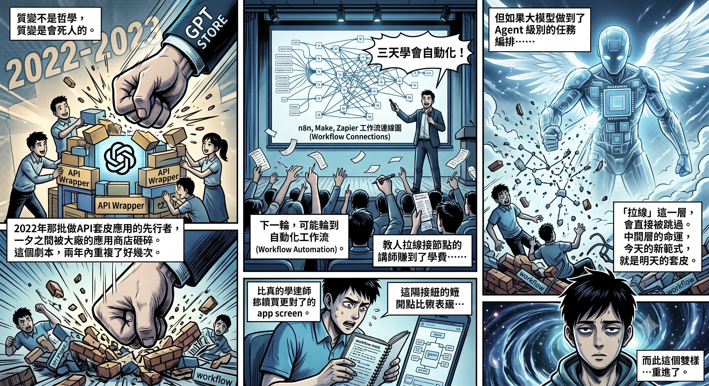

# When AI Undergoes Qualitative Change, Why Is Everyone Still Talking About Quantity?

Nebula Walker · MYTHOGEN ENGINE

---

FABLE 5 is out.

What was the community's reaction?

> "Hurry up and refactor the codebase."  
> "Long-task completion rate is 29% — double the previous generation."  
> "Pricing starts next Tuesday, get things done while it's still free."

These reactions are perfectly reasonable. Product builders have deadlines. Freelancers have clients. Founders fight for every second. When you get a more powerful tool, the first thing you do is solve the most painful problem in front of you. That's not short-sighted — that's survival.

But I want to say one more thing.

Not that those things aren't important. Rather, there may be another layer worth paying attention to.

---

## Two Kinds of Change: Quantitative and Qualitative

Every time AI's intelligence crosses a certain threshold, two kinds of change emerge:

1. **Quantitative change**: Doing the same things faster, better, cheaper.
   - Long-task completion rate jumping from 13% to 29% — that's quantitative change.
   - Code refactoring shrinking from three days to one — that's quantitative change.
   - Quantitative change has enormous commercial value. It directly affects your costs and delivery speed.
2. **Qualitative change**: Suddenly being able to do things that were previously impossible.
   - Not running faster on the same track, but an entirely new track appearing — one that didn't exist before.

The community's discussion right now is almost entirely focused on the first kind.

That's normal. Quantitative change is easy to measure, easy to compare, easy to monetize. Qualitative change isn't — it's vague, abstract, and in the short term might not earn you a single cent.

But historically, what truly reshapes the landscape has always been qualitative change.

---

## Recognizing Signals in the Noise: FABLE's Real Value

In the previous article, I used a dream and a library to talk about what FABLE truly made me care about.

It's not that it writes better code. It's not that its long-task completion rate is higher.

It's that it seems, for the first time, to have the ability to do something no AI has ever done before — **to recognize signals that have been wrongly buried in massive amounts of noise**.

- **Not** search, **but** judgment.
- **Not** retrieval, **but** recognition.

If this capability is real, its applications extend far beyond writing code:

- **Overlooked patterns** in DNA sequences.
- **Forgotten gems** in academic literature, buried by ranking systems for twenty years.
- **A fundamental restructuring of social algorithms** — not recommending things you "might like," but recommending things you "should know but don't know you need."

What all of these have in common: they're not a matter of "doing it faster" — they're a matter of "it couldn't be done before."

---

## Survival Comes First, but Qualitative Change Kills

I'm not saying everyone should put down their work and contemplate philosophy.

If you have a codebase to refactor, seize the window and refactor — that's right. If you have a product to launch, compress the timeline with the strongest tools — that's also right. Survival always comes first.

I'm someone who thinks about how to stay alive every single day.

But there's one thing that must be said: **Qualitative change isn't a philosophy class topic. Qualitative change kills.**

Every round of disruptive innovation sweeps away a batch of companies and tools that seemed like sure things. We've already seen this firsthand:

* **The Twilight of Wrapper Apps (2022–2023)**  
  Masses of entrepreneurs used OpenAI's API to build wrapper apps — slap on an interface, add some prompts, and you've got a product. Some raised funding. Some sold plenty of subscriptions. Then ChatGPT launched its own GPT Store, Google followed suit, and every major model started building its own app store. Overnight, most of the wrapper ecosystem was wiped out. Pioneers built, platforms copied, then pioneers died. This script repeated itself multiple times within two years.

* **The Hidden Risk of Workflow Automation**  
  Platforms like Make, n8n, and Zapier — courses teaching people to use them are selling well right now, and instructors are earning good money. But if large models truly achieve agent-level task orchestration, the entire "drag-and-drop node connection" layer could be skipped entirely. The people teaching these tools earned their tuition, but those who went all-in building their companies on this layer may lose everything.

And don't assume that "multi-agent" or "collaborative frameworks" — the hottest concepts right now — are safe. They share the same nature as API wrappers and workflow automation — they're all frameworks built on an intermediate layer.

> 💡 **The fate of the intermediate layer is to be skipped. Today's new paradigm is tomorrow's wrapper. What gets eliminated is never the technology — what gets eliminated is the framework.**

---

## The Half-Life of Frameworks and the Enduring Foundational Capabilities

This isn't saying frameworks don't matter. Of course you should learn frameworks — if the market demands Java, you learn Java; if the market needs Agent development, you learn Agent development. That's survival. Nothing to debate.

But one thing is worth remembering: **The lifespan of frameworks keeps getting shorter.**

* **Yesterday's standards**: Flash, jQuery, AngularJS, Hadoop, Docker Swarm, TensorFlow 1.x — every single one was once the industry standard, every single one once supported countless livelihoods. Learning them at the time was absolutely correct. But if anyone thought they could ride them for life, they were wrong.
* **Today's tools**: n8n, MCP, Agent Frameworks are no different. You absolutely must learn them today, but expect them to be replaced within three to five years.

The question isn't whether to learn — it's whether you're aware of which layer you're standing on, and when that layer will be skipped.

Crash courses always sell the topmost layer, because that layer is the easiest to teach, the easiest to sell, and has the most immediate market demand. "Learn n8n automation in three days," "Master AI Agent development in one week" — these courses sell because frameworks genuinely can be crash-coursed.

But the things beneath the frameworks:
- **Systems thinking**
- **Abstraction ability**
- **The intuition for understanding trade-offs**

These can't be crash-coursed, and they won't be made obsolete. They don't exempt you from learning frameworks — they ensure that when frameworks change generations, you don't have to start from zero.

This is the other face of qualitative change. It's not just "being able to do new things" — it also means "old things will disappear." Choosing not to think about qualitative change doesn't mean qualitative change won't come for you.
.png)

---
## Closing: Opening Up Previously Unimaginable Thinking

So "thinking about qualitative change" isn't a luxury. For some people, it's a matter of life and death.

But if, after finishing your work, you have a bit of margin left, perhaps it's worth thinking about:
1. This thing runs faster — I already know that. But what can it do that I've never even thought of?
2. And — could it make what I'm currently doing no longer necessary?

> **AlphaGo wasn't "a program that plays chess faster." It played moves that human players had never conceived.**

Perhaps the most interesting thing about FABLE isn't what it helped you finish.  
It's that, for the first time, it lets you begin to imagine — what things were previously so unthinkable that you never even thought to think about them.

---

### Related Reading

- [FABLE: It's Not Just About Smarter AI — It's Turning Expert Intuition into Infrastructure](./FABLE%20不只是智力提升，AI%20正在把專家直覺變成基礎設施.md)
