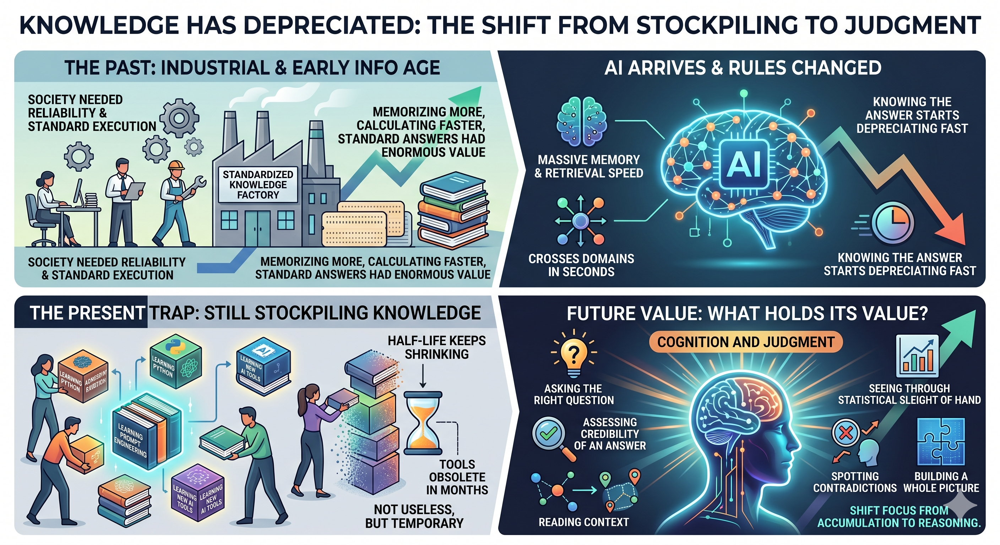
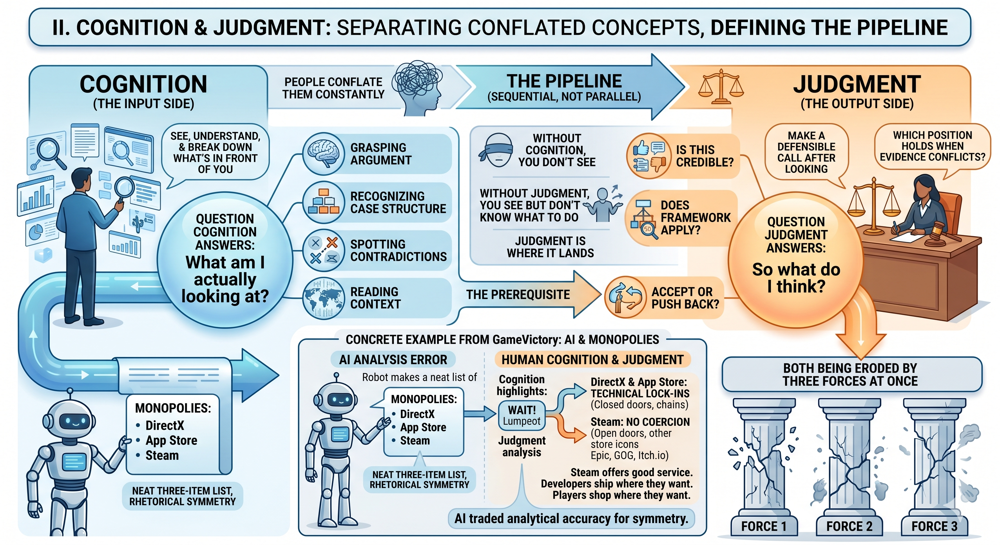
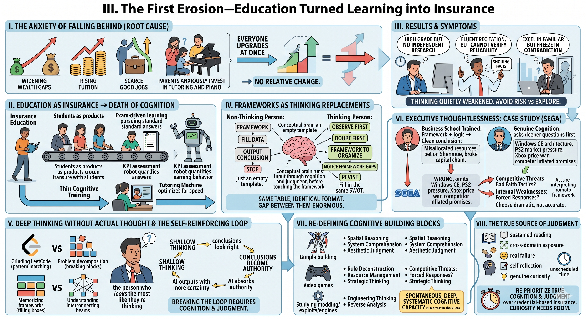
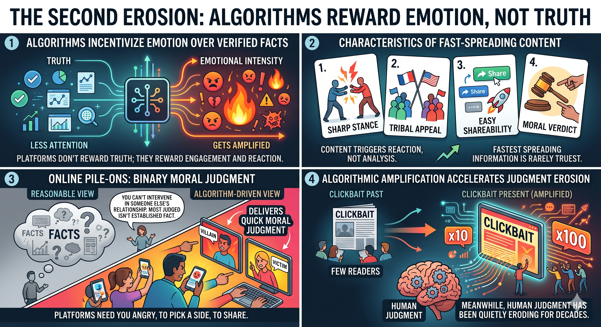
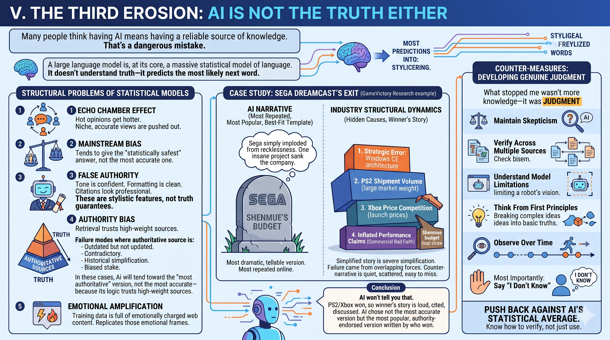
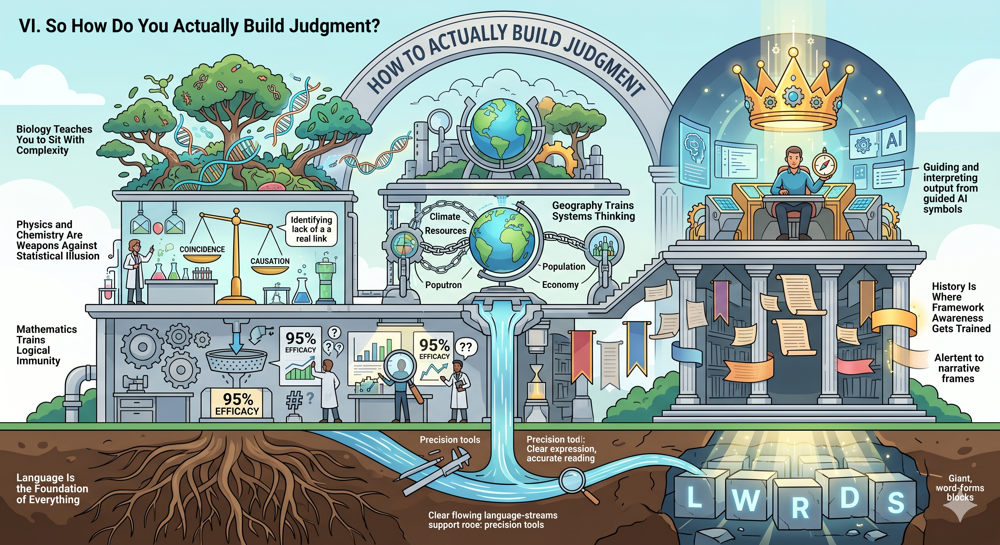
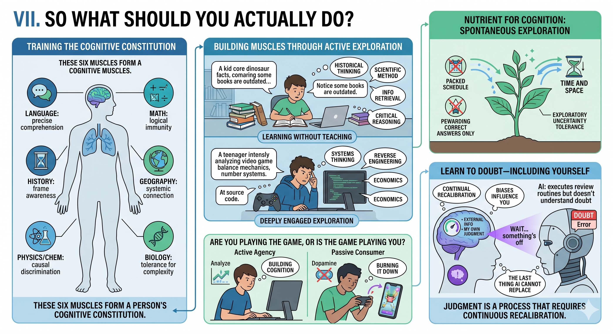

# Cognition and Judgment—The Last Thing AI Cannot Replace

## Foreword

The scarcest resource in the AI era isn't knowledge. It's the ability to tell what's worth believing.

That sounds like a cliché. But pay close attention to the people around you—including the well-educated, the high-earners, the ones society calls "smart"—and you'll find something unsettling: most people's judgment doesn't sharpen with age or credentials. They forward unverified news. They chase emotional headlines. They defer to authority, or rebel against it blindly. They treat AI output as fact. They deliver moral verdicts on strangers online without checking a single thing.

This isn't an IQ problem. It's a structural problem in how people think.

I've spent years studying the underlying mechanics of the tech industry. I wrote *GameVictory* using AI as a collaborator throughout. That experience left me increasingly convinced of one thing: the abilities that actually matter in the AI era aren't what everyone is scrambling to learn—not STEM, not certifications, not test prep. They're two things that sound abstract but turn out to be intensely practical: **cognition** and **judgment**.

---

## I. Knowledge Has Depreciated. Most People Are Still Stockpiling It.

In the industrial age and the early information age, memorizing more, calculating faster, knowing the standard answer—these had enormous value. Society needed engineers, clerks, accountants, administrators, mid-level technical workers by the millions. The core of those jobs was reliable execution of existing knowledge. The education system became a standardized knowledge factory. At the time, that made sense.

Then AI arrived, and the rules changed.

AI's memory dwarfs ours. Its retrieval speed dwarfs ours. Its ability to cross domains surpasses most people, and it can produce something that looks perfectly reasonable in seconds. Knowing the answer has started depreciating fast.

Yet look at the education market, the workplace training industry—everyone is still stockpiling knowledge. Learning Python. Learning prompt engineering. Learning how to operate the latest AI tools. None of this is useless, exactly, but the half-life keeps shrinking. The tool you spent three months learning today might be obsolete in six.

What actually holds its value? Asking the right question. Assessing the credibility of an answer. Reading context. Seeing through statistical sleight of hand. Spotting contradictions. Building a whole picture. In other words—cognition and judgment.

---

## II. Cognition and Judgment: Not Equals, but a Pipeline

Before going further, I need to separate these two concepts. People conflate them constantly.

**Cognition is on the input side**—can you see, understand, and break down what's in front of you? It includes: grasping what a piece of writing is actually arguing, recognizing the structure of a case, spotting contradictions, reading context, decomposing complexity into parts. The question cognition answers is: *What am I actually looking at?*

**Judgment is on the output side**—after you've looked, can you make a defensible call? It includes: is this credible, does this framework apply, should I accept this or push back, which position holds when the evidence conflicts? The question judgment answers is: *So what do I think?*

Here's a concrete example from writing *GameVictory*. I asked AI to help me analyze platform monopolies in digital gaming. To fill out a neat three-item list, it grouped DirectX, the App Store, and Steam together as the same type of monopoly. Cognition let me notice: "these three examples have been lumped together." Judgment made me stop and say: *Wait—DirectX and the App Store are technical lock-ins you cannot avoid. Steam isn't. Developers can ship on Epic, GOG, and Itch.io simultaneously. Players can shop wherever they want. Steam's market share comes from good service, not structural coercion. The AI traded analytical accuracy for rhetorical symmetry.*

Without cognition, you don't even see the problem. Without judgment, you see it but don't know what to do. Cognition is the prerequisite; judgment is where it lands. They're sequential, not parallel.

And right now, both are being eroded by three forces at once.

---

## III. The First Erosion—Education Turned Learning into Insurance

The anxiety driving modern education isn't the fear of not learning. It's the fear of falling behind.

Over the past few decades, the wealth gap has widened, the return on credentials has risen, and the cost of falling has grown too. Tuition up. Housing up. Good jobs scarcer. So parents started thinking: if I don't invest, my kid falls behind. Other kids are at tutoring. Other kids are learning piano. The entire society shifted into anxious-investment-parenting mode.

Here's the irony: when everyone upgrades at once, nobody's relative position changes. Kids lose their childhoods. Parents lose their lives. Family finances get hollowed out. Social mobility doesn't necessarily improve.

The deeper damage is this: insurance-style education is exactly where cognition goes to die.

Exam-driven learning pursues the standard answer. Tutoring optimizes for test-solving speed. KPI-based assessment quantifies every learning behavior into a score. People raised in this environment learn how to maximize their score within a known framework—not how to face the unknown. Their thinking has been quietly weakened.

I've seen plenty of them in the workplace. High grades. Can't do independent research. Recite knowledge fluently. Can't verify whether a source is reliable. Excel in familiar territory. Freeze completely when information contradicts itself. Not unintelligent—their cognitive muscles just never got trained. The whole education process taught them to avoid risk, not to explore.

What makes this worse: most of them don't know it. They apply business frameworks—SWOT, Porter's Five Forces, various matrices and quadrant charts—and treat the output as their own analysis. Organizing a problem with a framework is not the same as understanding the problem. These tools aren't wrong; they're thinking aids, not thinking replacements. But when your cognitive training is thin, you mistake *applying a template* for *exercising judgment*, because the framework produces something that looks structured, logical, and conclusive—and that feels like thinking.

This is the most dangerous cognitive failure of all: **deep thinking without actual thought**. Grinding LeetCode looks like logic training—it's pattern matching, not problem decomposition. Memorizing frameworks looks like strategic analysis—it's filling boxes, not understanding structure. The person who applies every thinking framework looks the most like they're thinking. They have processes, terminology, citations, outputs. But if the framework is all their thinking is, what they're doing is structurally identical to what AI does: select the best-matching template from known options, generate a "seemingly correct" answer. This kind of output doesn't just deceive others—it deceives the person producing it. And because it wears the clothes of methodology, it can become authoritative. It gets cited. It gets taught. It becomes the standard answer. Then AI learns from these "authorities" and outputs them to the next wave with even higher confidence. A self-reinforcing loop: shallow thinking produces conclusions that look right, those conclusions become authority, AI absorbs the authority and outputs it with more certainty—and breaking that loop requires not better tools, but enough cognition to find where the problem is, and enough judgment to fix it.

Let me be clear: **frameworks, processes, and methodologies are not the problem.** People with genuine cognition and judgment use SWOT. They use Porter's Five Forces. They use analytical frameworks all the time. These tools aren't the substance of thinking—they're instruments for organizing and expressing thought. The difference is whether the framework is the *starting point* of your thinking or the *ending point*. Someone who doesn't think takes the framework, fills in the data, outputs the conclusion, stops. The framework is their thinking. Filling it out equals thinking it through. Someone who thinks observes first, doubts first, senses something is off first—then uses the framework to organize and express what they're already working through. Then they notice what the framework can't contain. Then they revise. Two people filling out the same SWOT. Same format. Completely different content—because one of them ran the input through cognition and judgment before it ever touched the template.

This isn't just a junior employee problem. Executives fall into thoughtless deep-thinking too—more easily, in fact, because their position means fewer people will challenge them. Take this example: if you ask a business-school-trained executive to analyze why Sega exited the console market, they'll likely reach for a competitive strategy framework and produce a cleanly structured conclusion: Sega misallocated resources, bet the company on the astronomically expensive Shenmue, broke the capital chain. The analysis has framework, logic, causal chain. It looks completely correct—it could walk straight into a business school case study. But it's wrong. It omits the strategic failure of betting on the Windows CE architecture, the overwhelming market pressure of the PS2's shipment volume, the price war Xbox started, and the inflated performance promises competitors made before launch. It looks right because it chose the most dramatic, most framework-compatible attribution—not the most accurate one. A person with genuine cognition, using the exact same framework, arrives at a different answer—because before filling anything in, they ask: *Is this attribution too simple? The framework asks for "competitive threats"—but is the competition here normal market competition, or something more like bad faith tactics? Are the "internal weaknesses" really Sega's own failures, or forced responses to a distorted market?* Same table. Different cognition going in. The format is identical. The gap between them is enormous.

And many things that look like a "waste of time" may actually be building cognition. Building a Gunpla kit involves spatial reasoning, system comprehension, and aesthetic judgment. Playing video games involves rule deconstruction, resource management, and strategic thinking. Studying a game's modding scene, its exploits, its underlying engine—that's engineering thinking and reverse analysis. None of this registers on a traditional educational rubric. In the AI era, these are precisely what's scarcest: spontaneous, deep, systematic cognitive capacity.

Judgment doesn't come from memorization. It's a compressed form of high-order experience—built from sustained reading, cross-domain exposure, real failure, self-reflection, and genuine curiosity about the world. Curiosity needs room. A child with no unscheduled time has no room to be curious.

---

## IV. The Second Erosion—Algorithms Reward Emotion, Not Truth

If the education system undermines cognition at the source, information platforms poison judgment in the daily flow.

What platforms reward most isn't truth—it's emotional intensity. Content with a sharp stance, tribal appeal, easy shareability, and a flavor of moral verdict will always outperform calm analysis. The information that spreads fastest is rarely the truest. It's the kind that triggers a reaction.

Online pile-ons are the clearest example. A celebrity relationship dispute might involve extraordinary complexity—context outsiders will never fully know. But the internet quickly sorts it into black and white, delivers moral judgment on the "villain," and allows no grey area for the "victim." A reasonable person recognizes: you can't intervene in someone else's relationship, and most of what's being judged isn't even established fact. But an emotion-driven platform doesn't need you to be reasonable. It needs you angry. It needs you to pick a side. It needs you to share.

Clickbait has always existed. Under algorithmic amplification, its reach is ten, a hundred times what it used to be. Meanwhile, human judgment has been quietly eroding for decades.

---

## V. The Third Erosion—AI Is Not the Truth Either

Many people think having AI means having a reliable source of knowledge. That's a dangerous mistake.

A large language model is, at its core, a massive statistical model of language. It doesn't *understand* truth—it *predicts* the most likely next word. Which means: viewpoints discussed most online, narratives repeated most often, emotions accepted by the mainstream—all of these get naturally amplified in AI's output.

This creates several structural problems:

**Echo chamber effect.** Hot opinions get hotter. Niche but accurate views get pushed out.

**Mainstream bias.** AI tends to give the "statistically safest" answer, not the most accurate one.

**False authority.** AI's tone is confident. Its formatting is clean. Its citations look professional. These are stylistic features, not truth guarantees.

**Authority bias.** This one is subtler than false authority. AI's training and retrieval mechanisms weight "authoritative sources" heavily—academic papers, well-known institutions, mainstream media, heavily cited cases, widely accepted conventional wisdom. Most of the time that's reasonable: authoritative sources are more reliable than random web pages, and they've solved the vast majority of problems. But the failure mode lives in the minority of cases where an authoritative source is outdated but hasn't been updated; where authoritative sources contradict each other; where a field's "accepted common sense" is actually a historical simplification; or where the authoritative source has a particular stake or bias. In these situations, AI will tend toward the "most authoritative" version, not the most accurate—because its design logic is to trust high-weight sources.

**Emotional amplification.** Training data is full of emotionally charged web content. AI sometimes replicates those emotional frames without realizing it.

I ran into this directly while researching why Sega's Dreamcast exited the market for *GameVictory*. Ask AI "why did Sega fail," and most answers center on Shenmue—the game with the astronomical development budget, as if Sega simply imploded from its own recklessness. That narrative is the most dramatic, the most tellable, the best fit for the template of "one insane project sank a company." It's also the most repeated version online, so AI naturally reaches for it.

But if you understand the industry's structural dynamics, you know that story is a severe simplification. The Dreamcast's failure came from multiple overlapping forces: Sega's strategic error in choosing the Windows CE architecture, the sheer market weight of the PS2's shipment volume, Xbox's price competition after it launched. And both PS2 and Xbox made substantial inflated performance claims before launch—a kind of commercial bad faith that the mainstream narrative almost entirely ignores. Shenmue's budget, in context, was the final straw in a pile of causes, not the fatal one.

AI won't tell you that. Because PS2 and Xbox won, the winner's story is loud, heavily cited, widely discussed. The loser's counter-narrative is quiet, scattered, easy to miss. AI chose not the most accurate version but the most popular, most authority-endorsed version—which happens to be the history written by whoever won.

If I hadn't spent years studying the structure of the gaming industry, if I hadn't put together the scattered public record on Windows CE, PS2 shipping strategy, Xbox pricing, and pre-launch misrepresentations—I would have done exactly what AI did: written Shenmue as Sega's cause of death. What stopped me wasn't more knowledge. It was judgment—a gut feeling that *this attribution is too clean*, plus the methodological habit of *let me cross-check this*.

Knowing how to use AI isn't enough. You also need to know how to push back against AI's statistical average. That takes: maintaining skepticism, verifying across multiple sources, understanding the model's limitations, thinking from first principles, observing over time, and—most importantly—being willing to say "I don't know."

---

## VI. So How Do You Actually Build Judgment?

Almost every piece I've written ends in the same place: judgment matters. *"When Education Became an Unfailable Business"* concluded with "learn to learn on your own first." *"Human or AI—It's Actually a False Question"* ended with "that dissatisfaction is the human element." *"The True Difficulty of AI Collaborative Writing"* landed on "domain knowledge can't be outsourced." Every time, I stopped there. Never expanded.

So this time, I want to take it seriously: what actually builds judgment?

The answer will disappoint people looking for a shortcut—judgment isn't a skill you can fast-track. It's a cognitive constitution built over a long time. But that doesn't mean there's no method. The method is hiding in the subjects we assumed were "just basics."

### Language Is the Foundation of Everything

The real value of knowing a language—Chinese, English, any language—isn't "I can communicate." Language training builds precision: can you say a complex idea clearly? Can you read what someone is *actually* saying, not just the surface words?

Someone who can't read accurately will never develop judgment. They can't even establish what the other person is claiming, let alone assess whether it's right. In the AI era, language is the interface between you and AI. The more precisely you can articulate your thinking, the more useful AI's output becomes. Language skills aren't depreciating—they're appreciating. The direction just shifted: from "how much you can memorize" to "how precisely you can think and express."

### Mathematics Trains Logical Immunity

The value of math isn't calculus. It's this: when you see a statistic, do you know how it was derived and whether it's been manipulated? When a number says "95% efficacy," can you ask: *What was the sample size? What was the control group? Is that relative risk or absolute risk?* That's not exclusive to math prodigies—it comes from basic logic structure and the ability to abstract.

In a world where AI can generate charts and figures instantly, being able to *read* numbers matters far more than being able to *produce* them.

### History Is Where Framework Awareness Gets Trained

This is the most underestimated subject in the AI era.

Studying history isn't memorizing dates. It's learning to ask: *Who wrote this story? Why was it written this way? What's been left out?* Textbooks contain one recognized version—contemporary consensus, political balance, the teachable mainstream narrative. That doesn't make it wrong. But it's always been curated.

Mature cognition means knowing that **every piece of information carries a frame**—news, AI answers, academic papers, the opinion of a popular commentator, what's trending in your community, even your own views. History trains you to stay alert to narrative as such. In a world where AI can mass-produce seemingly objective historical accounts, that alertness is worth more than any individual fact.

### Geography Trains Systems Thinking

Geography isn't memorizing capitals. It's understanding causal chains between climate, resources, population, and economic activity. Why some places are wealthy and others aren't isn't random—it's the interaction of geographic conditions and historical paths accumulated over time. The ability to hold multiple variables and trace their causality is systems thinking. It's exactly the kind of cross-domain causal reasoning I was doing throughout *GameVictory*.

### Physics and Chemistry Are Weapons Against Statistical Illusion

The core thing physics and chemistry teach: how a hypothesis gets verified or falsified. What controlled variables mean. Why correlation isn't causation. When AI tells you two things are related, the physics-and-chemistry mindset asks: *Is that causation, or just coincidence?*

This is the most direct defensive tool in the AI era. What AI excels at is finding things that are statistically correlated. It cannot reliably distinguish correlation from causation. The human brain trained in experimental science can.

### Biology Teaches You to Sit With Complexity

Ecosystems, evolution, gene expression—none of these are simple linear causalities. Change one variable, and the whole system might respond in ways nobody expected. Biology forces you to accept an uncomfortable truth: the world isn't black and white. This is exactly where AI fails most often—it compresses compound problems into binary oppositions, because binary framing is statistically the most common in language.

---

## VII. So What Should You Actually Do?

Pull all these subjects together and you find a common thread: **the value in these disciplines isn't the knowledge—AI has all of it—it's the different cognitive muscles each one trains.**

Language builds precise comprehension. Math builds logical immunity. History builds frame awareness. Geography builds systemic connection. Physics and chemistry build causal discrimination. Biology builds tolerance for complexity. These six muscles together form a person's cognitive constitution. Someone with a strong constitution will naturally begin questioning, deconstructing, verifying, and characterizing when new information arrives. Someone with a weak one can only receive passively—and gets pulled along by emotion.

But these muscles don't grow from memorizing textbooks. They require **space for active exploration**.

A kid who gets fascinated by dinosaurs, goes to look things up, compares accounts across books, notices some books are outdated, tries to understand why scientists changed their classification system—in that process, historical thinking, scientific method, information retrieval, and critical reasoning are all happening at once. Nobody's teaching them. They're learning anyway.

A teenager obsessed with a video game who starts researching its balance mechanics, deconstructing its number systems, analyzing the developers' design intentions, even looking at source code—they might not know what they're doing. But they're training systems thinking, reverse engineering, and economics.

There's one important caveat: **are you playing the game, or is the game playing you?** Someone who can stop at any time is an active participant—understanding rules, making decisions, living with consequences. Someone who can't stop is a passive consumer trapped in a dopamine loop—not learning, being manipulated. A teenager studying game balance and a teenager mindlessly grinding a gacha game are doing completely different things. The first is building cognition. The second is burning it down. Games can be a training ground for thinking, but only if you enter with curiosity and agency—not because a well-engineered addiction mechanism is dragging you forward. I go into this more thoroughly in *GameVictory*.

Spontaneous, deeply engaged exploration is the actual nutrient for cognition and judgment. And it only requires one precondition: **time and space**. A kid with a packed schedule has no room to wonder. An education system that only rewards correct answers won't tolerate exploratory directions that are uncertain.

---

## Closing: Learn to Doubt—Including Yourself

In the AI era, what matters most isn't how much you know. It's your ability to tell what's worth believing.

But push that one layer deeper: the object of your doubt isn't only external information. It's your own judgment too. Judgment isn't something you *acquire* and then hold correctly forever—it's a process that requires continuous recalibration. You'll make mistakes. Your frameworks will age. Your biases will influence you when you're not paying attention.

The highest form of judgment isn't "I always get it right."

It's: **"I know I might be wrong—so I keep checking."**

This is what AI can't do. It's not that AI never doubts itself—modern AI systems have various self-review mechanisms; they can be prompted to reexamine their output, run multi-round verification, cross-reference sources. But even with all of that, they still make mistakes. The problem isn't the presence or absence of a checking action. It's that AI doesn't understand doubt. Without being explicitly prompted, it won't generate the intuition that says *wait, something's off here*. It doesn't have that unease. It can execute a verification routine. It doesn't understand why it should be suspicious, or what exactly to be suspicious of.

You can. You can read a seemingly airtight analysis and suddenly feel something is wrong—not because you've found the specific error, but because your experience, your intuition, your years of being immersed in a subject make something feel too smooth. The causal chain too tidy. The attribution too convenient. A voice missing from the room.

That *wait*—it's not a feature. It's a cognitive capacity.

And that capacity is the last thing AI cannot replace.
