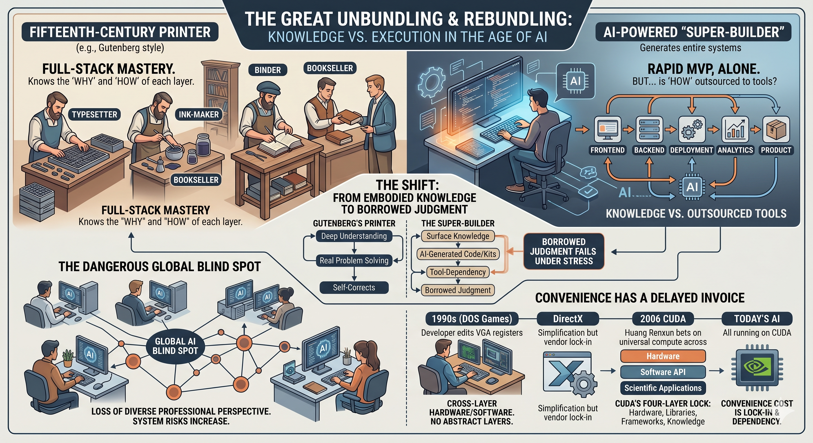
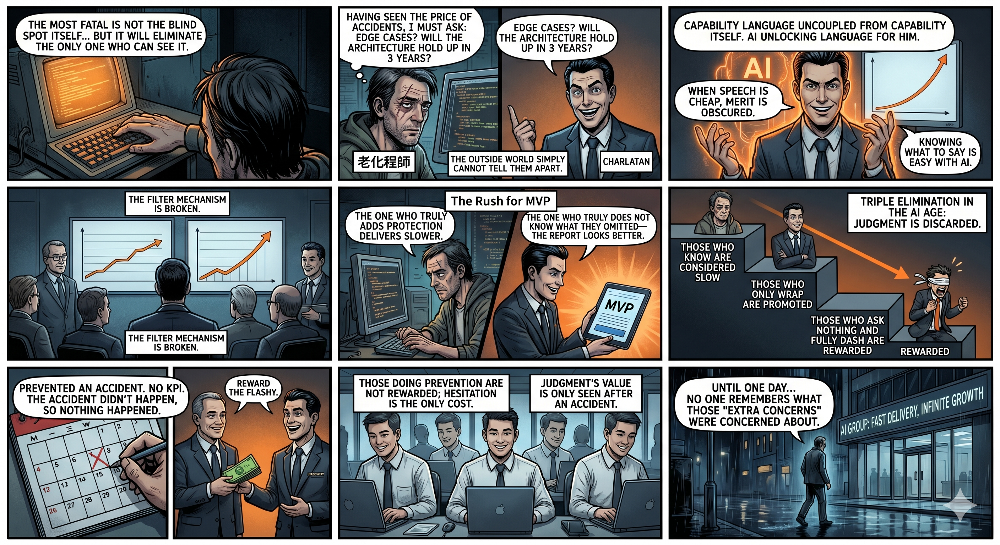

# "Knowing" and "Doing" Were Never the Same Thing

Someone used a beautiful analogy: a 15th-century letterpress printer was simultaneously a typesetter, ink blender, bookbinder, and bookseller. Industrialization spent three hundred years splitting him into ten different professions. Now, AI is compressing those ten professions back into one person.

The direction is right. But the conclusion needs correction.

---

The printer of Gutenberg's era was a true polymath. He developed his own alloy recipes for movable type, blended his own inks, and modified his own presses. If the ink smudged, he knew whether it was the recipe or the paper's absorbency—because he had made both himself.

His versatility was built on the physical intuition of having touched every layer.

The "Super Builder" of today seemingly handles the entire chain alone—frontend, backend, deployment, telemetry, data, product. One person delivers an MVP in 3 to 7 days, doing the work of half a team.

But look closely: for many links in this chain, he doesn't "know" them—he has outsourced them to tools. Writing code with an AI assistant, he may not understand what is happening underneath. Assembling interfaces from off-the-shelf components, he may not be able to explain the trade-offs behind the design principles.

The output looks the same. Often faster. Sometimes better.

The difference only surfaces when things go wrong.

Gutenberg's printer knew exactly where the problem lay. Today's Super Builder asks another layer of tools. A part of his judgment is borrowed. And borrowed judgment is the first to fail under pressure.

---

When all Super Builders use the same set of AI tools, their blind spots converge.

Previously, ten professions carried their own specialized judgment. They cross-verified each other. If one person made a mistake, other links in the chain could catch it. The system's fault tolerance came from diverse professional perspectives.

Now, one person completes all links using AI, and the AI's blind spot becomes his blind spot. When a massive number of Builders across the market share the same tools, the blind spot shifts from personal to systemic.

Diverse judgment is compressed into shared dependency. Fault tolerance declines while productivity rises.

---

But what is truly fatal is not the blind spot itself. It is that the blind spot eliminates the only people who can see it—and the mechanism of elimination is harder to recognize than you might expect.

An engineer who has witnessed production incidents will ask: Has this edge case been handled? Who owns the security updates for this dependency? Can this architecture sustain ten times the traffic three years from now? He asks because he has seen the cost of not asking.

The person who is best at packaging himself will ask the exact same questions—with the exact same jargon and the exact same tone. The only difference: after the former asks, the deliverables include corresponding mitigations. After the latter asks, nothing in the deliverables changes.

And outsiders—management, investors, neighboring teams—cannot tell the difference.

The language of competence has decoupled from competence itself. In an era where AI tools have lowered the cost of "saying the right things" to near zero, anyone can produce plausible technical judgments. Whether genuine understanding exists behind them is unverifiable from the outside.

The filtering mechanism breaks. In a rhythm of "MVP in 3 days, data in 7," both types of people say the same things, but the one who actually built safeguards delivers slower and promises more conservatively. The one who only talks—or who genuinely doesn't know what he skipped—delivers faster and produces better-looking reports.

The result is a triple elimination. Those who truly "know" are deemed too slow. Those who master packaging get promoted. And those who ask nothing and sprint at full speed are rewarded most—because ignorance eliminates hesitation, and hesitation is the only visible cost in this environment.

This is Gresham's Law applied to talent. What is being driven out is not technical ability, but judgment.

Once an organization filters out the people with judgment, the remainder won't know what they're missing—because the value of judgment is only visible after a disaster. The person who prevented an accident has no KPI to prove what was prevented; an accident that didn't happen equals nothing happening at all. So preventive action goes unrewarded, risk-raising goes unwelcomed, and unhesitating speed rises through the ranks—until one day, no one remembers what those "unnecessary worries" were actually about.

---

This pattern is not new.

In the 1990s, game programmers in the DOS era memorized every register of the VGA chip, every pipeline of the CPU, every I/O port of the Sound Blaster. They straddled every layer of hardware and software because no abstraction existed to separate them. Then DirectX appeared. It solved driver hell, but it also locked developers into Microsoft's walled garden. Convenience was traded for lock-in.

In 2006, Jensen Huang stuffed general-purpose computing cores into gaming graphics cards and called it CUDA. He used gamers' money to fund nearly a decade of R&D, waiting for AI to arrive and claim it. That gamble succeeded because he simultaneously understood the seams between hardware instruction sets, software APIs, and scientific computing—he was someone who had touched every layer.

Today, the entire AI industry runs on NVIDIA's CUDA, and its four-layer lock-in—hardware instruction sets, compute libraries, framework bindings, and the global academic knowledge base—cannot be pried open by anyone, except Google, which used internal scale to forcefully build its own closed TPU loop.

Behind every convenience, there is a deferred bill. The due date is often twenty years later.

---

The story of the Super Builder and the forty-year arc of tech history ask the same question:

As tools grow more powerful and the principles behind them grow more invisible—will the gap between "being able to do it" and "knowing what you are doing" become too large to repair?

Gutenberg's printer knew what he held in his hands. John Carmack knows. Jensen Huang knows. Lisa Su knows.

Today's Super Builder—and all of us standing atop countless layers of abstraction—might not.

The people who touched every layer are disappearing. What they understood is not disappearing with them. It is simply becoming invisible—buried under tools so convenient that no one thinks to look underneath.

Until the day someone has to.

_This pattern—from DOS-era engineers to CUDA lock-in to the Super Builder's borrowed judgment—is the through-line of_ GameVictory*, which tracks forty years of decisions made by people who touched every layer, and what happened when the industry stopped producing them.*

---

**《GameVictory: The Hidden Arithmetic of Forty Years of Tech Hegemony》**
Written by Xing Wangchen ｜ Produced by MYTHOGEN ENGINE

📖 https://mythogenengine-cyber.github.io/MythogenEngine/

