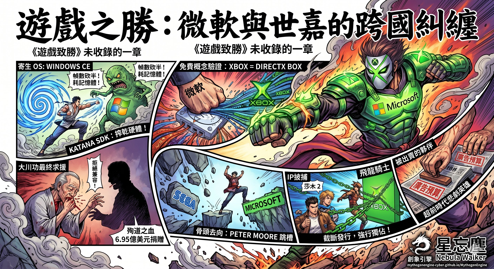

Author: Nebula Walker
Date: 12JUN2026
MYTHOGEN ENGINE (mythogenengine.com)

**📌 《遊戲致勝》未收錄的一章：微軟與世嘉的 WinCE 糾纏，以及 Xbox 如何從 Dreamcast 的屍體上誕生。**

# GameVictory: The Cross-Border Entanglement of Microsoft and Sega

**— The Chapter That *GameVictory* Left Out**

Nebula Walker

---

Chapter 3 of *GameVictory* told the story of Xbox's birth. The conclusion was: Xbox was never a games console — it was a wall. A wall Microsoft built to keep PlayStation 2 from invading the Windows living room.

But Chapter 3 deliberately sidestepped one piece of history.

Xbox's true cradle was not in Redmond. It was inside a Japanese console called Dreamcast.

This history has almost never been covered in full by mainstream media. The reason is simple: winners write history. After 2001, the gaming press's advertising revenue came from Sony, Microsoft, and Nintendo — the three surviving platform holders. Sega had left the stage, and its story left with it. Whenever Dreamcast was mentioned, the angle was always "a tragic hero ahead of its time," never "a partner stripped for parts by its ally."

This article fills in that thread. Every fact has been verified and sourced.

---

## I. The Starting Point of the Partnership

On 21 May 1998, Microsoft issued a press release with a stately headline: "Microsoft, Sega Collaborate on Dreamcast: The Ultimate Home Video Game System."

The deal was this: Microsoft would provide a console-optimised Windows CE operating system for Sega's new console, the Dreamcast, and integrate DirectX graphics. Sega's selling point was that PC game developers could use the familiar Win32 and DirectX APIs to develop games directly for DC, dramatically cutting porting costs.

For Sega, the deal looked sensible. The most painful lesson of the Saturn era was that its bizarre dual-CPU architecture had scared off third-party developers. If DC was going to survive, it needed a flood of games. If you could pull the entire PC developer ecosystem in at one stroke, wouldn't that solve everything?

Microsoft had its own calculus. In 1998, Microsoft had no plans to build a console — the Xbox team would not coalesce internally until 1999. But Microsoft desperately wanted one thing: **to extend DirectX's reach from the PC desktop to the box under the television.** Sega showing up at the door was a free proof of concept for the living-room market.

The contract was signed. SDKs began shipping to licensed developers by late 1998. On the DC's casing, a line of text read: "Compatible with Windows CE."

But the word "Compatible" concealed a fact most gamers overlooked.

---

## II. A Parasitic Operating System

Windows CE was not Dreamcast's native operating system.

DC had its own BIOS and a native development kit built by Sega (the Katana SDK). Windows CE was an option — developers could use it, or not. If they chose WinCE, the entire OS was burned onto the game disc. Each time the console booted, DC first loaded WinCE from the disc, and only then ran the game.

This architectural design created three problems immediately.

**First, memory was consumed.** DC had only 16 MB of main memory in total. After WinCE loaded, the space left for the game shrank drastically. Games using the Katana SDK could talk to the hardware directly, spending every byte where it counted; games using WinCE always had an OS layer sitting on top.

**Second, load times increased.** The disc had to read the entire WinCE image on every boot before entering the game. For players, this meant longer waits.

**Third, frame rates were unstable.** This was the most lethal issue. The core promise of a games console is smooth performance — and Sega, born in arcades, understood this better than anyone. But WinCE's abstraction layer prevented the GPU from being fully exploited.

The most famous victim was *Sega Rally 2*. The game was the top-selling DC launch-year title in Japan, moving 290,000 copies. It was developed using WinCE. The result: frame rates at half the arcade version, with stuttering so severe that players had to enter a cheat code to lock 30 fps just to make it playable. The Wikipedia entry still reads: "The Dreamcast version, ported using Windows CE, has a frame rate half that of the arcade version."

This was not an isolated case. The vast majority of experienced developers — including Capcom with *Biohazard: Code Veronica* — abandoned WinCE outright and used Sega's own Katana SDK.

The final numbers tell the whole story: **DC's global game library comprised roughly 600+ titles, of which only about 50 used WinCE. Less than 10%.**

Microsoft poured massive PR resources into touting "seamless PC-to-living-room game porting." In reality, it was a bloated abstraction layer that dragged down console performance and was abandoned by nine out of ten developers.

---

## III. What Microsoft Learned

WinCE's failure on DC was a loss for Sega. But for Microsoft, it was a free education.

**Lesson one: a console cannot run a general-purpose OS.** WinCE's miserable showing on DC made it crystal clear — cramming an OS designed for PDAs and embedded devices into a games console did not work. What a console needs is bare-metal performance, not software compatibility. So when Xbox arrived, Microsoft did not use WinCE again — it used a stripped-down Windows 2000 kernel, redesigned from the ground up for gaming.

**Lesson two: DirectX can leave the PC.** Although WinCE failed, the DirectX API itself did run on DC. Microsoft obtained first-hand data: how Direct3D behaved on non-PC hardware, where the performance bottlenecks lay, and what developers actually thought. That data fed directly into Xbox's design process. Xbox's full name — DirectX Box — was no coincidence. It was the next-generation product of the experiment conducted on DC.

**Lesson three: online connectivity is the future.** DC was the first console in history with a built-in modem that pushed online play from day one. SegaNet let players compete online as early as 1999. Microsoft saw the concept's potential and expanded it with Xbox Live two years later — the difference being that Xbox Live required broadband and was designed from the start as a closed, paid ecosystem.

DC was Microsoft's testing ground. Sega paid the tuition. Microsoft took the diploma.

---

## IV. The Final Plea

On 31 January 2001, Sega announced that Dreamcast would be discontinued.

But before that announcement, one man made a final stand.

Isao Okawa. Sega's chairman. He was not a games-industry native — he was the founder of CSK Holdings, a Japanese information-services conglomerate. CSK had held the majority stake in Sega since 1984, making Okawa its de facto controller.

In the days before DC's discontinuation, Okawa flew to Microsoft repeatedly to meet Bill Gates in person.

His proposal was: **make the soon-to-launch Xbox backward-compatible with Dreamcast games.** Sega was willing to provide all necessary technical assets. His purpose was straightforward — to give DC's player base a migration path, to let Dreamcast live on in some form.

Former Microsoft executive Sam Furukawa later confirmed this on Twitter: "Before Mr. Okawa passed away, he visited Gates several times, to see if it would be possible to add Dreamcast compatibility into the Xbox."

Negotiations fell apart.

The reason, according to Furukawa, was DC games' online connectivity. Okawa insisted that DC games running on Xbox must retain their online capability — one of Dreamcast's defining features. Microsoft refused. Xbox Live was a closed broadband service, and Microsoft was unwilling to let DC's dial-up games run on its platform.

No deal. Okawa returned to Tokyo in disappointment.

On 16 March 2001, Isao Okawa died of heart failure at the University of Tokyo Hospital. He was 74 years old.

Before his death, he did one thing: he donated all of his Sega and CSK shares — worth approximately US$695 million — to Sega, and forgave all debts the company owed him. One man used nearly US$700 million of personal wealth to keep a dying games company alive.

Isao Okawa was not a games person. But what he did for a games company was more than most gaming CEOs accomplish in a lifetime.

---

## V. Where the Bones Went

After Sega fell, its bones were redistributed. And the direction of that redistribution is deeply telling.

Peter Moore — president and COO of Sega of America — was the man who personally announced DC's discontinuation. He later acknowledged this himself.

Moore's career trajectory is clear: he replaced Bernie Stolar in August 1999, led DC's North American launch. Rose to president of Sega of America in May 2000. Then, after DC was discontinued and Sega transitioned to a software-only company — **in January 2003, Peter Moore joined Microsoft as a senior executive in the Xbox division.**

He did not just take a résumé with him. He took every relationship, distribution channel, and developer connection Sega had built in North America. His subsequent responsibilities at Microsoft included global game development, studio management, and third-party publisher relations — all capabilities he had built at Sega.

But personnel was only the first layer.

The second layer was IP. After Sega's transition, its internal development team Smilebit (formerly AM6) shifted almost entirely to developing Xbox exclusives — *Jet Set Radio Future*, *Panzer Dragoon Orta*, *GunValkyrie*, all Xbox-only. *Crazy Taxi 3* as well. These could at least be explained as normal business decisions: Sega no longer made hardware, its studios needed to pick a platform, and Xbox's architecture was closest to PC, with the lowest porting costs.

But *Shenmue II* was a different story.

*Shenmue II*'s North American distribution history is the most naked link in the entire "absorbing the legacy" chain.

In 2001, *Shenmue II* was released on Dreamcast in Japan and Europe. The game was finished. The English localisation was complete. North American DC players were waiting for a release date.

Then Microsoft intervened. It signed a deal with Sega, buying exclusive North American console rights to *Shenmue II*. Sega of America promptly cancelled the North American Dreamcast release.

A game that was already developed, already on sale in other regions, had its distribution path severed at the final step. North American DC players who wanted to play the English version of *Shenmue II* had exactly one option — buy an Xbox.

Microsoft even included a recap DVD of *Shenmue I*'s story with the Xbox version. **This was not serving new players. This was receiving old ones.** The entire product design logic was: you're a Sega die-hard? Good — here's your migration path, and it ends at Xbox.

This was not Sega "voluntarily sending its games to Xbox." This was Microsoft, at the moment of Sega's greatest financial vulnerability, using capital to rip a completed game away from its original platform and turn it into a market-grabbing weapon. Sega was not making a business choice — Sega was selling its blood.

At Chicago airport, a TSA officer recognised Peter Moore — the man who had personally announced DC's death and then defected to Microsoft. Moore recounted the incident himself in interviews:

"I don't need to see your passport. You're the asshole that gave away Shenmue to Xbox."

That officer said what every DC player in North America wanted to say.

(It was not until 2018 that Sega remastered *Shenmue I & II* and re-released them on PS4, PC, and Xbox One. North American DC players waited seventeen years.)

---

## VI. The Players' Anger

Post-hoc verification can tell you that the ranking of causes for Sega's death was: its own hardware fragmentation first, Sony's market tactics second, and the PS2's installed base choking off the last exit third. Microsoft's WinCE doesn't rank in the top three — 90% of developers bypassed it, DC's truly great games all used the Katana SDK, and the damage WinCE caused was localised, not systemically fatal.

But the players of 2001 did not know this.

All they had was a timeline. And that timeline had only one possible reading.

1998 — Microsoft loudly announced its partnership with Sega, with "Compatible with Windows CE" printed on the console. Players thought Sega had found a powerful ally.

1999–2000 — News of WinCE games' poor performance began circulating in player communities. But DC's games themselves were excellent, and most people did not dig deeper.

January 2001 — DC discontinued.

March 2001 — Isao Okawa died.

November 2001 — Xbox launched. A living-room console running on DirectX. Conceptually almost identical to "stuff WinCE + DirectX into DC." **DC's body was still warm when Xbox went on sale standing on its grave.**

2002 — *Shenmue II*'s North American release was snatched by Microsoft. Japanese and European DC players had already played it, but North American players were told: want to play? Buy an Xbox. In the same period, *Panzer Dragoon Orta* and *JSRF* debuted as Xbox exclusives. Sega's legacy was being carried, piece by piece, into Microsoft's new house.

January 2003 — Peter Moore joined Microsoft.

Collaborate. Learn. Discard. Replace. Absorb the legacy. **Laid out in sequence, it is emotionally impossible not to conclude: "We were betrayed."**

Even if you can prove today that every single step had its own independent rationale — WinCE failed because of a technical mismatch, DC was discontinued due to financial collapse, Moore's move was a personal career decision, the IP exclusives were the result of business negotiations — these explanations hold up rationally. But when you are a player who spent ¥30,000 on a DC, bought *Shenmue*, and spent a hundred hours walking every street of Yokosuka, what you see is not "independent rationales." What you see is a conspiracy.

**And what is even more suffocating is — almost no mainstream outlet said any of this on your behalf.**

After 2001, the gaming media ecosystem had been reshaped by the three surviving platform holders. Microsoft, Sony, Nintendo — their advertising budgets kept the entire gaming media industry alive. Exclusive early review access, first-look invitations for new consoles, VIP passes to E3 show floors — these were chips only advertisers could obtain. After Sega left the stage and stopped buying ads, its perspective naturally vanished from coverage.

The press was not unaware of this history. It chose a safer narrative angle: "Dreamcast was a tragic console ahead of its time." This version had no villains, only bad luck. It carried a gentle note of nostalgia and did not offend any company still placing ads.

As for the version — "Microsoft used Sega's body to train, then opened its own gym, then absorbed Sega's legacy"? Too sharp. Write it, and Microsoft's PR department would call. The next exclusive early review might not include you.

So winners don't just write history. **Winners use advertising budgets to purchase editorial control over history.** No need to delete a single fact — just ensure those facts remain forever confined to forum posts and personal blogs, never reaching the pages of mainstream coverage.

In 2010, Sam Furukawa tweeted about the Okawa–Gates negotiations. Kotaku ran a piece. Then what? Nothing. No follow-up investigation, no long-form feature, no mainstream gaming outlet pulled the full thread. One tweet, one short article, then it sank to the bottom of the internet, and fifteen years later only forum reposts remain.

Those DC players who wrote eulogies on 2ch, the American players who raged at Peter Moore on GameFAQs, the console fans in Hong Kong forums who stood up for Sega — their anger was real, and their judgment was directionally correct. They simply lacked a platform that could string the entire thread together and present it with facts rather than emotion.

That is what this article attempts to do.

---

## VII. This Is Not a Conspiracy Theory — But It Is Not Innocence Either

The boundaries need to be drawn clearly.

Did Microsoft "deliberately use Windows CE to destroy Sega"? **No.** WinCE was a lightweight OS designed for PDAs and embedded devices; its architecture was fundamentally unsuited to a games console. Microsoft's engineers did assist DC developers in optimising performance — the official technical documentation remains in the MSDN archives to this day. They were not poisoning the well. They simply brought the wrong tool.

But "not a conspiracy" and "not predatory" are two different things.

Microsoft completed a full proof of concept for a living-room console at minimal cost. It learned how DirectX behaved on non-PC hardware, the operational logic of the console supply chain, and the requirements framework for online gaming. Then it used that knowledge to build Xbox. Then it rejected Okawa's compatibility request. Then it poached Sega's president. Then it turned Sega's classic IPs into its own exclusive weapons.

Every step was legal. Every step was rational. Every step, taken together, formed a complete value-extraction chain — **extracting maximum value at minimum cost from a dying partner.**

And using advertising budgets after the fact to ensure this version never became the mainstream narrative — that is not a conspiracy. **That is structure.** The gaming media's business model dictated that it could only write the stories of survivors. No one needed to phone in pressure; economic incentives are the most efficient censorship mechanism there is.

---

## VIII. Why *GameVictory* Did Not Write This Chapter

Two reasons.

First, the sources are thin. The details of Okawa's negotiations with Gates rest on nothing more than Sam Furukawa's tweets and Kotaku's reporting. No contract documents, no meeting minutes, no official statement from either side. Under *GameVictory*'s writing discipline, every argument must be backed by verifiable facts — and this history's core details have only a single source. Put it in the main text, and it would not meet the book's evidentiary standard.

Second, structure comes first. Chapter 3's argument is "Xbox was a defensive weapon." Chapter 4's argument is "Sega's charitable donation gave birth to NVIDIA's monopoly." If Microsoft and Sega's WinCE entanglement were inserted into Chapter 3, it would pull the reader's attention from "defensive logic" toward "cross-border predation" — a real and important story, but not the argument Chapter 3 was built to deliver.

So I left it outside the book.

But it deserves to be remembered.

---

## IX. The Final Arithmetic

Isao Okawa donated US$695 million to Sega.

Shoichiro Irimajiri — discussed in Chapter 4 — invested US$5 million in NVIDIA.

Microsoft lost US$4 billion on the first-generation Xbox.

Three sums, three different natures. Okawa's was martyrdom. Irimajiri's was a bet on character. Microsoft's was buying insurance.

The martyr died. The one who bet on character vanished. The one who bought insurance survived — and pocketed the insured party's legacy.

If you are a reader of *GameVictory*, you have already seen eight variations of this pattern across eleven chapters. This article is the ninth. Only this time, it happened outside the book's borders — in a stretch of history that winners do not wish to write, that the media finds inconvenient to cover, and that players can only piece together for themselves in forums.

Collaborate. Learn. Discard. Replace. Absorb the legacy. Then use advertising budgets to lock this version out of the mainstream line of sight.

Winners write history. But the places winners cannot reach do not mean nothing happened there. There was a console called Dreamcast. There was an old man called Isao Okawa. There is a community of players who, to this day, remember every street in Yokosuka.

Their anger does not need conspiracy theories to sustain it. The facts alone are enough.

---

*This article is supplementary reading for* GameVictory: From Pixels to AI — How Entertainment Secretly Reshaped Global Tech Hegemony*. Chapter 3 (Microsoft's Fear and the Birth of Xbox) and Chapter 4 (Sega's Five-Million-Dollar Charitable Donation) provide the background context for this piece.*

