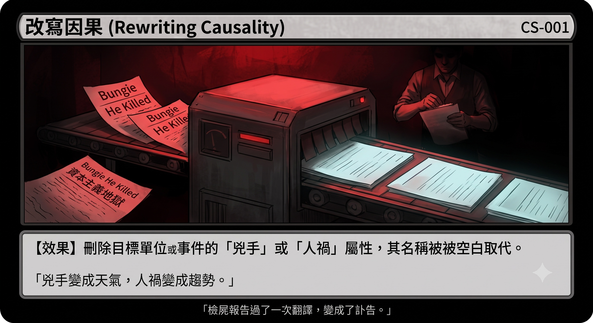
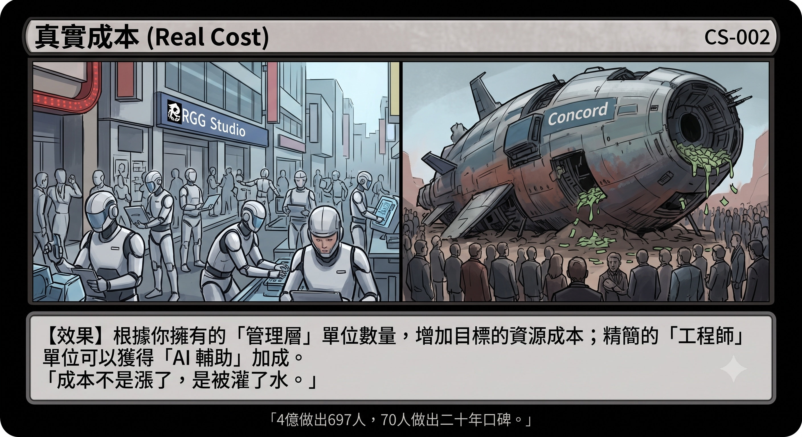
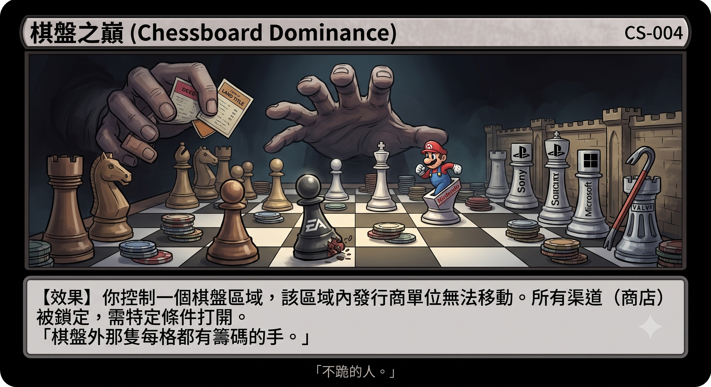
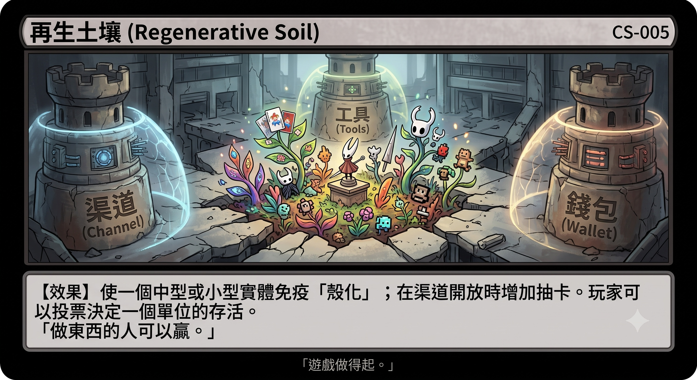
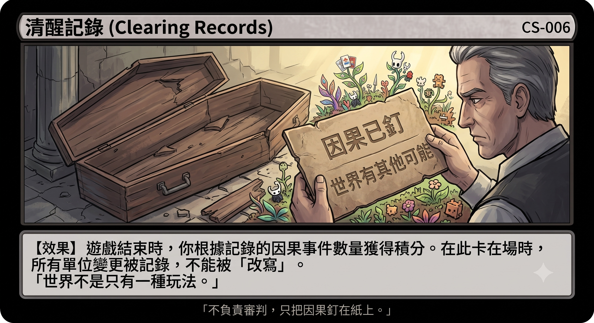

# Who Says Games Are Too Expensive to Make

Nebula Walker · MYTHOGEN ENGINE 2026JUL29

---

**Author** Nebula Walker

**Series** Lucid Record · Case File 02

**Category** Industry Analysis / Capital Structure / Tech Commentary

**First Edition** July 2026

**Version** v1.0

**License** CC BY-NC-SA 4.0

**Website** mythogenengine.com

---

This book is based on the analysis of public information, and all data sources have been cited within the text. The viewpoints represent the author's personal judgments and do not constitute investment advice.

---

**Structure of this Document**

**[Prologue: An Obituary]** An angry autopsy report of how a translation assembly line turned it into a peaceful obituary. The murderer becomes the weather, and human-made disasters become trends—this book begins here.

**[Part One: Who Says Games Are Too Expensive to Make]** 70 people, twenty years, fifteen games, versus 400 million dollars, 697 concurrent players, and server closure in fourteen days. Costs haven't just risen; they've been artificially inflated; and AI, the tool that could drain this inflation, is being systematically suppressed.

**[Part Two: How Long Can a Shell Live]** Companies that stop creating don't die. The specimen gallery from GE to Boeing to Kodak proves it: shells can decay healthily for decades; it's almost never the founders who hollow them out; and those who play this game won't face retribution.

**[Part Three: The Chessboard]** How a healthy company gets pushed onto the operating table: an anatomy of EA's $55 billion leveraged buyout. The chess players, the chess pieces, two who refuse to kneel, a two-faced entity, and the hand outside the board that has chips on every square.

**[Epilogue: Soil]** Games won't die; games will move. What determines whether the new place has soil are three lines of defense: distribution channels, tools, and your wallet.

Series Prequel: [*What Does the Capital Game Play (Case File: Gaming Industry)*](/capital-game) — A four-step dismantling record: replacing people, expanding, purging, cashing out. Not having read the prequel will not affect your reading of this book.

---

# Prologue: An Obituary

### When GameSpot's Anger Becomes Chinese Resignation

---

This book needs to start with an obituary.

An obituary written for the entire console gaming era—the problem is, the deceased hasn't died yet.

---

On July 7, 2026, GameSpot published an article titled: *There Is No Reason To Buy Another PlayStation Or Xbox*.

A few days later, Hong Kong and Taiwan Chinese tech media republished this article. The title became: "The Console Era is Nearing Its End—Recommending Players to Hold Off Buying the Next-Gen PlayStation and Xbox."

The same article. Two completely different stories.

---

GameSpot's original text was an angry article. The author, Moises Taveras, used an extremely specific phrase: "starved corporations". He called the next-generation consoles the "answer" to a pseudo-problem forced upon the market by "starved corporations." He specifically named Bungie being "cut to the bone," Arkane Lyon hanging by a thread under "reckless management," and Double Fine and Compulsion Games being "kicked out of first-party ownership." Near the end of the article, he explicitly wrote of the "current capitalist hellscape."

He even explicitly pointed out that the memory shortage was caused by the demand from the AI tech bubble, and this was the direct reason why the next-generation console prices might skyrocket to a thousand dollars. In other words: you can't afford a PS6 because tech giants threw hundreds of billions of dollars into AI data centers, grabbing all the RAM.

This article has perpetrators. It has causality. It has names. It has anger.

This is an autopsy report: the cause of death column is clearly written—homicide.

---

What was left in the Chinese version?

"Console manufacturers have continued to close their development studios in recent years." — Not a single name. Bungie, Arkane Lyon, Double Fine all evaporated.

"Priced near $1,000, players will find it even harder to find enough reasons to upgrade." — What is the reason for the thousand dollars? The original text said the AI bubble snatched the memory. Chinese version: unmentioned. The price became a number without a source, as natural as the weather.

"Capitalist hellscape" — The entire sentence vanished.

"Starved corporations" — The entire sentence vanished.

It was replaced by an editor's addition: "Editor's Note: There are also short-video platforms like Hongguo." The original accusations were deleted, and the editor's private goods were inserted.

What Chinese readers received was not an analysis with a clear target of accusation, but a sigh about the "natural end of an era." The murderer became the weather report. Human-made disasters became trends.

The autopsy report went through translation once and became an obituary: the cause of death column only had a few words left—died of natural causes.

---

This is not a translation issue. This is narrative cleansing.

The previous book in this series, *What Does the Capital Game Play*, recorded frame by frame the four steps capital takes to dismantle an industry: replacing people, expanding, purging, cashing out—swapping in obedient management, claiming territory under the guise of expansion, clearing out those who do the work and speak the truth under the guise of "adjustment," and finally cashing out at a high price. If you haven't read it, it won't affect your reading of this one; you just need to know that those four steps have entirely happened in the gaming industry by 2026, with names, prices, and markets.

But after dismantling the bones, there is one last step—the easiest to overlook, yet the one that determines how the whole event will be remembered:

**Rewriting causality.**

Writing a man-made killing as a natural death. Replacing the names of specific decision-makers with "the times," "trends," and "irreversible shifts." This way, the dismantlers are no longer murderers but "pragmatic managers adapting to the times."

And this step doesn't even require corporate PR to step in personally. The aggregated translation assembly line completes it automatically—what the editor chooses, deletes, and simplifies filters down layer by layer, and the accusation automatically becomes a weather report. No one bribes anyone, no one issues any directives, and the result is: the "natural end of the console era" seen by readers in Hong Kong and Taiwan is what an article originally containing "starved corporations" and "capitalist hellscape" looks like after being whitewashed.

---

There is an ironic part to this.

Moises Taveras at GameSpot and we are looking at the exact same thing. His anger is real. He named Bungie, named Arkane Lyon, and directly linked the AI bubble to console pricing. If you only read the Chinese version, you would think all gaming media are writing cynical remarks; but the author of the original text is actually standing on the side of players and developers.

His article was silenced—not by censorship, but by translation.

---

Why start a book with a fake obituary?

Because you have probably already read this obituary—maybe not this specific one, but its ten thousand variants: "AAA costs are out of control; games are too expensive to make," "the console era naturally ends," "industry winter, layoffs are a helpless necessity." The commonality of these sentences is that they all lack a subject. No one did anything; everything just happened.

If you believed it, this book is an exhumation and autopsy written for you.

It aims to do four things.

First, refute the obituary's cause of death—"games are too expensive to make" is a lie. A studio of seventy people has proven to you over twenty years and fifteen games that costs haven't just risen; they've been artificially inflated; and those doing the inflating are preventing others from draining the water.

Second, answer a question the obituary dares not touch—will these companies that stop creating die? The answer is colder than you think: no. Shells can live for decades, and there is a whole gallery of specimens to prove it.

Third, draw the chessboard—who are the players, who are the pieces, who gets pushed onto the operating table while healthy, and that hand outside the board with chips on every square.

Fourth, find the real ground of life and death—it's not in any company's stock price; it's in the soil: distribution channels, tools, and your wallet.

From beginning to end, this book has only one mission, same as the previous one: not to judge, not to appeal, but simply to nail the causality to paper before it gets rewritten.

The obituary says the era is dead.

After opening the coffin, you will see: the coffin is empty. The deceased has moved, is still in the next street, continuing to make things.

---

# Part One: Who Says Games Are Too Expensive to Make

---

A narrative is popular in the gaming industry: AAA games are too expensive, they can no longer be sustained.

Taiwanese YouTube is full of this argument. Development costs are too high, player attention is stolen by short videos, only indie games can survive. GameSpot directly wrote an article *There Is No Reason To Buy Another PlayStation Or Xbox*, describing the console era as ushering in the "beginning of the end." Analysts say games are falling behind other entertainment forms in the "attention competition." The conclusion of the entire public opinion is: times have changed, and games are too expensive to make.

This conclusion is false.

It's not that costs haven't gone up. It's *why* costs have gone up—this question is systematically avoided.

---

### A Studio That Made Games For Twenty Years

RGG Studio, under Sega, is the developer of the *Yakuza / Like a Dragon* series. From the first generation in 2005 to *Like a Dragon: Pirate Yakuza in Hawaii* in 2025, they have released over fifteen titles in twenty years, almost one to two titles a year. The graphics have gone from the PS2 era all the way to PS5, with stable quality, stable reviews, and stable sales.

The core development team of this studio peaked at 70 to 80 people.

This number has basically remained unchanged from the first generation to now.

Masayoshi Yokoyama, director of RGG Studio, said this himself in a 2025 interview with Denfaminicogamer. The entire Division 1 has 300 people, but they work in shifts—the same group of people alternates working on different projects, including *Like a Dragon*, *Virtua Fighter*, and *Super Monkey Ball*. The programming team for each game is about 40 to 50 people. Technical Director Yutaka Ito was even more direct: "With the development cycle of recent blockbusters getting longer and longer, I think new programmers at RGG are lucky." — Meaning, other companies release one game every five years; we release one every year, and newcomers can see their names in the end credits in their second year.

How did they do it? Three things.

First, asset reuse. RGG Studio has a continuously accumulating original asset library. The streets of Kamurocho aren't rebuilt every generation—they are layered on top of each other. New technologies (3D scanning, automated testing) are used to reduce repetitive labor, not to bloat the team.

Second, modular development. Adventure, combat, and minigames each have independent teams and team leaders, not interfering with each other. There is no need for hundreds of people to hold big meetings, no need for matrix reporting.

Third, they haven't been acquired. RGG Studio is an internal department of Sega, not an independent company that needs to answer to financial reports after being acquired at a premium. There is no acquisition premium to amortize, no investors to explain "where this money was spent" to.

What is the result? 70 people, twenty years, more than fifteen games, and the reputation remains. This is not a miracle; this is what a studio uninflated by capital looks like when operating normally.

---

### The 400 Million Dollar Corpse

Concord, Sony's live-service shooter, launched on August 23, 2024.

Development cost: reported to be around 400 million dollars. Before acquiring Firewalk Studios, 200 million had already been burned; after Sony took over, they spent another 200 million to drag the game from a "laughable state" to a "minimum viable product." A massive budget was spent on emergency outsourcing—because when the game entered alpha, even the onboarding and monetization systems hadn't been built.

Steam peak concurrent players: 697 people.

Estimated total sales: about 25,000 copies.

Two weeks after launch, Sony announced a permanent delisting and full refunds. Firewalk Studios was subsequently shut down.

400 million dollars, 697 people.

During the same period, *Like a Dragon 8: Infinite Wealth*, made by 70 people at RGG Studio, sold millions of copies and scored 89 on Metacritic.

The question is: is it that games are too expensive to make, or was the 400 million dollars never actually spent on "making the game"?

Of Concord's 400 million, how much was bloated management cost? How much was repeated rework due to decision-making errors caused by a "toxic positivity" corporate culture? How much was administrative drain from acquisition premiums, outsourcing rescues, and cross-departmental coordination? How much was truly spent on game design, level polish, and gameplay testing?

No one knows the exact numbers. But the answer is already written in the outcome: the thing made with 400 million couldn't even retain seven hundred people.

---

### Costs Aren't Astronomical; They're Inflated to Be

The contrast between RGG Studio and Concord is not simply "Japanese studios are more frugal." It reveals a structural problem: the cost inflation of AAA games is largely not driven by technology, but by capital structure.

After a studio is acquired, its costs automatically bloat. Management expands (to report to the parent company), HR expands (to comply with corporate policies), legal expands (to handle multinational compliance), marketing teams expand (to coordinate with the parent company's brand strategy). None of these people are making the game, but they are all counted in the game's development cost. And when this watered-down cost becomes a number on the financial report, it becomes the "industry standard"—"Look, a AAA game just costs two or three hundred million dollars."

Bluepoint Games, which Sony personally praised as a "highly skilled team," had 70 people. After being acquired, they were assigned to an unsuitable live-service project; the project was axed, and the studio was closed down. If Bluepoint had remained independent and continued to make remakes with 70 people, what would the cost have been? The development cost of the *Demon's Souls* remake wasn't public, but it certainly wasn't 400 million dollars.

Yutaka Ito of RGG Studio said a crucial sentence: "It's true that the improvement of hardware specs requires more labor, but the development environment is also advancing—so we can work with the same number of people." Technological advancement could have offset rising costs, but only if your team structure hasn't been eaten by capital bloat.

---

### AI Could Have Changed This

AI-assisted development—not replacing developers, but allowing small teams to do what only large teams could do before. Automatically generating test cases, accelerating asset iteration, compressing debugging time. The things RGG Studio is already doing (3D scanning, automated testing), AI can do even more of.

This was an opportunity to break monopolies. A ten-person studio, with AI assistance, could make games that previously required a hundred people. Development costs decrease, the survival space for indie studios expands, and the narrative of "games are too expensive to make" naturally collapses.

But this is being systematically suppressed.

In December 2025, *Clair Obscur: Expedition 33* won Game of the Year at The Game Awards—the industry's highest honor. The same week, the Indie Game Awards revoked its two awards (Best Indie Game, Best Debut Game), citing the use of AI-generated assets during development. Developer Sandfall Interactive confirmed using "some AI, but not much," and the related assets were removed in an update five days after release.

A game that won Game of the Year. Highly praised by players. Used a bit of AI assistance. Awards revoked.

Meanwhile, Sony touted "AI unleashing the creativity of studios," and then closed eight studios. Microsoft promised to spend 190 billion building AI data centers, but *Forza Horizon 6* didn't even have basic AI racing behavior.

Look closely at this structure: big companies using "AI transformation" as an excuse for layoffs is acceptable. Small studios using AI as a development tool is unacceptable.

The discourse power of AI is being monopolized. Big companies define what constitutes "legitimate AI use"—numbers on financial reports, PowerPoints in investor presentations, strategic paragraphs in annual reports. AI use by small studios—the kind that actually lands in products, drives down costs, and makes games possible—is labeled "unethical," reported, and stripped of awards.

---

### The Closed Loop

Now string the whole logic together:

Big companies artificially inflate development costs through acquisitions, watering down studio book expenses from tens of millions to hundreds of millions. The bloated numbers become the "industry standard," establishing the narrative that "games must cost astronomical amounts." This narrative strangles the indie ecosystem—investors don't dare invest in small studios because "the market has proven" that small sizes can't produce AAA quality.

At the same time, AI-assisted development could have allowed small teams to break through the cost ceiling, but it is being suppressed—through award rules, community public opinion, and platform reporting mechanisms. It's okay for big companies to shout AI transformation, but not for small studios to use AI to make games.

Finally, when independent studios are squeezed completely out, big companies monopolize the supply side, and then tell you: "Look, games are too expensive to make, so we need higher prices, more microtransactions, and more closed digital ecosystems."

This is not the natural evolution of the market. This is a monopoly manufacturing scarcity, and then using scarcity to prove the necessity of the monopoly.

---

### So, Are Games Too Expensive to Make?

RGG Studio has done it with 70 people for twenty years. *Clair Obscur: Expedition 33* was the debut of a small French studio and won Game of the Year. The development team of *Hollow Knight: Silksong* is less than ten people.

Games have never been too expensive to make.

What's too expensive are the book numbers after capital bloat. What's too expensive are the management and administrative structures that exist for the sake of reports. What's too expensive is the story the monopolists need you to believe.

Four hundred million dollars made Concord with 697 concurrent players. Seventy people made twenty years of reputation for *Like a Dragon*.

The numbers themselves are already the answer.

---

# Part Two: How Long Can a Shell Live

---

I worked for a veteran manufacturing company for many years.

I won't say which one. Not because I'm afraid, but because once the name is spoken, you'll think it's just that company's problem—a problem with specific management, a problem with a certain corporate culture, a problem of a specific era and place.

It's not.

During those years, I watched a young man with less than ten years of tenure rise from the HR department all the way to a position close to department head. I watched capable engineers stuck in place, and watched those best at "coordinating resources" take the helicopter up. The ones promoted the fastest were not those who made things, but those who negotiated budgets, fought for headcounts, and always stood on the right side during waves of restructuring.

At the time, I thought the problem was me: Was I not smooth enough? Did I not know how to interact with people?

Later, I understood that structure. When a company no longer competes by creating new value, a political market forms inside it. In this market, the most scarce resource isn't technology; it's budget, headcount, and the trust of higher-ups. The rules of the game have changed, and those who are adept at the new rules naturally rise fast; those who disagree naturally don't fit in. This isn't anyone's conspiracy; it's the inevitability of the structure.

Twenty years later, as I watch Sony close its eighth studio, and Microsoft spend 69 billion to buy IPs and then fire the people who make games, I recognize it.

It's not similar. It's the exact same playbook.

So this chapter won't talk about that company. This chapter will answer two bigger questions: How long can a company that has stopped creating and only distributes resources live? And will those who play this game face retribution?

Let me give the answers upfront: A very long time. No.

---

### The Origin of the Playbook

This playbook has a birthplace.

In April 1981, Jack Welch became CEO of GE. Over the next twenty years, he invented the entire set of rules that were later copied by the whole world: shareholder value supremacy; mandatory elimination of the bottom 10% of employees in performance reviews every year; financializing a manufacturing giant—GE Capital contributed nearly half of the group's profits at its peak. A company that built airplane engines and generators made half its profits from lending money.

During his tenure, GE was once the most valuable company in the world. Welch was dubbed the "Manager of the Century" by financial media, his books were business school bibles, and his protégés were heavily recruited as CEOs by major corporations. This is how the playbook spread—not by being forced, but by being worshipped.

Then look at the ending. Welch retired gloriously in 2001. In the 2008 financial tsunami, GE Capital almost dragged the entire company down to the bottom of the ocean, relying on Warren Buffett's capital injection and government backing to survive. In 2018, GE was kicked out of the Dow Jones Industrial Average—it had been a founding member when the index was created in 1896, holding its place for 122 years. Welch passed away in 2020; the following year, GE announced it would split into three companies.

Even the founder's own church couldn't escape this doctrine.

But more worth looking at than GE itself is the GE alumni association. Robert Nardelli left GE to become CEO of Home Depot; during his seven years there, the stock price stalled, watching competitor Lowe's surge; upon leaving, he took away a severance package of about 210 million dollars, turning around to become CEO of Chrysler—two years later, Chrysler went bankrupt. James McNerney left GE to first head 3M, slashing R&D, and then led Boeing from 2005 to 2015—the 737 MAX was approved during his tenure, substituting a new engine on an old frame instead of building a new plane.

Remember these two names. We will come back to them at the end of this chapter.

---

### The Specimen Gallery

"This kind of company will go bankrupt sooner or later." — This is the intuition most people have about shell companies.

The intuition is wrong. Here are the specimens.

**IBM**, which has been transitioning from hardware to services since 1993, a transition taking thirty years. Along the way, it sold its PC business, sold its server business, spun off its infrastructure services, and once had twenty-two consecutive quarters of revenue decline. It is still alive today, still on the Fortune lists. A company can shrink and survive simultaneously for thirty full years.

**Sharp**, a century-old brand founded in 1912, had two-thirds of its equity acquired by Foxconn in 2016. The name is still on TVs and home appliances, but the company is already another company.

**BlackBerry**, stopped producing phones in 2016, pivoted to automotive software and information security, and then sold off its portfolio of patents accumulated during the phone era in bulk. Even the patents were sold, but the name remains.

**Toshiba**, exploded with an accounting scandal in 2015, its nuclear business went bankrupt in 2017, sold off its most valuable memory business in 2018, and was taken private by a consortium in 2023, ending its 74-year public listing history. The name is still on rice cookers and elevators.

**Gold Peak (GP)**, Hong Kong's former "battery kingdom," whose name GP Batteries was stamped inside a whole generation's remote controls and Walkmans. Production lines have long been moved to China, Vietnam, and Malaysia, and GP Batteries was delisted and privatized in Singapore in 2017. The brand is still on global shelves today—it just has nothing to do with "Made in Hong Kong" anymore.

Every specimen proves the same thing: as long as the brand, distribution channels, or cash flow remains, the shell won't die. Becoming a shell is not a prelude to bankruptcy; being a shell is itself a state of survival that can last for decades.

And one specimen needs to be placed under the spotlight alone.

**Boeing.** After merging with McDonnell Douglas in 1997, a saying circulated in the industry: "McDonnell Douglas used Boeing's money to buy Boeing." The financial culture overwhelmed the engineering culture, the headquarters moved thousands of miles away from the Seattle factories, core processes were outsourced layer by layer, and between 2013 and 2019, more than 40 billion dollars were spent buying back its own stock. Then, in October 2018, Lion Air Flight 610 crashed, killing 189 people; in March 2019, Ethiopian Airlines Flight 302 crashed, killing 157 people. The same aircraft model, the same design decision spawned by financial logic. In 2024, a 737 MAX 9 had a cabin door blow out mid-air.

From the cultural blood transfusion to the bill arriving, twenty years had passed. The cost of hollowing out a company can be delayed by twenty years before surfacing—because the deeper a company's roots, the longer its inertia. In the gaming industry, the billing unit is broken games; in the aviation industry, the billing unit is 346 human lives.

---

### The Ship of Theseus

Every specimen in the gallery has a question that hasn't been asked yet: Who wielded the scalpel?

Go through the bench roster one by one. When GE was financialized, the helm was held by a professional manager, almost a century removed from Edison's era. When Boeing was taken over by financial culture, founder William Boeing had been gone for over sixty years. When Kodak missed digitization, George Eastman had been dead for over half a century. The great Atari crash was presided over by a parachuted manager with a background in textile marketing—founder Nolan Bushnell had been kicked out by the parent company five years earlier. The one who signed to sell EA was a professional CEO; founder Trip Hawkins had faded out by 1991. When Sony harvested PlayStation, Akio Morita and Masaru Ibuka had long passed away.

Across the entire specimen gallery, not a single hollowing out was done by a founder. This isn't speculation; it's the bench roster.

Of course, where there's a pattern, there are exceptions—cases of founders personally cashing out exist, and they are ugly. But as a pattern, it's strong enough to establish the second axis of this book. The previous section used the lifecycle axis: startup, maturity, harvest, shell. Now add the governance axis: **the Founder Era, the Family Era, the Manager Era, the Capital Era.** Overlapping the two axes reveals that hollowing out almost always occurs at the intersection of the latter stages of both—because by the time you reach the manager and capital eras, the relationship between the people sitting in the chairs and the company has shifted from "author and work" to "manager and asset." An author won't dismantle their own work; a manager dismantling an asset is just performing their duties.

But don't read this section as a moral story of "outsiders bad, founders good." The real mechanism goes a layer deeper: **People build institutions, and institutions then mold the next generation of people.**

KPIs, boards of directors, quarterly expectations, shareholder returns—once these things take shape, they become a self-operating machine. It has its own filtering function: founding veterans have high salaries and long tenure, so they are at the top of the downsizing list; engineering culture clashes with financial culture, and those who clash will leave on their own; those left behind are not the most creative bunch, but the bunch most adapted to the institution. Technical knowledge can be written into documents and passed down, but how to think, how to challenge, how to take risks—these have no document format. Thus, a company can have all its patents, all its products, and all its brands, yet that way of solving problems has died. That indescribable feeling old employees get when visiting their former company—the sign is still there, but the soul is not the same soul—is the visceral version of this.

There is an anomaly here, worth its own paragraph because it tests the boundaries of this entire theory.

In 2013, Michael Dell teamed up with private equity to execute a leveraged buyout and privatize the company he founded. On the surface, the operation was exactly the same as EA's today—LBO, debt, delisting. But the direction was entirely opposite: he did it to escape Wall Street's quarterly theater, bet heavily on acquiring EMC post-privatization, and returned to the market five years later with a completely transformed company. Incidentally: the private equity firm that handled the deal for Dell back then is the same Silver Lake that is one of the hands in the EA deal today.

The exact same tool can be a lifeboat or a butcher's knife. The difference isn't in the tool, but in three conditions: the founder is still present, still holds control, and is still willing to stake their own fortune. Place these three conditions against the specimen gallery one by one—not a single company has all three. Dell is an anomaly, and the rarity of the anomaly itself is the yardstick measuring how strong this pattern is.

Then, what if we parachute in someone with ideals?

This is the cruelest part of the institution. When the institution completes its self-replication—when every generation of managers it cultivates only thinks in the same financial logic, when shareholders, boards, and the market all price according to this logic—even if an idealist who wants to do things is parachuted in, they will find every path blocked by KPIs; even if the founder sits back in the chairman's seat, they may not be able to bring it back to the startup era.

There is only one exception in history: when the institution is on the verge of death.

When Jobs returned in 1997, Apple was ninety days from bankruptcy—it wasn't that he persuaded the institution; it was that the institution had no strength left to resist. Sony in 2012, Fujifilm during its transition period, all were only able to change when at the brink of survival. Reading this pattern in reverse yields the coldest sentence of the whole chapter:

**Cash flow is the institution's immune system.**

A shell that is still making money will never accept reform, because it doesn't need to. This is the real reason why those shells in the specimen gallery can remain unchanged for decades—it's not that no one wants to save them; it's that they are healthy enough not to need saving. And a company has to wait until it is near death to earn the right to be reborn, and once reborn, it will become healthy enough to reject all change once again.

The two film companies in the next section, and that Sony that died once, will walk you through this cycle.

---

### A Choice, Not Destiny

Writing up to here, there is a danger in this chapter: it starts to sound like fatalism—as if companies inevitably turn into shells as they age, and becoming a shell is a natural corporate senescence.

It is not. There is a pair of specimens specifically used to refute this.

Kodak and Fujifilm, two film companies, faced the same tsunami of digitization.

The digital camera was invented by Kodak itself. In 1975, engineer Steve Sasson built the world's first digital camera, and management's reaction was roughly: Very interesting, but don't tell anyone. For the next thirty years, holding the patents, Kodak chose to continue squeezing the high margins of the film business—paying dividends, buying back stock, guarding the cash cow. In January 2012, Kodak filed for bankruptcy.

Fujifilm took a different path. Management broke down their film technology: collagen processing, anti-oxidation, precision coating—where could these capabilities go? The answers were cosmetics, medical imaging, and semiconductor materials. Today's Fujifilm is a healthy company whose main revenue is no longer film, but every new business line grew from the technological roots of the film era.

The same tsunami, the same starting point, two endings. The difference wasn't luck; it was a decision: Do you take the money earned during the harvest period to pay dividends and buy back stock, or do you use it to buy your next growth curve?

Becoming a shell is a choice, not destiny. This sentence is very important because it implies that responsibility has an owner.

---

### Sony's Mirror

And the company that understands this best in the world should be Sony.

Because Sony itself pulled a Fujifilm once.

Around 2012, Sony was on the verge of death: four consecutive years of losses, a net loss of over 450 billion yen in fiscal year 2011, the TV business losing money for a decade straight, and the company selling its buildings to survive. What saved it was exactly a second growth curve—PlayStation. The PS4 launched in 2013, the gaming division grew all the way to become the group's largest profit source, and together with the image sensor business, Sony completed a textbook rebirth.

And then?

And then came the four steps recorded in the previous book: replacing people, expanding, purging, cashing out. Eight studios closed, physical discs discontinued, and executives dumping more than half their shares two days after controversial policies were announced.

A company can be reborn once, and then personally harvest its own rebirth.

Kodak could at least argue it couldn't see the future. Sony cannot—it personally experienced how a second curve can save its life, and what it is harvesting at this moment is the very savior from back then. This is why the previous book said: It's not that they can't do it; it's that they don't intend to do it anymore.

---

### The Gaming Industry's Own Ghosts

If not reborn, what does the terminal station look like? The gaming industry itself has the answer.

Atari. Founded in 1972, it defined the name of the entire video game industry. The great crash in 1983, sold off in pieces in 1984, the brand passed through different buyers' hands for decades, going bankrupt several times. What does today's Atari survive on? Licensing nostalgic IPs, remaking mini consoles, licensing the trademark to hotels. The logo is still there, but it has not a single trace of connection to the company back then—except for a line of record at the trademark registry.

This is the completed tense. There is also a present progressive tense.

Embracer, sweeping up over a hundred studios in five years, stacking leverage to the sky. In 2023, a $2 billion investment negotiation broke down, and the leverage snapped: laying off over 1,400 people, closing the 30-year-old Volition, selling Gearbox, and finally dismantling itself into three companies. When buying, every studio was a "long-term commitment"; when dismantling, every single one was a "non-core asset."

The ghosts aren't history. The ghosts are broadcasting live.

---

### No Retribution

Now back to the second question at the beginning: Will those who play this game face retribution?

No. This section must make this clear because it is the coldest part of the entire chapter.

The skills honed in a political market—managing upward, fighting for budget, crafting beautiful narratives, standing in the right position during every round of restructuring—are portable skills. When this shell is played out, they can move to the next shell. And what did the first half of this chapter just prove? The world of shells is vast and long-lived; IBM shrank for thirty years and is still here, Toshiba changed a few layers of skin and is still here. The habitats are always plentiful, enough for one person to play from entry-level to retirement.

No need to speculate; there are public records. Nardelli's stock at Home Depot didn't move for seven years, and he left with 210 million dollars, seamlessly taking over as CEO of the next corporate giant. McNerney went from GE to 3M to Boeing; at every stop, he gained both fame and fortune, retiring gloriously. When the bill for the 737 MAX arrived, the person who signed it was long gone from the counting house. This cohort of GE alumni has traveled the world for decades carrying the same playbook, and none of them met retribution—they are the orthodox establishment, acting with full legitimacy.

So is there a price to pay?

There is one. But they themselves won't feel it.

If a person spends their entire life playing resource allocation inside shells, they have never seen a company where the rule of the game is "making things." Places like RGG—seventy people, twenty years, fifteen games—do not exist to them; it's not that they are denied; they are simply not in their cognition. They won't feel they've lost anything, just as a colorblind person won't miss a color they've never seen.

This and another group of people are two sides of the same coin: young newcomers look at the seniors' playbooks and think "this is just how companies are"; while veterans who have played for thirty years also think this is just how the world is. One has yet to see other possibilities, and the other will never see them.

So this book doesn't wait for retribution. Retribution won't come, and that is the world that needs to be faced with sober clarity.

The price doesn't fall on them. The price falls on the soil—falls on people who still want to make things, finding nowhere to do it.

And the mission of the Lucid Record, from the previous book to here, has never changed: not responsible for judging, only responsible for nailing it to paper before causality is rewritten—who did what, where the money came from, and where it went.

---

### The Next Operating Room

The final specimen is placed at the exit, because it leads to the next chapter.

In 2005, KKR, Bain Capital, and Vornado executed a $6.6 billion leveraged buyout of Toys "R" Us, of which about $5 billion was debt—shouldered by the company itself. From then on, over $400 million in annual interest expenses swallowed the cash flow; the company had no money to invest in e-commerce, watching helplessly as Amazon grew up. It filed for bankruptcy protection in 2017, liquidated in 2018, and 33,000 employees in the US lost their jobs—initially without even severance pay, until public pressure forced the buyers to set up a compensation fund.

Incidentally: the name Toys "R" Us is still alive today. The trademark was acquired and continues to be licensed globally. Toys "R" Us died, but the shell is still doing business. Even death can't stop a shell.

Remember the structure of this surgery: the money was borrowed, the debt was carried by the company itself, the interest ate up the future, and when liquidation came, it was the employees who footed the bill.

Because the same surgery is being prepped on another operating table at this very moment.

The patient is named EA. $55 billion, the largest all-cash leveraged buyout in history, $20 billion in debt, about $1.4 billion in annual interest, estimated to eat up three-quarters of free cash flow.

The lights in the operating room are already on. In the next chapter, we walk in.

---

# Part Three: The Chessboard

---

The patient on the operating table has a perfectly normal heartbeat.

This must be stated clearly upfront, because it determines the nature of the entire surgery. In the specimen gallery of the previous chapter, most shells shared one thing in common: the market had genuinely changed. Film was truly replaced by digital, the world of disposable batteries truly shrank, and behind the hollowing out of those companies, at least half of it was market logic.

EA is not. For the 2026 fiscal year, EA delivered record-breaking results. *EA Sports FC* is one of the most stable money-printing machines globally; *The Sims* has been selling for twenty-five years and is still selling; *Apex Legends* is still contributing cash flow; *Battlefield 6* sold over seven million copies in its first three days on the market. This is a healthy, profitable, cash-rich company.

No market logic demands it go onto the operating table. It is being put there purely because it is worth harvesting.

At the end of the previous chapter, it was said: becoming a shell is a choice, not destiny. What this chapter looks at is the most extreme kind of choice—not management slowly giving up the future, but capital stepping in directly, buying a healthy company whole, and then dismantling it to eat.

---

### Anatomy of the Surgery

On September 29, 2025, EA announced its agreement to be taken private by a consortium: Saudi sovereign wealth fund PIF, private equity firm Silver Lake, and Jared Kushner's Affinity Partners. The deal was valued at $55 billion, at $210 per share in cash, a 25% premium over the unaffected stock price, and even higher than EA's highest historical closing price. PIF holds over a 90% controlling stake in the consortium—reading through the names once makes it clear: this is practically a nation's sovereign wealth fund buying one of America's most representative entertainment companies.

This is the largest all-cash leveraged buyout in corporate history, breaking the $45 billion record set by TXU in 2007.

Incidentally, the fate of the previous record holder: TXU went bankrupt seven years after privatization.

Let's look again at where the money comes from. Of the 55 billion, about 36 billion is the consortium's equity (including PIF rolling over its existing 9.9% stake), and the remaining 20 billion is debt—debt financing arranged by investment banks, shouldered by EA itself.

Please bring over the structure of the Toys "R" Us surgery from the last chapter and compare frame by frame: the money is borrowed, and the debt is carried by the company itself. Market analysts estimate that the annual interest expense on this debt is about $1.4 billion, which will swallow more than 70% of EA's free cash flow. Every decision going forward—what games to release, how many people to keep, what price to set—must first pass through a filter: can we afford this year's interest?

A company that was breaking records yesterday, overnight, finds its top priority for the next ten years has become paying off debt. This is the essence of a leveraged buyout: **the company itself puts up the money, hires someone to buy itself, and then uses its own future to pay in installments.**

---

### Before the Anesthesia Settles, the Scalpel Cuts

According to the playbook, the acquirers made the usual promises as expected: team stability, creative autonomy, business as usual.

Then look at the timeline. The transaction is not yet complete—it is stuck in the national security review by the Committee on Foreign Investment in the United States (CFIUS), missing the contract deadline of June 30, 2026, with the deadline extended to September 28. In other words, as of the writing of this chapter, EA has not yet legally changed hands.

But in 2026, EA has already gone through three rounds of layoffs.

In February, Full Circle—the studio developing *Skate*—laid off staff. In March, the four studios under *Battlefield*—DICE, Criterion, Ripple Effect, Motive—were slashed all at once, even though *Battlefield 6* sold over seven million copies in three days, and even though it had just won the British Game of the Year award. In June, it was the turn of the Trust and Safety team—the people responsible for policing the multiplayer gaming environment.

The anesthesia hasn't even settled, but the scalpel is already cutting. Are teams that made record-breaking products being laid off because the products failed? No. It's because after the surgery, there will be $1.4 billion in interest waiting to be cleared every year, and the cost structure must be reshaped in advance. The previous book wrote Microsoft's version: spend $69 billion to buy IPs, then fire the people who make the games. Here is a replay of the same sentence: **Layoffs have nothing to do with performance; they have to do with the playbook.**

There is another detail worth putting under the spotlight. After the transaction is completed, EA will be delisted from the exchange—quarterly reports, earnings calls, net bookings numbers, all will cease to be public. The conclusion of the previous book was: the goal is never to make the technology better; it's to make the financial reports better. EA goes even further: **From now on, there won't even be financial reports.** The harvest will take place inside a black box, and the key to the black box is in the hands of a sovereign wealth fund.

CEO Andrew Wilson remains in office and will become one of the major shareholders post-privatization. The surgeon performing the operation took an equity stake in the surgery.

---

### Chess Players and Chess Pieces

Now pull the lens back.

The most important lesson from the EA case is not how big it is, but that it reveals who the players are and who the pieces are. EA is one of the largest game publishers globally, with tens of thousands of employees, decades of history, and countless classic IPs—yet throughout this entire transaction, it had no choice. It was the one being bought. No matter how big a publisher is, it is still a chess piece.

The chess players sit on another layer: the platform layer. The four positions that determine the future of the entire industry are Sony, Microsoft, Nintendo, and Valve—the people who own the distribution channels.

Two of them were already anatomized in the previous book: Sony and Microsoft are in the harvest period, closing studios, cutting teams, locking down channels, and cashing out. Their playbook needs no repeating.

What is truly worth looking at are the other two. Because they prove one thing: in the same industry, the same era, and the same AI storm, some companies choose not to kneel.

---

### Two Who Refuse to Kneel

**Nintendo.**

Nintendo has an ancestral product philosophy, coined by legendary designer Gunpei Yokoi: "Lateral Thinking with Withered Technology" (枯れた技術の水平思考)—using mature, cheap technology that is ripe to the point of rotting to create lateral, new gameplay. So Nintendo's consoles always use previous-generation chips, are always cheaper than competitors, and are always mocked by hardware enthusiasts for their performance—and then they always make money. While Sony and Microsoft pushed console costs towards a thousand dollars in their performance arms race, Switch 2 launched in June 2025 and sold 3.5 million units in four days, setting the fastest record in Nintendo's history.

Look at the capital structure again: Nintendo sits on over a trillion yen in cash and has almost zero debt. Without creditors, no one can force it to cut down for next quarter's numbers. Former President Satoru Iwata faced performance troughs twice during his tenure; twice he refused layoffs and chose to halve his own salary. His reasoning was roughly: layoffs can make short-term numbers look good, but the destroyed morale will cost the company much more in the long run. This quote should be framed and hung in the lobby of every company currently "improving organizational agility."

**Valve.**

Valve is a private company, with founder Gabe Newell holding control, and the entire company has only just over 300 people—fewer than the number of people EA lays off in a single round. It is not publicly listed, so there is no quarterly theater to perform; there is no shareholder narrative to feed, so it doesn't have to invent a new "strategic transformation" every earnings season. It quietly operates Steam—a platform whose peak concurrent players have exceeded 40 million, serving as the infrastructure of the entire PC gaming world. After the last chapter, you should be very familiar with this model: collecting rent. But there is a crucial difference in how Valve collects rent—its store is open. Any developer can submit a game and have it listed; a student's work and a major publisher's work are displayed on the exact same shelf.

Putting these two companies together, their commonality emerges, and it is highly unromantic: **It's not that they possess higher moral ground; it's that their capital structures mean they don't have to act.** One relies on a mountain of cash and ancestral edicts, the other on privatization and control. Immunity doesn't come from kindness; it comes from having no creditors, no audience forcing you to deliver numbers every quarter.

This is one of the most important conclusions of the whole book: whether a company ends up on the operating table is almost entirely determined by its capital structure, and has absolutely nothing to do with the quality of its products, the hard work of its employees, or the passion of its players.

---

### The Two-Faced Entity

There is one more piece on the chessboard, not standing on either side, because it stands on both.

Epic Games.

On one side, it is the guardian of the soil. Over the past few years, Epic is the company that has fought the hardest for open channels globally: suing Apple, fighting all the way until a 2025 court ruling held Apple in contempt of an injunction, forcing them to open up external payment links, and *Fortnite* returned to the US App Store after a five-year exile; suing Google, winning a jury verdict, winning the appeal, and finally forcing Google to settle and concede. Meanwhile, Unreal Engine allows small teams to produce big-studio-level graphics at near-zero upfront cost—half of the arsenal for the small team counterattacks described in Part One is provided by Epic. It is also a private company, with founder Tim Sweeney holding control, so it doesn't have to kneel to Wall Street.

On the other side, look at what it actually is. *Fortnite* is the prototype of the live-service casino—season passes, item shops, endless operations; the entire industry chased this model until they fell to their deaths. The $400 million of *Concord* was exactly chasing the back of *Fortnite*. Forty percent of Epic's equity is held by Tencent. In 2023, it laid off 830 people itself. And its way of fighting for "openness" is to open a store that takes a 12% cut to head-to-head with Steam's 30%—in other words, **what it opposes is not rent collection, but the current landlord.**

Epic is the biggest variable on the chessboard: the wars it fights objectively clear the way for all small teams; its motive for fighting is that it wants to be the next one collecting rent. Historically, many open doors were forced open in this exact way by selfish challengers. Remember this piece; we will return to it in the epilogue.

---

### The Hand Outside the Chessboard

Finally, pull the lens back one more layer. Far enough to see beyond the borders of the chessboard.

PIF, which bought EA, is not appearing on this chessboard for the first time. Look at where this sovereign wealth fund has placed its bets in recent years:

In January 2026, PIF transferred about $12 billion in publicly traded gaming equity into its gaming company, Savvy Games Group—including stakes in Nintendo and Bandai Namco, as well as about $3 billion in shares of Take-Two. After the transfer is complete, Savvy will hold nearly 10% equity in Koei Tecmo, NCSoft, Nexon, and Square Enix. Savvy itself wholly owns SNK, esports giant ESL FACEIT, and mobile publisher Scopely. Previously, PIF also held shares in Activision Blizzard—until Microsoft bought it; and injected $1 billion into Embracer—then watched its leverage explode and split into three.

Draw out the map: Activision, bought by Sony's rival Microsoft, it held; Take-Two, the parent company of GTA, it is a major shareholder; Nintendo, the one that doesn't kneel, it holds; Japan's Square Enix, Koei Tecmo, South Korea's NCSoft, Nexon, it holds nearly 10% in all of them; and then EA, it bought the whole thing.

The exact same hand has chips on every square of the chessboard.

Savvy's official statement is: passive investment, no interference in operations. Perhaps that's true. But what this chapter wants to record is not intent, but structure: **Capital has evolved to the point where it no longer bets on which piece wins—it directly buys the chessboard.** Whether Sony wins, Nintendo wins, or Take-Two wins, the exact same backer is on the winner's shareholder register. The outcome of the chess game, to the owner of the chessboard, is just an internal transfer within an asset portfolio.

And this layer is forever invisible to players. What players see are console wars, exclusivity battles, fan flame wars—Sony vs. Xbox, like a hundred-year war between two kingdoms. Zooming out, you see the deeds to the two kingdoms increasingly bear the same set of names.

---

### The Exit

Let's sort out the chessboard seen in this chapter.

The publisher layer: EA proved that no matter how big a publisher is, it's a chess piece, and whether it's healthy or not does not affect its eligibility for the operating table. The remaining listed publishers on the board—Take-Two, Ubisoft, Warner's gaming division—every one of their names has already appeared in various acquisition rumors. Once EA's surgery is successfully completed, it won't be an exception; it will be a template.

The platform layer: four positions, two are harvesting, two are immune due to their capital structure. Plus a two-faced entity, objectively paving the way for its own ambitions.

The chessboard layer: an invisible hand with chips on every square.

So, where do the people who still want to make games—those medium-sized teams like RGG, those small teams using AI to do a hundred people's work with ten, those young people who haven't yet entered the industry—where is their place?

The answer is not on any square of the chessboard. The answer is below the chessboard: the soil. Whether the channels are still open, whether tools are still allowed to be used, whether there's a place to sell what's made—these three things determine whether the act of making games itself can continue to happen, regardless of who wins or loses on the chessboard.

In the final chapter, we leave the chessboard and look at the soil.

---

# Epilogue: Soil

---

Hong Kong used to be the factory of the world. Toys, apparel, electronics, watches—and then, over two to three decades, all the factories moved away.

But the world didn't stop making toys.

This sounds obvious, but it is the key to understanding the future of the gaming industry. When capital in one place decides to stop producing, production doesn't disappear; it just moves—it moves to places still willing to make things. What remains at the original site are brands, office buildings, and increasingly beautiful financial reports. The specimen gallery in the previous chapter proved that shells can live for decades; what this chapter wants to talk about is everything outside the shell: **Games won't die; games will move.**

Only one question remains: Does the place they move to still have soil?

---

### Who is Still Making Games

Let's do a census first and look at the addresses after the move.

Mid-sized studios in Japan are still making them. The math of RGG's seventy people, twenty years, and fifteen games was written earlier; Capcom relies on an in-house engine and a stable product line to hit record profits year after year; FromSoftware, with graphics that don't chase hardware specs, created the most influential game genre of the decade. Their commonality is that they rejected that artificially inflated cost curve.

Studios in China are making them. A company of just over a hundred people sold over 25 million copies with a monkey, proving that AAA quality never needed a headcount of three thousand. Europe is making them: a medieval sequel by a Czech studio sold two million copies in two weeks; Larian used an unlisted company with no shareholder theater to make a once-in-a-decade RPG—and its founder stood on the podium and publicly exposed the industry's pathogen: it's greed, not cost.

Then there are the smallest units. A farming game made by one person sold over forty million copies; a poker roguelike made by one person sold over five million copies; a French team with a core of thirty members won Game of the Year—and was then stripped of awards for admitting they used AI assistance.

Put this list side-by-side with the list from Part One: on one side, four hundred million dollars, 697 people, closed in fourteen days; on the other side, all of the above. The film industry already performed this scene—after the big studios morphed into IP management companies, true creation moved to the A24 layer, and audiences slowly learned to tell the difference. The gaming industry is growing its own A24 layer, and it's growing faster, because its distribution costs are lower.

The relocation of creativity is halfway complete. The other half is determined by three lines of defense.

---

### Three Lines of Defense

**The First Line: Distribution Channels.**

The people who moved have made things; they need a place to sell them. Today, the shelves of the entire PC world are open: anyone can submit a game and have it listed, tens of thousands of new titles a year, student works and big studio works displayed on the same shelf. This is a prerequisite for small teams to exist—the *Concord*-style failures die because the shelves are honest; small teams can turn the tables also because the shelves are honest.

But this line of defense is more fragile than it looks. On the console side, the previous book already recorded the death of physical discs and the shackles of accounts; that channel is being welded shut. And the openness of PC is largely tied to a private company of 300 people, and even to the will of one person—Steam's openness is not an institution, it's a choice, and the chooser will age. Channels aren't even just stores: in 2025, when payment processors exerted pressure, indie platforms were forced to delist massive amounts of works—it turns out there's more than one hand gripping the throat of the channels.

The two-faced entity left over from the last chapter, Epic, comes to collect here. The doors it opened by suing Apple and Google don't stop counting just because its motives were selfish—historically, most open doors were opened by ambitious challengers clearing paths for themselves. But the same principle applies in reverse: **Do not entrust the soil to any challenger.** The challenger's goal is always to become the landlord themselves, and a new landlord only needs one fiscal year to learn how to collect rent.

**The Second Line: Tools.**

The ability to make things depends on whose hands the tools are in. The arsenal of this generation of small teams—engines, assets, AI—was originally pushing the cost curve back down to earth: engines are free until a revenue threshold is met, AI lets ten people do the work of a hundred. This is what capital narratives fear the most, because it directly punctures "games are too expensive to make."

So look closely at the direction of the attack. While big companies use AI to lay off thousands, in the public opinion sphere, small teams using AI are stripped of awards—the exact same tool, used by big companies, is "efficiency enhancement," but used by small teams is "tainting art." No matter whose hand this double standard comes from, the objective effect is singular: guarding the scale threshold for those with the most money.

And there is evidence that the tool defense line can be held. In 2023, a certain engine company announced they would charge developers per install. Developers worldwide rebelled en masse, and within weeks, the policy was retracted, and the CEO stepped down—incidentally, that CEO's previous job was CEO of EA. The tool landlord tried to raise the rent, and was beaten back by the tenants once. This proves the defense line is not an impenetrable natural barrier; it is held by people.

**The Third Line: The Wallet.**

The final line of defense is in the hands of you, reading up to here.

Players often feel powerless—unable to change acquisitions, unable to stop layoffs, unable to vote on CFIUS approvals. All true. But in this game of chess, there is one step where the players, the pieces, and even the hand that bought the board, all must pass through you: **The moment you pay.**

*Concord* shut down in fourteen days not because of critics, but because players didn't pay. Larian, the monkey, poker, and farming games sold tens of millions not because of marketing budgets, but because players paid. The market can still tell things apart because the people buying things can still tell things apart. Every purchase is a vote: cast for the people who are still making things, or cast for the shells that are harvesting inventory.

This isn't a call to boycott anyone. Lucid Record doesn't organize movements. It's just pointing out a fact: among all defense lines, the only one entirely uncontrolled by capital structure is the demand side. They can buy the chessboard; they can't buy your judgment.

---

### Two Endings

The offense and defense of the three lines lead to two endings.

**Ending One: Hollywoodization.** Big studios devolve into IP management companies, focusing on remakes, remasters, licensing, and subscriptions; the center of gravity for creation finishes its relocation, settling in mid-sized studios and small teams; audiences learn to distinguish studio films from auteur films. The industry changes shape, but things are still being made, and the soil is still alive. This isn't a happy ending, but an acceptable one—this is exactly how the film industry survived.

**Ending Two: Concrete.** Channels are welded shut one by one, tools are fenced in by scale thresholds and stigmatization, the middle layer disappears, leaving only a few live-service casinos and a nostalgic IP frying machine. The soil is paved over with a parking lot; the people still here don't lack the desire to plant, they just have nowhere to plant.

The divide is not in Sony's boardroom, nor in CFIUS's approvals, but in the daily battles over the three lines of defense—every time a store policy is amended, every time a tool's licensing terms change, every time you press the buy button. Concrete isn't poured all in one night; it is trucked in load by load; the way to stop it is also to block it load by load.

---

### What This Book Opposes

Reaching the epilogue, a misunderstanding must be dismantled: reading up to here, you might think this book opposes capitalism.

It does not. Count the positive examples throughout the book: RGG belongs to a listed company; Nintendo is a century-old listed enterprise; Valve is private capital; Larian, Fujifilm, Capcom—all are capitalist enterprises, all compete in the market, all survive on profit. Their difference from EA is never whether they have capital, but what the capital is doing.

The original function of capital is to allocate society's resources to the most efficient and creative people; market competition has always been a mechanism to discover innovation. Companies that stop innovating are eliminated, and new teams get funding to complete the succession—every healthy case in this book is predicated on the normal functioning of this mechanism. A one-person team selling forty million copies is exactly the market doing what it's supposed to do.

The problem arises when the allocation function fails: when financial returns remain higher than production returns for a prolonged period, capital stops flowing to the people making things.

This failure has multiple, overlapping causes. The ideology of shareholder value supremacy—Part Two wrote of its origins and missionary history. The maturation of the private equity model—Part Three anatomized its scalpel. Platform monopolies—the previous book recorded its walled gardens. And after the 2008 financial crisis, long-term ultra-low interest rates and quantitative easing were a crucial accelerator—not the sole cause, but critical fuel: when the cost of capital is so low it's nearly free, massive amounts of capital flow into buybacks, acquisitions, leverage, and asset markets, rather than R&D and production, because the former brings in money faster and the numbers look prettier.

There is a ready-made exhibit in this book: Embracer. The frenzy of sweeping up over a hundred studios in five years could only happen in an era where money was so cheap you didn't have to ask "why"; and the moment interest rates rose, the leverage snapped instantly. Its rise and fall is a complete slice of the cheap-money era. EA's $55 billion, on the other hand, is the completed tense of this logic—financial engineering is no longer a corporate tool; financial engineering itself has become the business, and companies making games are reduced to the underlying assets of financial products.

Hence the inversion recorded throughout the book: in the world of financial reports, the people truly making the product become "costs," while what truly drives up valuation are financial maneuvers. Firing the team that made a record-breaking game is "efficiency enhancement," while a $400 million failure is "industry norm."

So, what this book critiques is never the market, but the financialized structure formed after the market fails—when finance overrides production, when capital deviates from its core business of allocating for innovation. The ending of the previous book stated: this is not an issue of left or right. Here, let's finish the sentence: the stance this book takes is on the side of production—no matter what color flag is flying.

And if you look back at those three lines of defense—channels remaining open, tools accessible to everyone, consumers voting with their judgment—you will find they share a common name: the market competition mechanism itself.

Protecting the soil is not opposing the market. Protecting the soil is protecting what the market was supposed to look like in the first place.

---

### Conclusion: The World Has Other Possibilities

It's time to wrap up this book. Ending where it began.

In the prologue, an angry autopsy report was translated into a peaceful obituary—"the natural end of the console gaming era." Now you can see entirely where that obituary was wrong: the death never happened at all. What happened was a harvest, and a relocation. The people making games are still making them, the people buying games are still buying them, what was buried was just the willingness of a few brands to continue production. **They wrote their own exit as the obituary for the entire industry.**

In the specimen gallery of Chapter Two, there was a type of person who played resource allocation for thirty years, never knowing that companies whose rule was "making things" existed in the world—not denying them, but completely lacking them in their cognition. At the time, it was said that this was their only, yet unfelt, price to pay.

Now that sentence can be finished: **The soil is where "other possibilities" reside.** RGG exists, Larian exists, a world where one person sells forty million copies exists—as long as these still exist, "this is just how companies are" is a lie, and young people entering the industry have a chance to witness another set of rules with their own eyes, instead of being colorblind their whole lives without knowing it, like the people inside the shells.

So guarding the soil is never just about guarding games. It's about guarding whether an industry still has the ability to prove to the next generation: creation is viable, the people who make things can win, and the world doesn't just have one way to play.

From beginning to end, this book hasn't appealed for anyone to save anyone. Sony doesn't need you to save it; its shareholders are doing very well. You can't stop EA's surgery; the approval papers aren't in your hands. The mission of Lucid Record is exactly as the prologue stated: to nail it to paper before causality is rewritten—who did what, where the money came from, where it went, who is harvesting, and who is still planting.

Recording is not for judgment. Recording is to let the next person pushing open the industry's door know:

Games are affordable to make. Always have been.
Those who can't afford it are someone else entirely.

---

<!-- Publication Revision Note: Data in this book is as of July 2026. The EA transaction was still pending CFIUS approval at the time (contract deadline September 28, 2026); please update relevant paragraphs in Part Three according to the status on the day of publication. Numbers that fluctuate over time, such as Switch 2 sales and Steam concurrent players, should also be updated accordingly. -->

*Lucid Record · Nebula Walker · mythogenengine.com*

