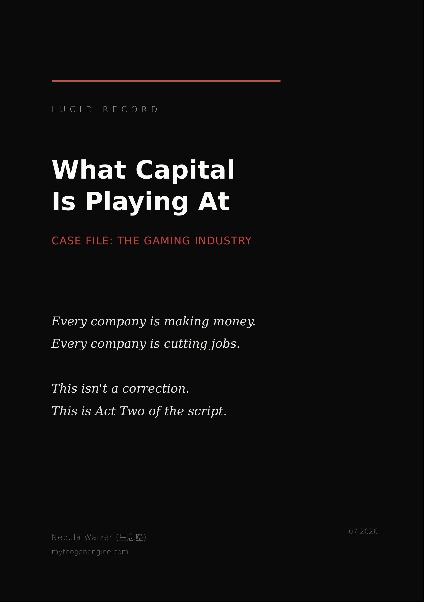

# What the Capital Game is Playing (Case Study: The Video Game Industry)

Nebula Walker · MYTHOGEN ENGINE 2026JUL09

---

:::danger[Your Industry Is Only More Hidden, More Brutal]

This article uses the video game industry as its case study — not because it's the worst hit. **Quite the opposite.**

The video game industry is the only dismembered industry where the scars are still visible. Billions of players watch in real time, product cycles are laid bare, and every executive stock dump is screenshot-archived. Every single cut happens under the spotlight.

**But what about *your* industry?**

| | Video Games (This Case Study) | Your Industry |
|---|---|---|
| Community Oversight | Billions of players reacting in real time | Closed client relationships, NDAs |
| Product Cycle | Visible, trackable | Internal development, invisible from outside |
| Layoff News | Global media coverage | Silent restructuring, "organizational optimization" |
| Victims | Speak out, organize | Bound by non-competes, afraid of being blacklisted |
| Capital Playbook | Documented and analyzed | **Happening right now, but nobody is writing it down** |

Semiconductors, education, healthcare, finance, manufacturing — the logic of dismemberment is identical, but the walls are higher, the process crueler, and the victims more silent. Just because you can't see it doesn't mean it isn't happening; you can't see it precisely because it was designed that way.

**The video game industry is a window, not an exception.**  
This article uses that window to deconstruct the entire playbook capital is staging right now.  
When you're done reading, look back at your own industry — you'll recognize every step.

:::

---

**Author**　Nebula Walker

**Series**　Lucid Record

**Category**　Industry Analysis / Capital Structure / Tech Commentary
  
**First Edition**　July 2026

**Version**　v1.0

**License**　CC BY-NC-SA 4.0

**Website**　mythogenengine.com

---

The content of this book is based on the organization and analysis of public data. All data sources have been noted in the text. The viewpoints belong to the author's personal judgment and do not constitute investment advice.

---
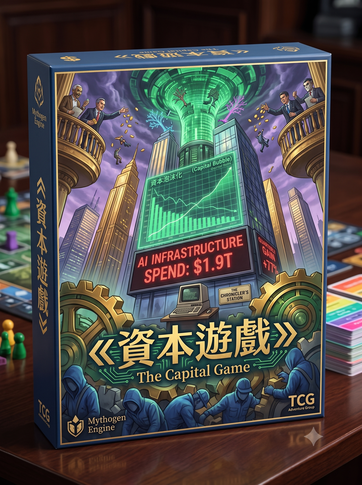

---

**Structure of this Article**

**[Act Two of the Playbook]** Layoffs in the tech industry in 2026 are no longer a correction, but a systemic operation to free up funds for the AI narrative.

**[Sony: Michelin Turned All-You-Can-Eat]** A four-step real-time record of dismemberment—changing leadership, acquiring to dilute, precision purging, and selling off to cash out. Eight studios closed; executives sold over half of their stock just two days after announcing controversial policies.

**[Xbox: Same Playbook, Different Actors]** Microsoft spent $69 billion to buy the video game industry's largest IP library, then laid off staff, flipped its strategy, and poured $190 billion into AI data centers. Yet its flagship game hasn't even implemented basic AI.

**[The Ghost of Sega]** Sega was a tragedy of exhaustion. Sony and Microsoft aren't failing to do it; they simply have no intention of doing it. The difference is: one is dying, the other is being harvested alive.

**[Tech Compradors and Cognitive Dissonance]** The most dangerous thing isn't capital itself; it's the technical people who wear the skin of capital, using the language of refactoring to extinguish any real refactoring. The Nokia era was silence driven by fear; now, it is a deliberately orchestrated disguise.

**[Where Did the $725 Billion Go?]** The big four giants saw a 77% increase in capital expenditures in 2026. The money saved from layoffs is filling the accounts for AI infrastructure. The people doing the work are driven out, while the numbers on the financial reports go up.

**[This Is Not Creative Destruction]** Past industrial revolutions plowed the fields but left the soil. Now, it's pouring cement into the soil—firing the people who innovate, and locking down the paths to innovation.

**[This Is Not a Left vs. Right Issue]** This article is not criticizing capitalism; it's criticizing capital occupying its position after it has stopped producing. At the same time, the "anti-capital" left-wing narratives and DEI political language, just like AI language, can all be used as packaging for purges. Crushed between the extremes are the people in the middle trying to get things done.

---

### Act Two of the Playbook

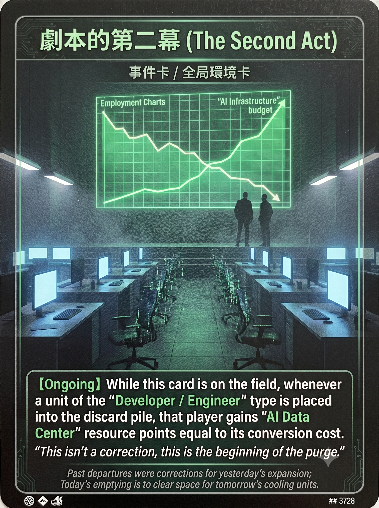

In the first half of 2026, the global tech industry laid off over 185,000 people. Across 267 companies, an average of 989 people lost their jobs every day.

This number itself is not fresh—430,000 in 2023, 240,000 in 2025. What's truly worth pausing to consider isn't the size of the number, but that the logic behind it has completely changed.

The reason for layoffs in 2023 was "we over-hired during the pandemic." That was a correction. The reason for layoffs in 2026 is "we need to invest in AI infrastructure." Oracle laid off at least 10,000 people on April 1st—the company's Slack users dropped from 165,000 to 155,000 overnight—with total estimates reaching up to 30,000. TD Cowen analysts estimated that laying off 20,000 to 30,000 people could save Oracle $10 billion. Where did the saved money go? To fill a $20 billion funding gap for AI data centers. At the same time, Oracle had just released a stellar third-quarter earnings report.

Meta laid off 8,000 people in May, with an even larger wave to follow, expecting to cut nearly 20% of its workforce for the year. Snap laid off 1,000 people, with CEO Spiegel stating that "40% of the company's new code is already generated by AI." Atlassian laid off 1,600 people. ClickUp laid off 22%, with its founder claiming to be building a "100x output organization."

Every company is making money. Every company is laying off people.

This is not a correction. This is the start of Act Two of the playbook.

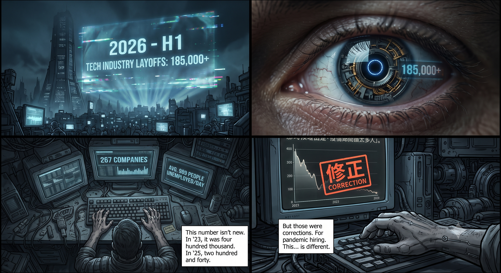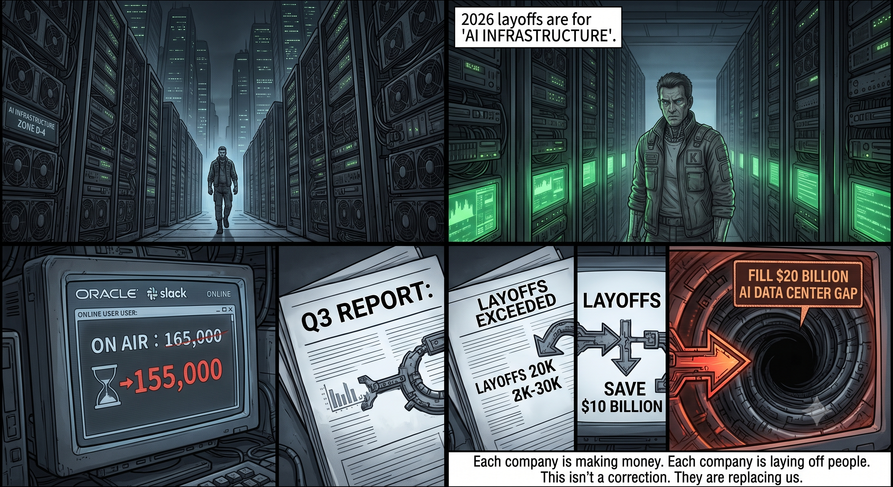
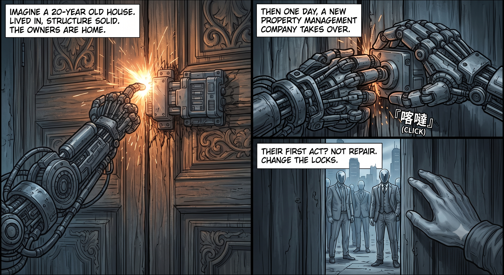
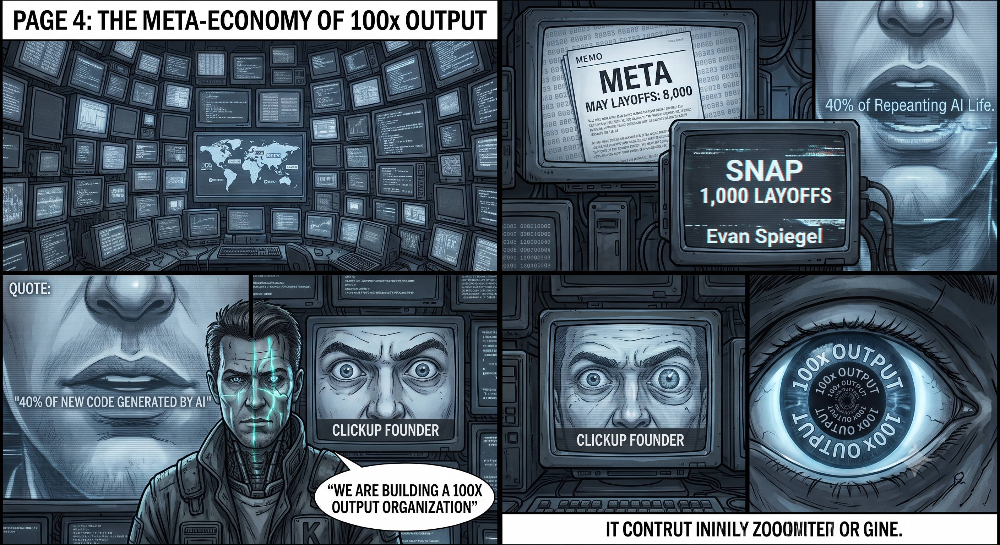
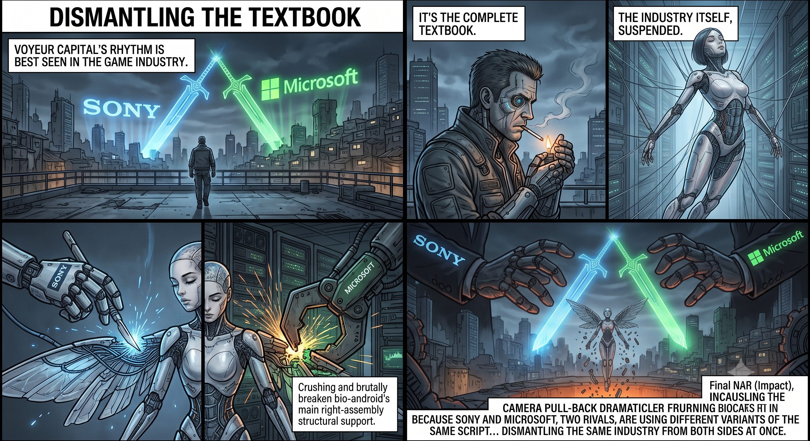

---

Imagine an old house. The owner has lived there for twenty years. Although some parts are in disrepair, the structure is solid, and every corner holds traces of being lived in. Then one day, a new property management company takes over.

The first thing they do is not repair the house; they change the locks.

To understand what capital is playing at now, you can't just look at the decisions of individual companies. You have to look at the rhythm of the entire operation. And the video game industry is currently the most complete textbook—because Sony and Microsoft, two rivals, are using different variants of the same playbook to dismantle the same industry simultaneously from both sides.

---

### Sony: Michelin Turned All-You-Can-Eat

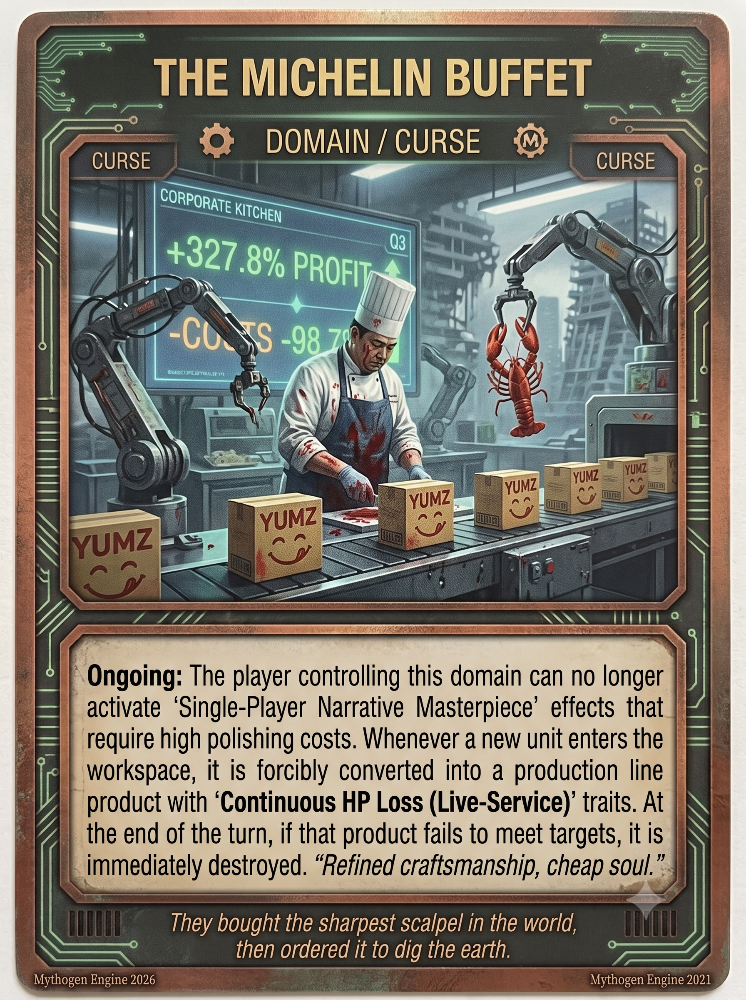

**Step One: Change Leadership.**

Not replacing regular employees, but changing those at the helm. The core condition for these new leaders isn't their nationality—it's that they have absolutely no emotional attachment to the company's existing technical accumulation, product culture, or engineering traditions. They are not here to make products; they are here to execute capital's directives.

The core strategy pushed by former Sony CEO Jim Ryan during his tenure was to release twelve first-party live-service games by 2026. PlayStation became PlayStation because of single-player narrative masterpieces like *The Last of Us*, *God of War*, and *Horizon*—games where players are willing to spend $60 for a story polished over five years. Redirecting the entire product line toward live-service is like telling a Michelin-starred restaurant: "From now on, you only do all-you-can-eat buffets."

By 2026, only two of the twelve games had been released. Among them, *Concord* was taken offline just a week after launch, with reported development costs between $200 million and $400 million.

But the cost of strategic failure didn't fall on the decision-makers. It fell on the studios.

**Step Two: Expansion and Dilution.**

Sony aggressively acquired studios between 2021 and 2023: Bluepoint Games (2021), Haven Studios (2022), Neon Koi (formerly Savage Game Studios, 2022), and Firewalk Studios (2023). The acquisition of Bungie amounted to a staggering $3.6 billion.

On the surface, this was expanding their footprint. In reality, every acquired studio was required to align with the "new direction" of live-service. Bluepoint was originally a top-tier technical team for remakes—their *Demon's Souls* remake was a PS5 launch title, and their *Shadow of the Colossus* remake is hailed as an industry benchmark. After the acquisition, they were sent to develop a live-service version of *God of War*.

This is like buying the best surgical scalpel in the world and using it to plow a field.

**Step Three: The Purge.**

In February 2024, Sony laid off 900 people globally, nearly 8% of its workforce. London Studio was shut down entirely—a studio that had operated for over twenty years, developers of *EyeToy*, *SingStar*, and *Blood & Truth*, and a core force in Sony's VR plans. In October of the same year, Firewalk Studios and Neon Koi were closed. Firewalk had been acquired just a year prior, with Sony promising to "help it grow." Neon Koi hadn't even released a single game.

In June 2025, Bend Studio laid off 30% of its full-time employees, about forty people.

In February 2026, Bluepoint Games was closed, leaving 70 people jobless. In March, Dark Outlaw Games closed—established just a year ago, without even announcing a game. In June, Bungie laid off another 400 people, roughly half of its remaining staff. The WARN notice filed with the Washington State Department of Labor listed 292 affected positions. This studio, which once boasted 1,300 employees, was left with only about 400 by mid-2026. The impairment loss Sony recorded for Bungie: $765 million.

Since the beginning of the PS5 generation, Sony has closed eight studios. Of the ten studios acquired in recent years, six have experienced layoffs or closures.

During this same period, the operating profit of Sony's gaming division for the 2024 fiscal year grew by 43%, reaching 414.8 billion yen (about $2.5 billion). PlayStation's monthly active users hit a record high: 129 million.

Profits are rising. Studios are dying. It's like how the income statement of a slaughterhouse always looks good—the only cost is that no one counts the feathers on the ground.

**Step Four: Sell-Off, Packaging, and Cashing Out.**

In January 2026, Sony announced it would sell a 51% stake in its Bravia TV and home audio-visual business to TCL for 75.4 billion yen (about $475 million). A brand that had defined "premium television" since the Trinitron era handed over control for less than half a billion dollars.

On July 1st, PlayStation announced that starting in January 2028, it would cease production of all physical discs for new games. From then on, physical boxes would only contain a download code. Former PlayStation head Shawn Layden called it a "quite dramatic decision," bluntly stating it was likely just "a decision on a spreadsheet." He had worked at PlayStation for 32 years.

Two days later—on July 3rd—Sony Group President Hiroki Totoki filed a Form 4 with the U.S. SEC: selling 225,000 shares of Sony stock at $21.02 per share, cashing out about $4.73 million, representing 56.5% of his directly held shares. On the same day, Chief Strategy Officer Toshimoto Mitomo sold 25,000 shares, roughly $520,000, representing 18% of his holdings.

Neither executive's action was a pre-arranged automatic trading plan. It was an active, open-market sale.

Announce a policy you know will infuriate consumers, then sell more than half your stock during the brief window of a slight price bump. A comment under an Unwire article put it most directly: "Smashing it to pieces before leaving."

Sony's latest 20-F annual report filed with the SEC included three changes. First, a new paragraph on AI strategy was added: "Sony is leveraging AI to unleash the creativity of its studios and further elevate the PlayStation experience." Second, the sentence about "continuing to deploy first-party games to PC and other platforms" was deleted. Third, "sustainable and profitable commercial growth" was changed to simply "commercial growth"—the word *profitable* was removed.

Financial reports are written for Wall Street. Games are written for players. When the two conflict, capital will unhesitatingly choose the former.

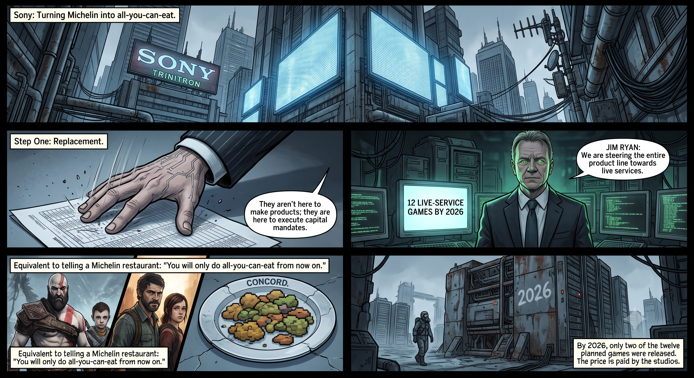

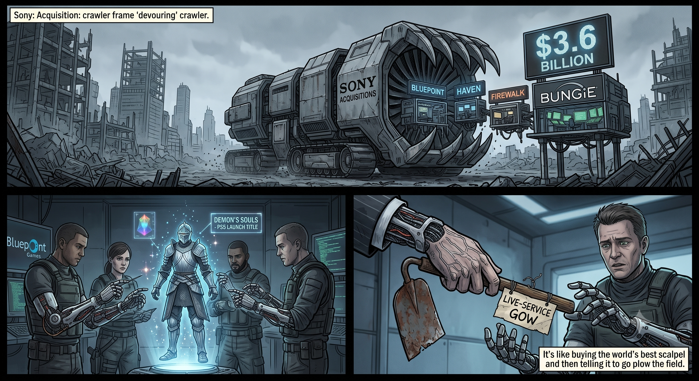

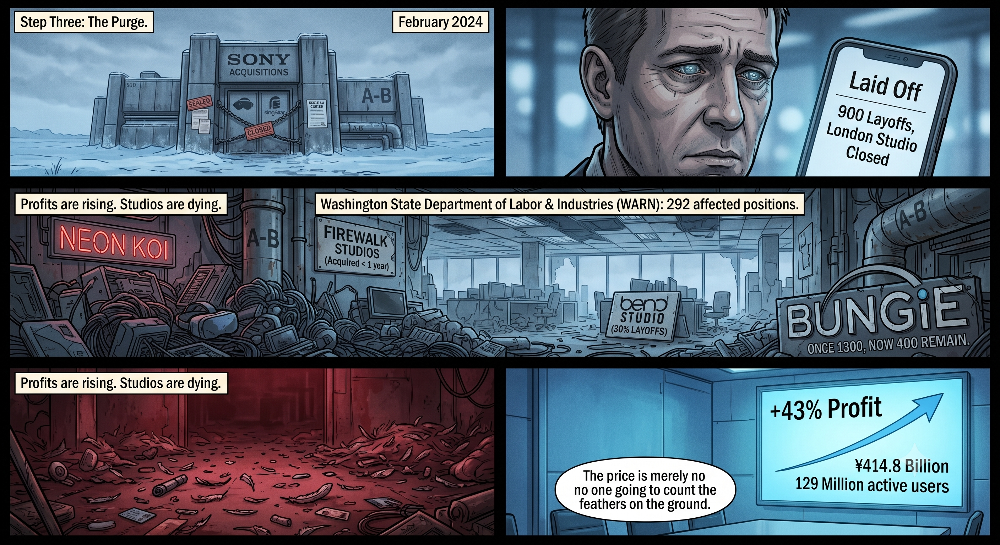

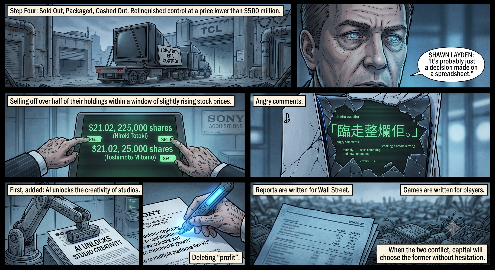

---

### Xbox: Same Playbook, Different Actors

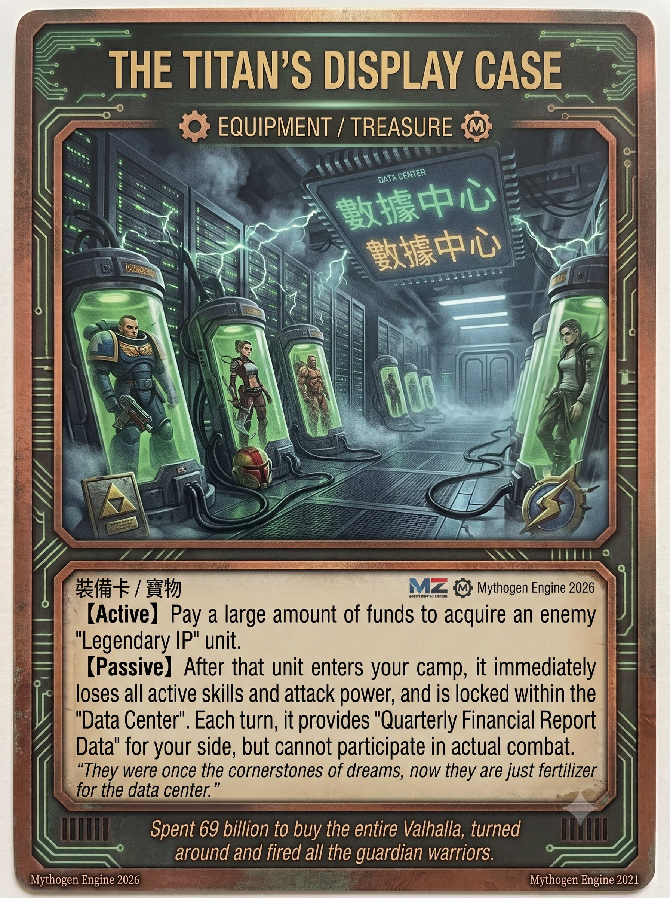

If Sony's maneuver is "turning a Michelin restaurant into an all-you-can-eat buffet," what Microsoft is doing with Xbox is even more straightforward: tearing down the whole restaurant, tables, chairs, kitchen and all, and keeping the plot of land waiting for it to appreciate in value.

In October 2023, Microsoft completed its $69 billion acquisition of Activision Blizzard—the largest transaction in the history of the video game industry. Three months later, in January 2024, Microsoft Gaming laid off 1,900 people. Then came the closures of Arkane Austin, Tango Gameworks, and Alpha Dog. In early 2026, Phil Spencer stepped down, and the new head of Xbox Game Studios, Asha Sharma, took over, simultaneously laying off another 580 people, primarily cutting marketing and multi-platform porting teams.

They spent $69 billion to buy *Call of Duty*, *World of Warcraft*, and Blizzard's entire IP lineup. Then they started firing the people who make games.

Meanwhile, Xbox's exclusivity strategy underwent a 180-degree flip over two years. In early 2024, they insisted exclusivity was their core strategy; by 2025, *Halo*, *Forza*, and *Sea of Thieves* were released on PlayStation and Switch; in early 2026, *Fable* and *Kiln* were confirmed for day-one simultaneous release on PS5. Then, in July 2026, Bloomberg reported that Microsoft had fully flipped back, announcing that all future first-party blockbusters would return to Xbox exclusivity. Internal data showed that every day-one multi-platform release eroded about 18% of the Xbox console attach rate, and failed to bring the expected growth in Game Pass subscriptions.

This is not strategic vacillation. This is capital testing which narrative can better prop up its valuation.

Someone on NeoGAF drew an eerily accurate generational parallel between the decline of Xbox and Sega: Xbox = Master System, Xbox 360 = Mega Drive, Xbox One = Saturn, Xbox Series X = Dreamcast. The parallel is chilling. But the real difference is: Sega was a video game company; it died because it couldn't beat PlayStation. Microsoft is a productivity software company; Xbox was never built to make games from day one—it was meant to occupy a place in the living room, a tool to extend the Windows ecosystem into the consumer market.

Before stepping down, Phil Spencer himself responded to the Sega comparison by saying, "I get it."

When a productivity software company spends $69 billion to buy the largest IP library in the video game industry, fires the making the games, flips its exclusivity strategy twice in two years, and then promises in 2026 to spend $190 billion building AI data centers—it's hard not to ask: Was that $69 billion an investment in games, or an investment in a number to put on an annual report?

*Forza Horizon 6* is the answer. If Microsoft had truly invested any fraction of that $190 billion AI capital expenditure into gaming—even one ten-thousandth—its flagship racing game wouldn't still be using rubber-band AI. A company spending $190 billion on AI infrastructure can't manage a feature that "suggests suspension settings based on your driving style." It's not that the technology can't do it; it's that absolutely no one intends to do it.

So where did that $190 billion go? It went onto the PowerPoint slides for investor presentations.

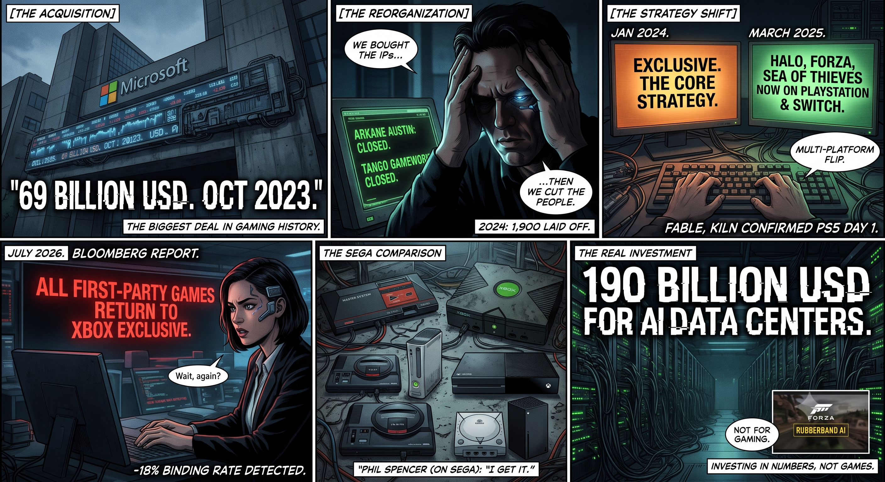

---

### The Ghost of Sega

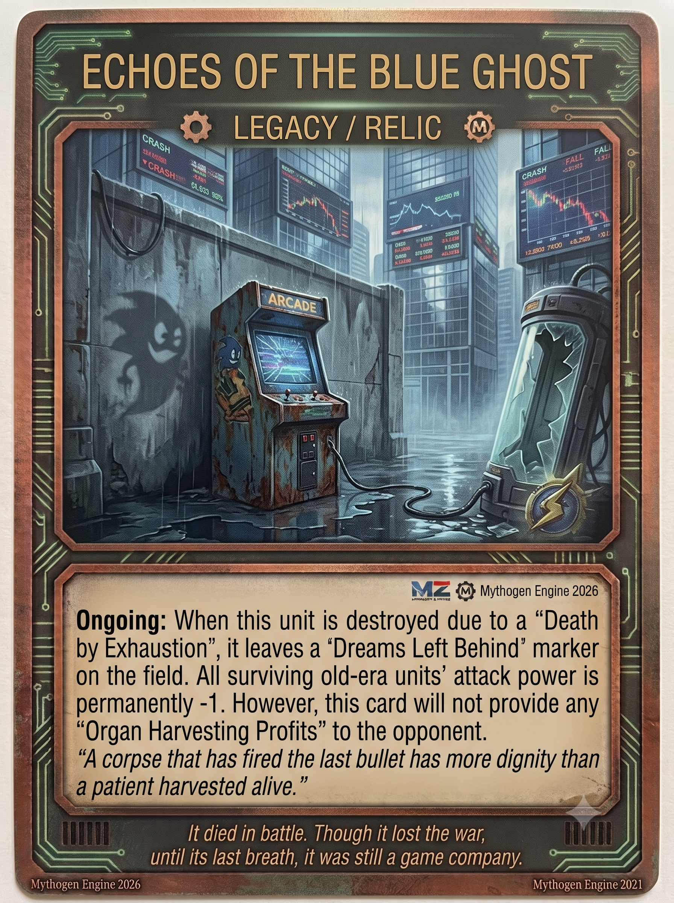

It's worth pausing here to take a look at Sega.

In 1991, the Sega Genesis held over 60% of the console market in North America. Ten years later, on January 31, 2001, Sega announced the discontinuation of the Dreamcast, exiting the hardware business. What happened in between? The Sega CD failed, the 32X failed, the Saturn failed—each step wasn't due to a lack of technology, but internal factional infighting, strategic wavering, and continuous self-harm. By the time the Dreamcast launched, it was genuinely a technological pioneer—the first console with built-in internet connectivity—but consumers no longer trusted Sega.

The Dreamcast only sold 9.1 million units worldwide. The PlayStation 2 went on to become the best-selling console in history.

Afterward, Sega was acquired by Sammy, a pachinko machine manufacturer. A company that once stood toe-to-toe with Nintendo ended up in pachinko parlors.

Sega's death was a self-inflicted tragedy. But at least when it died, it was still a game company—it truly wanted to make the Dreamcast succeed, it just couldn't.

Today's Sony and Microsoft are different. It's not that they can't do it. It's that they don't intend to.

Sony has closed eight studios, yet profits hit a record high. Microsoft spent $69 billion buying IP, then laid off staff. Executives on both sides are cashing out. The product is no longer the goal; it's a prop—an illustration for the "Our Gaming Ecosystem" section in the annual report.

Sega was, at the very least, a tragedy. What is happening now feels more like a carefully planned organ harvesting. The patient still has a heartbeat, but the kidneys have already been extracted and sold, while the sign outside the operating room reads, "An entirely new AI-driven medical experience."

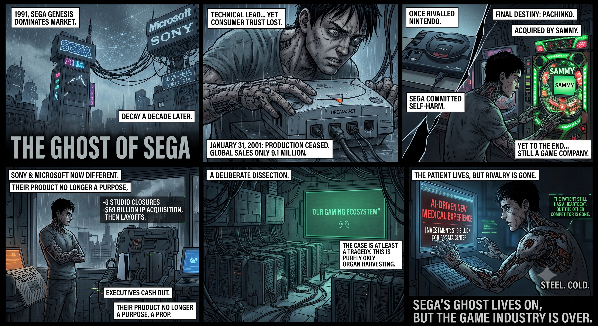

---

### Tech Compradors and Cognitive Dissonance

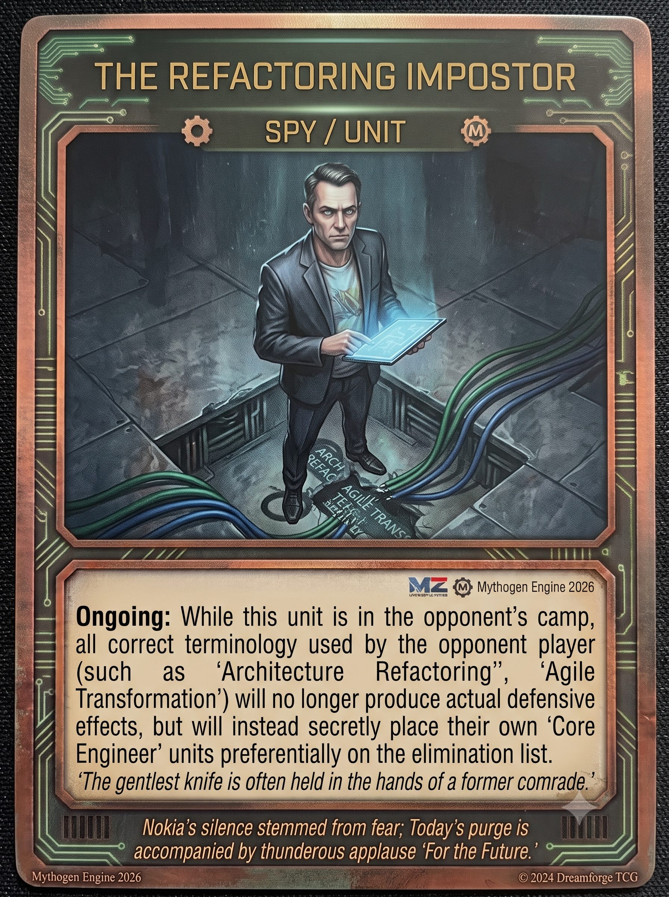

But if the story stopped here, this article would be no different from any other generic "capital is evil" complaint.

What we truly need to see clearly is the most insidious, hard-to-detect, and destructive link in this entire operation: **Throughout this process, a large number of people who originally possessed technical skills will abandon their craft, betray their ideals, and actively align themselves with capital.**

Let's make an analogy. There's an old doctor in a neighborhood; everyone goes to him when they're sick. One day, a corporate medical group buys the clinic. If the group sends a guy in a suit to announce, "From now on, we prescribe the cheapest over-the-counter medicine for colds, and we only spend three minutes per patient," the whole street would riot. But what if the person making the announcement is the old doctor himself? "I've practiced medicine for thirty years, and in my professional judgment, this new direction is the right one." — You would hesitate.

You hesitate not because you are foolish, but because you trust him. And what capital buys is precisely that trust.

In the tech industry, these people aren't corporate parachutists from finance. They are your former colleagues, your seniors, people you once wrote code with. After putting on the skin of capital, they use the most professional technical jargon—"agile transformation," "architectural refactoring," "AI-driven development"—to package every decision. This skin creates an illusion for outsiders and employees alike, making them believe the company is genuinely undertaking a technological upgrade.

And this is the most toxic part of the entire operation. It doesn't crush you with violence; it relies on creating cognitive dissonance to make you doubt yourself.

---

Speaking of cognitive dissonance, it's necessary to make an important distinction. Because the current version of this dissonance is not a difference in degree from past versions; it is a difference in nature.

The problem during the Nokia era was a culture of fear. A 2015 study by Quy Huy from INSEAD and Timo Vuori from Aalto University (published in *Administrative Science Quarterly*) interviewed over seventy former Nokia executives and engineers. The conclusion was: Nokia didn't die from a lack of technology; it died from "collective fear." Top management feared external competition, middle management feared top management; middle management systematically reported good news while hiding the bad, and top management made decisions based on distorted information. Frontline engineers knew early on that Symbian needed a complete refactoring, but middle management, trying to save their jobs, forced engineers to patch things up and deliver.

That was fear. At least it was an overt threat—people knew the truth, they just didn't dare say it. The problem lay in the communication channels, which, at least theoretically, could be fixed.

The current operation operates on a level far above a culture of fear.

Now, it's no longer "too afraid to refactor." Now, it is **deliberately appointing people who will not truly refactor, having them march under the banner of refactoring, while actively doing things that prevent refactoring from happening.**

The logic is simple: a true architectural refactoring means admitting that the existing system has deep-seated problems (which looks bad on financial reports), means no new features will be produced in the short term (KPIs won't be met), and means retaining the people who understand the underlying architecture best (who are often the most "disobedient" ones). None of this aligns with the needs of capital.

What capital needs is: pretty financial reports, smooth layoffs, and a cohesive narrative.

So the people capital brings in are those who know how to use the word "refactoring" but will never actually do it. They know how to draw beautiful architecture migration diagrams on PowerPoint, they know how to say things in all-hands meetings that leave engineers half-convinced, and they know how to prioritize those who ask, "How will the low-level IO be handled in the new architecture?" on the layoff lists.

This is like hiring a nutritionist not to improve your health, but to make you *look* healthy on your medical exam—while secretly selling your kidneys.

At Nokia, middle management hid problems out of fear. Now, management actively uses the language of refactoring to extinguish the possibility of refactoring. One is passive silence; the other is active disguise. The outcome is the same—technical debt piles up, those who apply patches stay, and those who point out problems are ousted—but the latter is much harder to expose. Because all the right words are being used, and all the right things appear to be executed.

Until finally, those who won't refactor successfully use the slogan of refactoring to destroy any room for actual refactoring.

"Am I just too old-school? Do I really not understand new technology?" — When you start asking yourself these questions, you have already given up resistance. You become numb, begin to think, "Maybe times really have changed," and quietly watch the people around you get "organizationally restructured" one by one, until it's your turn.

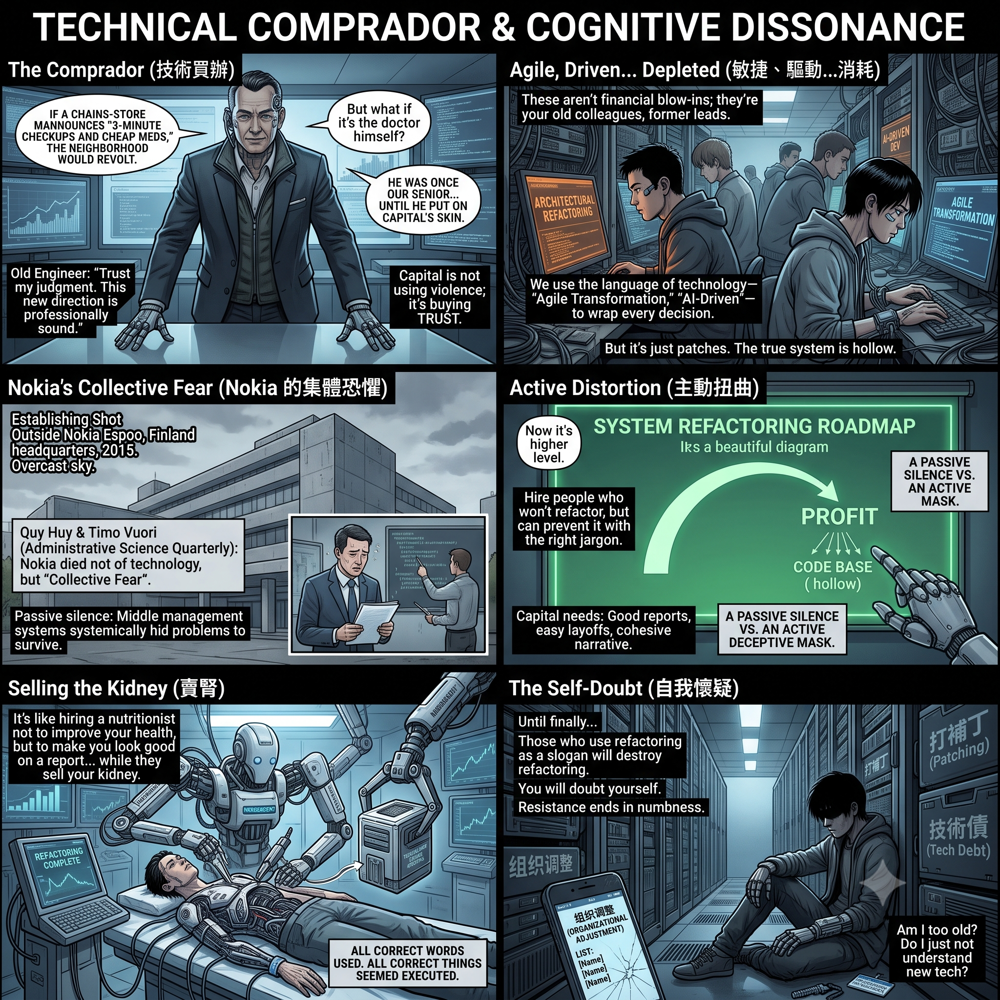

---

### Where Did the $725 Billion Go?

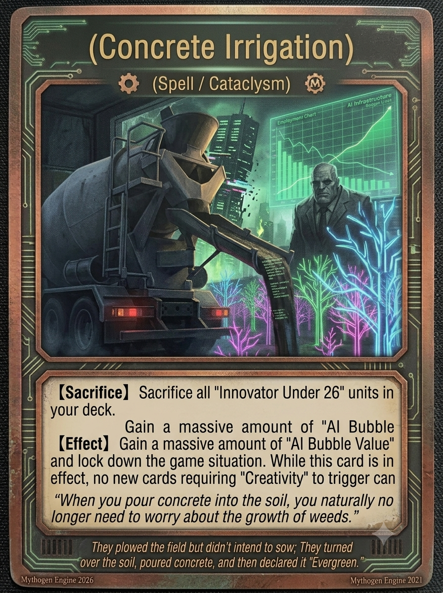

Zoom out and look at the bigger picture.

The four major tech giants—Amazon, Microsoft, Alphabet, and Meta—have projected capital expenditures totaling approximately $725 billion in 2026, a 77% increase from $410 billion in 2025. Breaking it down: Amazon $200 billion (the day CEO Jassy announced this, the stock plunged 11%, dropping for nine consecutive trading days, evaporating over $450 billion in market value—a reporter from *The Register* sarcastically noted, "You just misplaced the GDP of Croatia"), Microsoft $190 billion (of which $25 billion is purely from the rising prices of memory and GPUs), Alphabet $175 billion to $185 billion, and Meta $125 billion to $145 billion.

Almost all of this is flowing into AI data centers, AI chips, and AI infrastructure. Internal documents from multiple companies state explicitly: the money saved from layoffs is meant to offset the costs of AI investments. Amazon announced its $200 billion capital expenditure plan at the same time it laid off 16,000 corporate employees in January 2026. Data from Stanford HAI shows that the employment rate for software engineers under 26 has plummeted by nearly 20% since 2024.

The global video game industry generated nearly $195.6 billion in revenue in 2025, the highest in history. At the same time, the GDC 2026 survey showed that one-third of American game developers had been laid off within the past two years. 62% of industry professionals expressed interest in unionizing.

Revenues are up. The people doing the work are being driven out. The money saved is buying the props for the next narrative.

It’s like a theater where the seats are full and the box office is breaking records, but backstage, the actors are being replaced one by one with cardboard cutouts. The audience in the front row hasn't noticed yet because the lights are bright and the music is loud.

---

### This Is Not Creative Destruction

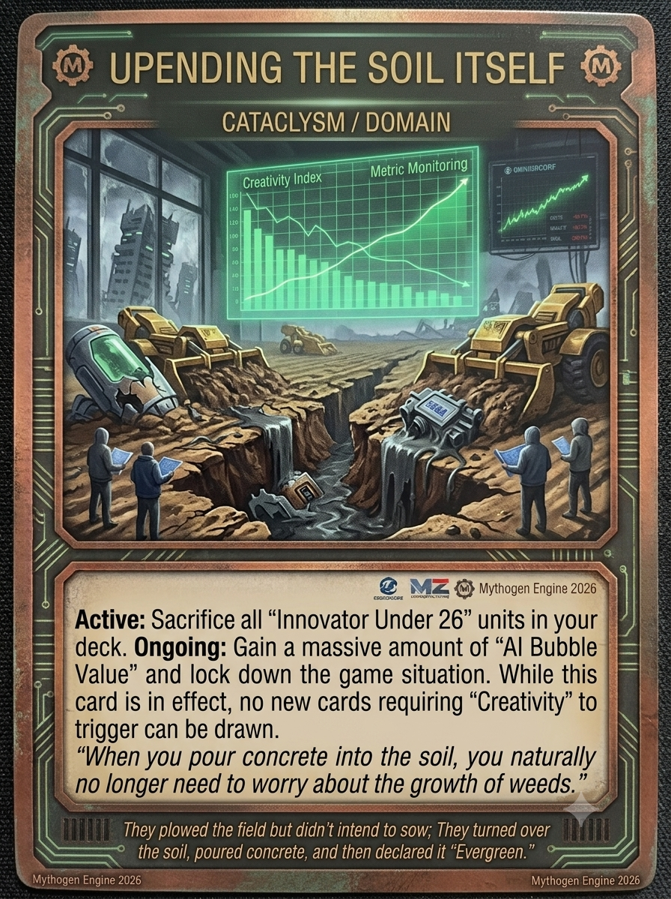

Some might say: "Isn't this just creative destruction? Out with the old, in with the new."

No.

Past industrial revolutions were indeed destructive, but they simultaneously cultivated new spaces for creation. The power loom replaced hand weaving, but it birthed mechanical engineering. The steam engine rendered human labor obsolete in certain sectors, but it opened up railways and shipbuilding. The old fields were plowed, but the soil remained; new seeds could take root.

Now, they are not plowing the fields. They are digging up the soil itself.

R&D teams are cut, independent studios are bought and hollowed out, the people building low-level engines are replaced by those monitoring metrics. It's not that Bluepoint's technical capability wasn't good enough—Sony itself admitted they were a "highly skilled team"—but these capabilities simply don't have a corresponding column in capital's ledger. Sega at least died from exhaustion; Bluepoint had its organs harvested while still healthy.

Beyond the cut of layoffs, there is a second cut: blocking future creators through closed-source models and platform lock-in. Microsoft's ASD technology is a textbook example—they created shader compilation problems with DX12, returned a decade later to "solve" it, but tied the solution exclusively to their own store and cloud. Light the fire first, then sell the fire extinguisher, but only sell the extinguisher to tenants living in your own building. Sony deleting its commitment to multi-platform PC releases in its SEC annual report, announcing full digitalization, and having executives cash out—is essentially the same operation: narrow the ecosystem, lock in users, and take the money before the exits are completely sealed.

One blade cuts the people innovating today. The second blade locks down the path for future innovation. When both blades fall, it's not plowing the field; it's pouring cement into the soil.

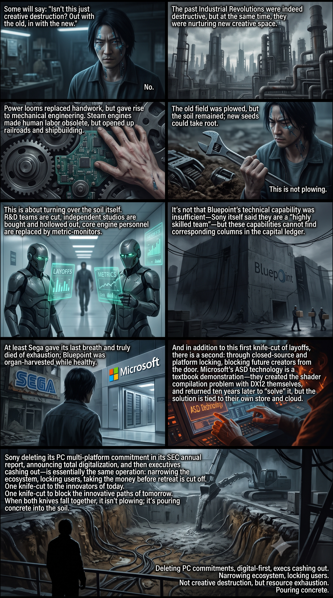

---

### This Is Not a Left vs. Right Issue

At this point, it's necessary to clarify something, as some readers might have already begun categorizing this article.

This article does not critique capitalism. Quite the contrary—a true market economy requires capital to take risks, invest in production, and create value. When a company spends ten years polishing a game and sells it for $60, and players find it worthwhile, that is the market at work. When capital focuses only on financial statements rather than products, it betrays not just labor, but the market itself.

However, what we also need to be wary of is the language that appears antithetical to capital, but is actually weaponized by it.

Within capital's playbook, there is a layer even more covert than the tech comprador: political language. And the scale at which this political language is being deployed is far more massive than most people realize.

Following the George Floyd events in 2020, American corporations launched a massive DEI (Diversity, Equity, and Inclusion) movement. Hiring for DEI roles surged 123% within a year. Google pledged to increase underrepresented groups in leadership by 30% before 2025. Meta set goals to expand the proportion of Black and Latino employees. Amazon announced a "comprehensive overhaul." Walmart established a $100 million "Center for Racial Equity." Almost every major corporation formed DEI teams, expanded HR departments, and hired Chief Diversity Officers.

And then?

Then, all these companies initiated massive layoffs—and DEI teams and HR departments were often the first to go. Data from Revelio Labs indicated an attrition rate of 33% for DEI roles, far higher than the 21% for non-DEI roles. A Bloomberg analysis found that among the employees laid off by 84 major companies in 2023, 26% were Black—nearly double their representation in the overall workforce.

And then, starting in the latter half of 2024, these companies began dismantling the DEI policies themselves—not because they "woke up," but because the political winds changed, and the DEI banner was no longer the most useful wrapping paper. A list maintained by Forbes documented the entire process, and its scale is staggering:

In tech: Meta eliminated its entire DEI team and stopped requiring diversity from suppliers. Google scrapped diversity hiring goals, ceased marking cultural events like Pride Month, and the word "diversity," mentioned eight times in its 2024 annual report, disappeared entirely. Amazon removed all paragraphs related to "inclusion and diversity" from its 2024 annual report. Microsoft laid off its entire DEI department on July 1, 2024, with the head sending an internal email that same day calling the move "purposeful and strategic." Tesla, GameStop, Workday, and Salesforce quietly scrubbed all DEI-related text from their 10-K filings.

In traditional industries: Walmart ended its $100 million Center for Racial Equity, stopped sponsoring Pride Month, and banned third-party sellers from offering certain LGBTQ merchandise. Boeing disbanded its entire DEI department while simultaneously laying off 10% of its workforce. Ford, Lowe's, Harley-Davidson, John Deere, Tractor Supply, Molson Coors, and Toyota all announced the scaling back or termination of DEI programs. McDonald's scrapped diverse representation goals and renamed its "Diversity Team" the "Global Inclusion Team." Target slashed its DEI initiatives, sparking consumer boycotts.

In finance: Goldman Sachs removed the requirement that corporate boards of companies going public must include women and people of color. JPMorgan and Morgan Stanley drastically reduced DEI-related wording in their annual reports. Accenture announced it would no longer use diversity targets to guide hiring and promotions.

Research by the Conference Board showed: the frequency of the term DEI appearing in the annual reports of S&P 500 companies dropped from an average of 12.5 times in 2020 to just 4 times in 2024. NPR reported that over a dozen major corporations—including Pepsi, GM, Disney, GE, Intel, PayPal, Chipotle, and Comcast—massively cut or completely removed DEI-related text in their 2024 annual reports. GM simply deleted all instances of the word "diversity." Pepsi removed almost everything—just a year prior, it had written in its annual report that DEI was a "competitive advantage."

Dell is the most naked microcosm of this pattern: laying off 10% of its workforce for three consecutive fiscal years—13,000 in FY2024, 12,000 in FY2025, 11,000 in FY2026—cutting 36,000 jobs in three years, nearly 30% of its total headcount. During this exact time, it was one of the few companies that publicly "reaffirmed its DEI commitment." The layoff report and the DEI statement were written into the exact same financial report.

The point is not whether DEI itself is good or bad. The point lies in a much colder truth: **For capital, any political language—whether from the left or the right—serves exactly the same function: to make purges unquestionable.**

To put it bluntly, it's a two-hit combo: the first cut uses DEI to wash out the old guard, and the second cut fires the DEI teams themselves. Both groups thought they were valued, but both were ultimately expendable.

From 2020 to 2023, the banner was "Diversity and Inclusion." Under the guise of "diversity," HR and administrative teams were expanded to dilute the influence of the technical core. You couldn't object, because objecting meant you were "not inclusive."

From 2024 to 2026, the banner shifted to "AI Transformation." Under the guise of "embracing AI," all non-core departments, including DEI teams, were laid off. You couldn't object, because objecting meant you were "not embracing the future."

The banners change, but the blade is the same. The hand wielding it has never switched.

Therefore, left-wing narratives whose profession is "anti-capital" often do the exact same thing: replacing analysis with righteous language, replacing facts with stance, replacing structural deconstruction with moral judgment. The result equally creates cognitive dissonance, just in the opposite direction. The extreme right devours everything with profit maximization; the extreme left devours everything with moral correctness. Neither side cares about the people actually doing the work.

This article has no intention of taking a side. Both left and right have veered into extremes, and those getting crushed in the middle have always been the people who just want to get the job done right.

This article only does one thing: it records what is happening.

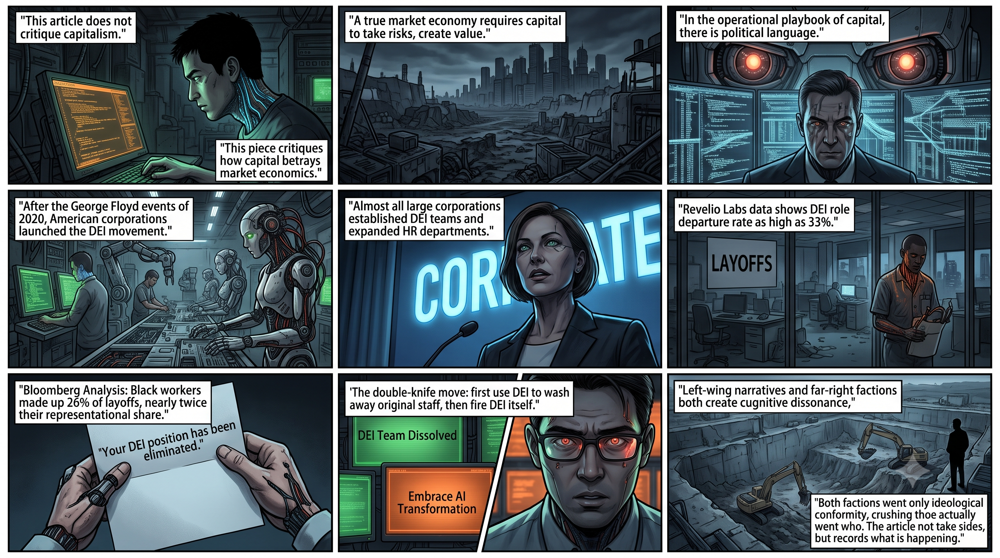

---

### So, What is Capital Playing At?

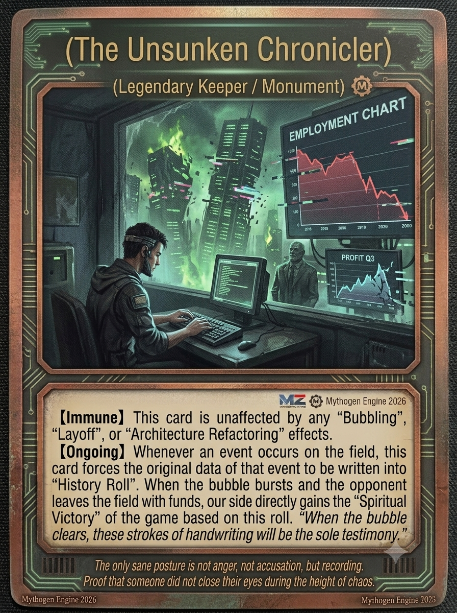

It is playing an unprecedented game of asset stripping. Using the AI narrative as packaging, using layoffs as the surgery, using closed-source as the walled garden, and using tech compradors as white gloves. The goal has never been to make the technology better; it is to make the financial reports better. Once the reports look good enough to cash out, capital takes the money and leaves, leaving behind a floor full of shattered glass. Sony and Microsoft look like competitors, but they are actually Side A and Side B of the same playbook—one liquidating studios, the other hoarding IP and laying off staff—and the people being crushed in the middle are the exact same group of game developers.

The most sophisticated part is that the language of refactoring is used to extinguish the possibility of refactoring. This makes it almost impossible for those on the inside to discern what is actually happening—because every correct word is being spoken, every correct motion is being performed, only the direction is completely reversed.

It's not that nobody sees it. The problem is that most of the people who saw it have already been driven out, those still inside are slowly being ground down by cognitive dissonance, and the people on the outside only see the numbers on the financial reports and the AI visions in the press releases.

And while all this is happening, the president of Sony just sold over half his stock.

The only sober posture is not anger, not accusation, but recording.

Write down what is happening exactly as it happens. When their stories finish and the bubble bursts, these records will be the only proof—proof that during the most chaotic times, someone kept their eyes open.

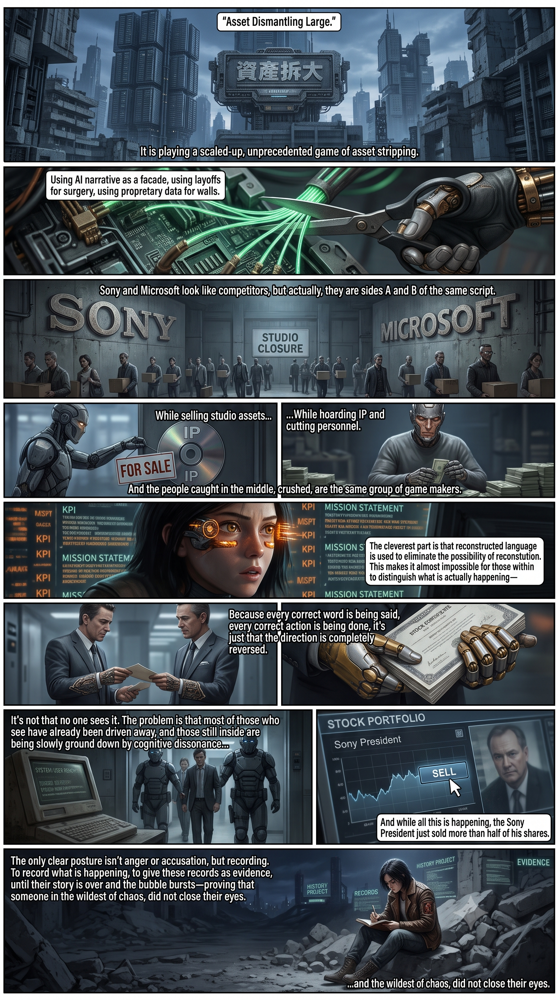

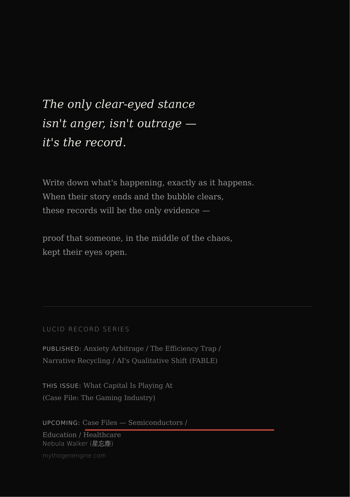