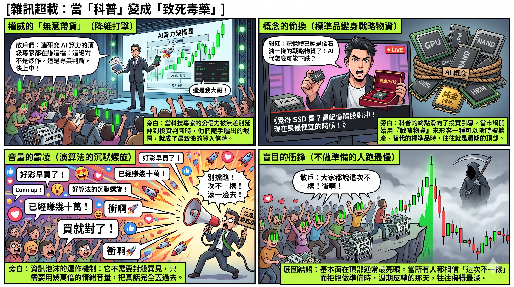
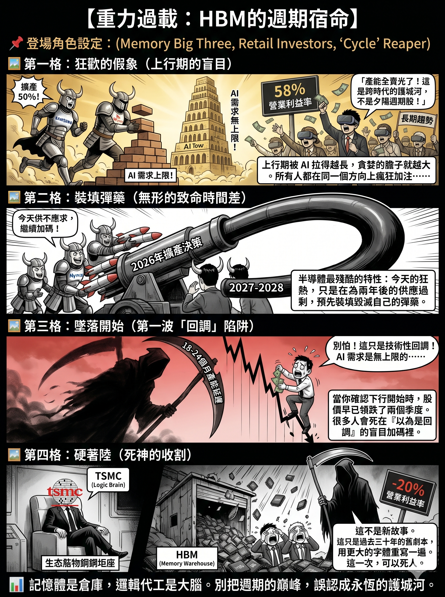

# HBM 不是下一個台積電：內存與邏輯晶片的結構性鴻溝
作者：星忘塵 Nebula Walker
Date: 26 MAY 2026
創象引擎 Mythogen Engine

## 引言：一句被反覆傳頌的錯誤類比

2025 年以來，隨著 AI 基礎建設進入爆發期，高頻寬內存（High Bandwidth Memory，HBM）成為半導體市場上最炙手可熱的名詞。SK Hynix 股價屢創新高，Samsung 急起直追，Micron 宣布退出消費級內存市場全力押注 AI 數據中心。市場上開始出現一種極具感染力的敘事：「HBM 就是下一個台積電。」

這句話聽起來順耳，卻經不起拆解。它混淆了兩種截然不同的商業模式、兩種完全不同的護城河結構，以及兩種在地緣政治棋盤上佔據不同位置的產業角色。

本文的目的，不是否定 HBM 的技術價值或短期投資潛力，而是從產業結構的底層邏輯出發，說明為什麼內存——即便是技術含量極高的 HBM——在商業本質上永遠不可能成為「下一個台積電」。

---

## 第一層：商業模式的根本差異——代工服務 vs. 大宗標準品

### 台積電賣的是什麼？

台積電（TSMC）是全球最大的純晶圓代工廠（Pure-Play Foundry）。它不設計晶片，只負責製造。但這個「只負責製造」的定位，恰恰構成了它最深的護城河。

每一顆在台積電生產的晶片——無論是 Apple 的 A 系列處理器、NVIDIA 的 H200 / B200 GPU、還是 AMD 的 EPYC 伺服器處理器——都是客戶自行設計的專屬產品。台積電提供的是「異質性服務」：針對不同客戶的不同設計，在極端精密的製程節點上實現量產。客戶與台積電之間的關係是深層綁定的：一旦某款晶片在台積電的 3 奈米或 2 奈米製程上完成設計定案（tape-out），要轉移到其他代工廠，幾乎等同於從零開始。

這種綁定的結果，體現在台積電的財務數據上。2025 全年，台積電營收達 1,224 億美元，毛利率 59.9%，營業利益率 50.8%。到了 2026 年第一季，毛利率進一步攀升至 66.2%，營業利益率達 58.1%。第二季的指引更預告毛利率將達到 65.5% 至 67.5%。這不是週期性的高峰，而是結構性的定價權——當你的客戶離不開你，你就擁有持續提價的能力。

### 內存賣的是什麼？

內存，包括傳統 DRAM 與 HBM，本質上是「標準品」（Commodity）。它的規格由國際標準組織 JEDEC 統一定義。2025 年 4 月，JEDEC 正式發布了 HBM4 標準（JESD270-4），規範了介面寬度（2,048-bit）、傳輸速率（最高 8 Gb/s）、堆疊配置（4/8/12/16 層）、電壓範圍等關鍵參數。換言之，只要任何一家內存廠商能夠按照這套規格生產出達標的產品，它在功能上就是可以互換的。

這並不是說 HBM 沒有技術門檻。矽穿孔（TSV）堆疊、微凸塊（micro-bump）連接、散熱管理、良率控制——這些都是極其困難的工程挑戰。但關鍵在於：這些挑戰是「工程執行層面」的，而非「架構層面」的。一旦競爭對手在工程上追上，產品就變成了規格達標的標準品，客戶就有了切換供應商的能力與動機。

這正是內存行業與邏輯晶片代工最根本的分野：台積電的客戶走不掉，因為他們的設計是為台積電的製程量身打造的；內存廠的客戶可以走，因為他們買的是達標的標準規格產品。

---

## 第二層：歷史不會騙人——內存行業的週期宿命

### 「超級週期」的幻覺

每一次內存價格暴漲，市場都會出現「這次不一樣」的聲音。2017 至 2018 年，DRAM 價格飆升，業界稱之為「超級週期」（Supercycle），宣稱智慧手機、雲端運算的結構性需求將打破傳統的漲跌循環。結果到了 2019 年，需求成長放緩，庫存堆積，ASP（平均售價）全面崩盤。Micron 當年的 DRAM 平均單位售價較 2018 年下跌 30%，每股盈餘暴跌 84%。

2022 年，內存再次進入嚴重衰退。庫存膨脹、價格跌至谷底、廠商大幅虧損。SK Hynix 在 2023 年第三季的營業利益率為負 20%。

然後 AI 來了。HBM 需求爆發，DRAM 價格在 2025 年第四季較一年前幾乎漲了三倍。SK Hynix 2025 全年營業利益率飆升至 49%，第四季更達到 58%。市場再次高喊：「這次真的不一樣。」

但從產業結構來看，驅動這個循環的底層機制從未改變。內存行業的宿命在於：價格高漲時，廠商必然擴產；擴產的產能在 18 至 24 個月後上線時，如果需求增速無法匹配，就會再次出現供過於求。而且，一旦產能建成，巨額的固定成本使廠商無法輕易停產，只能以更低的價格搶佔市場份額，進一步加速價格下跌。

目前三大內存廠商都在大舉擴產。Samsung 計劃 2026 年將 HBM 產能提高約 50%，平澤 P5 廠預計 2028 年投產。SK Hynix 的 M15X 廠預計 2027 年中啟用，基礎設施投資規模擴大至原計劃的四倍以上。TechInsights 預測，內存行業最快可能在 2027 年再次進入下行週期。

將這個圖景與台積電對比：台積電的客戶在排隊等產能，台積電擁有主動提價的議價權，毛利率逐季攀升。內存廠商則是在週期高點拼命擴產，等著在下一個低谷互相廝殺。這是兩種完全不同的商業生態。

---

## 第三層：最強反論——「AI 需求無限大，再多產能都不夠」

這是目前市場上為 HBM 辯護最有力的論點，也是最需要認真拆解的一個。它不是錯的——它是對了一半。

當前的現實確實是供不應求。三大廠的 HBM 產能在 2026 年全部售罄。NVIDIA 甚至削減消費級 GPU 產量（RTX 50 系列上半年減產 30-40%），將內存產能優先分配給 AI 數據中心。SK Hynix 預計 2025 年 HBM 出貨量較上年翻倍。AI 預計將在 2026 年消耗全球近 20% 的 DRAM 晶圓產能（以 HBM 的四倍晶圓消耗量換算）。這些都是事實。

但「現在買不夠」不等於「永遠買不夠」。要讓「需求永遠大於供給」的邏輯成立，你需要以下幾個條件同時且持續為真：

第一，Big Tech 的 AI 資本開支必須維持目前的增速。Meta、Google、Microsoft、Amazon 在 2024-2025 年的資本開支合計已經達到天文數字。但這些公司的管理層遲早要向股東交代 AI 投資的回報率。一旦 AI 的商業化變現速度跟不上基建投入的速度——不是說 AI 沒用，而是「回報沒有快到能 justify 這個燒錢速度」——資本開支就會放緩。不需要停，只要增速放緩，HBM 的供需關係就會鬆動。

第二，AI 模型的內存效率不能顯著提升。但事實上，整個行業都在往「用更少內存做更多事」的方向努力——模型壓縮、量化（Quantization）、稀疏化（Sparsity）、混合精度推理。如果下一代模型在同等性能下只需要一半的 HBM，需求增長的斜率就會被技術進步壓平。

第三，沒有替代架構出現。目前所有主流 AI 加速器都依賴 HBM，但這不代表永遠如此。Processing-in-Memory、CXL 內存池化、甚至光子計算等技術方向都在嘗試繞過 HBM 的瓶頸。這些短期內不會成熟，但它們的存在本身就說明 HBM 的「不可替代性」是有時間窗口的。

更根本的問題是：即使需求真的持續爆發，「供不應求」也不會永遠保護內存廠的利潤率。因為「供不應求」觸發的廠商行為就是瘋狂擴產——而這正是我們眼前正在發生的事。Samsung 產能加 50%，SK Hynix 基建投資翻四倍，Micron 退出消費市場全倉押注。所有人都在同一個方向上加注，加注的幅度遠超以往任何一個週期。當這些產能在 18 到 24 個月後集中上線，只要需求增速稍有放緩，供需關係就會在極短時間內反轉。

所以這個反論的正確版本應該是：「AI 需求延長了這一輪 HBM 上行週期的持續時間。」這是對的。AI 可能讓這個週期比以往任何一次都長——從通常的 2-3 年延長到 4-5 年。但「延長」和「消除」是兩回事。它推遲了週期轉折點的到來，但沒有廢除週期本身的運作機制。而台積電的定價權不依賴於週期。無論 AI 需求是暴漲還是放緩，客戶的晶片設計都綁定在台積電的製程上。這就是結構性護城河和週期性順風之間的本質區別。

---

## 第四層：地緣政治的棋盤位置——大腦與倉庫的戰略落差

### 美國制裁的重心在哪裡？

觀察美國自 2022 年 10 月以來對中國的半導體出口管制，可以清楚看到一個優先順序。

管制的核心打擊對象是邏輯晶片及其製造生態系統。BIS（美國商務部工業安全局）的管制範圍涵蓋：先進邏輯 IC（16/14 奈米以下的非平面電晶體架構）、GPU 和 AI 加速器（以總處理性能和性能密度為標準）、EDA 設計軟件（特別是針對 3 奈米以下 GAA 架構的工具）、以及半導體製造設備（SME）。美國進一步與日本、荷蘭協調，限制 ASML 的 EUV 光刻機出口。

這套管制體系的戰略邏輯非常清晰：邏輯晶片是「大腦」，是一切 AI 運算能力的根源。控制了邏輯晶片的設計工具、製造設備和代工能力，就等於控制了 AI 發展的命脈。

內存當然也在管制範圍內——BIS 對 18 奈米以下的 DRAM 和 128 層以上的 NAND 同樣設有出口限制。但從管制力度的分配來看，內存的戰略優先級明顯低於邏輯晶片。原因很簡單：內存是「倉庫」，是配套角色。沒有它，大腦跑不動；但有了它，沒有大腦也跑不起來。在地緣政治的半導體賽局中，邏輯晶片是先手棋，內存是後手配套。

這個層級差異，本身就是對「HBM = 下一個台積電」這一命題的結構性否定。

---

## 第五層：SK Hynix 的技術領先，能持續多久？

### 當前的領先是真實的

截至 2025 年第四季，SK Hynix 在 HBM 市場佔據約 53% 至 57% 的份額。它是 NVIDIA 最主要的 HBM 供應商，最早量產 HBM3E，並率先完成 HBM4 的開發，宣稱功耗效率提升 40%，數據傳輸速率達 10 Gbps。2025 全年營收達 97.15 兆韓元，營業利益 47.21 兆韓元，全年營業利益率 49%，第四季更飆升至 58%。這些數字非常亮眼。

但問題在於：這種領先的性質是什麼？

### 領先的本質是「時間差」，而非「結構性壁壘」

台積電的領先是結構性的——它的製程技術、客戶設計的深度綁定、以及由此產生的轉換成本，構成了一道競爭對手幾乎無法逾越的護城河。客戶不是不想走，而是走不了。

SK Hynix 的領先則來自「先發時間差」：它比 Samsung 和 Micron 更早與 NVIDIA 建立合作關係，更早在 TSV 堆疊良率上取得突破，更早通過 NVIDIA 嚴格的認證流程。但這種領先並不構成結構性的不可替代。

事實已經在證明這一點。2025 年 9 月，Samsung 的 12 層 HBM3E 通過了 NVIDIA 的認證測試。到了第三季，Samsung 的 HBM 市場份額從 15% 躍升至 22%。Samsung 在 2025 年 10 月宣布其 2026 年 HBM4 產能已全部售罄，並已向 NVIDIA 提交 HBM4 工程樣品。NVIDIA 方面，在與 SK Hynix 鎖定 2026 年供應合約後僅一週，就邀請 Samsung 進入 HBM4 的價格談判。

這個動作的信號再清楚不過：NVIDIA 作為全球最大的 HBM 買家，正在積極引入第二甚至第三供應商。這不是因為它對 SK Hynix 不滿意，而是因為任何一家理性的企業都不會讓核心零件的供應集中在單一廠商手上。分散風險，壓低採購成本——這是基本的供應鏈管理邏輯。

而這正是內存（標準品）與邏輯晶片代工（異質服務）的關鍵區別。NVIDIA 可以在 SK Hynix、Samsung、Micron 之間切換 HBM 供應商，因為它們遵循同一套 JEDEC 標準；但 NVIDIA 無法將在台積電 3 奈米製程上設計定案的 GPU，輕易搬到 Samsung Foundry 或 Intel Foundry 去生產。前者是供應商管理，後者是戰略鎖定。

### 「HBM4 Base Die 交給台積電做」= HBM 變成客製化半導體？

市場上近期流傳一個頗具迷惑性的論點：HBM4 的底層邏輯晶圓（Base Die）將首次交由台積電等晶圓代工廠、以先進製程客製化打造，因此 HBM 已經不再是「論斤秤兩賣的大宗商品」，而是升級成了「客製化半導體」——言下之意，HBM 正在獲得類似邏輯晶片的護城河屬性。

這個推論把兩件事混為一談了。

Base Die 交給台積電代工，改變的是 HBM 的製造供應鏈，不是它的商業本質。Base Die 確實需要更先進的製程來提升信號處理能力和功耗效率，但它仍然是按照 JEDEC HBM4 標準規格（JESD270-4）設計的組件。台積電在這裡的角色，是替內存廠代工一個標準化的零件——而不是像替 NVIDIA 做 GPU 那樣，承接一個只屬於該客戶、綁定在該製程上的專屬設計。SK Hynix 可以找台積電做 Base Die，Samsung 可以用自己的代工產線做，Micron 也可以找第三方。最終產品出來之後，NVIDIA 驗收的標準是：你的 HBM4 達不達標？達標了，你就是合格供應商之一。

Base Die 的製程升級提高了 HBM 的技術門檻，但沒有改變最終產品「達標即可互換」的標準品屬性。技術難度高只代表進入門檻高，不代表進來之後的產品有差異化。三個玩家都能做出達標的 HBM4，客戶就有切換的能力與動機。這跟台積電面對的情況——客戶的晶片設計綁死在你的製程上，物理上換不了——是根本不同層次的事情。

將「製造供應鏈變複雜」等同於「商業護城河變深」，是這一輪 HBM 敘事中最常見、也最危險的邏輯滑坡。

---

## 第六層：估值邏輯的根本錯位

當市場將 HBM 類比為「下一個台積電」時，它隱含的假設是：內存廠商將獲得類似台積電的結構性溢價——持續的高毛利率、穩定的營收成長、以及不受週期波動影響的定價權。

但數據告訴我們的是另一個故事。

台積電 2025 全年毛利率 59.9%，2026 年第一季攀升至 66.2%，且這個數字在製程領先的加持下仍在持續上升。Micron 在同期間的毛利率則從 2025 年第二季的 36.8% 爬升至第四季的約 44.5%——這已經是內存行業在週期高峰時的優異表現。SK Hynix 在 2025 年第四季的營業利益率達 58%，看似逼近台積電的水平，但需要注意的是：這個數字是在 HBM 供不應求、ASP 劇烈上漲的極端環境下實現的。

對比兩年前——2023 年第三季，SK Hynix 的營業利益率是負 20%。這種從負 20% 到正 58% 的劇烈擺盪，本身就說明了內存行業的週期性本質。台積電即使在半導體行業最低迷的時期，毛利率也從未跌破 40%。

如果你用台積電的估值邏輯去給一家內存公司定價，你實質上是在為一個週期股支付了護城河股的溢價。這不是投資，是賭下一個週期高點還會更高。

---

## 風險警告：這一次的下行週期，可以死人

以上的分析如果只是學術討論，那寫出來的意義不大。但它不是。它指向一個非常具體的、對持倉者而言生死攸關的風險：**這一輪下行週期的烈度，很可能遠超歷史平均值。**

邏輯很簡單：上行週期被 AI 需求拉得越長，廠商在高點累積的擴產規模就越大。正常週期裡，廠商擴產兩年左右就會開始感受到供需反轉的壓力，資本開支還有一定的自我節制。但這次不同。因為需求持續爆發的時間太長，廠商的信心被不斷強化，擴產的膽子也越來越大。Samsung 產能加 50%，SK Hynix 基建翻四倍，Micron 全面轉向 AI——所有人都在同一個方向上加注，而且加注的幅度遠超以往任何一個週期。

半導體產能有一個殘酷的時間差特性：投資決策是今天做的，但產能上線是 18 到 24 個月後的事。今天供不應求的狂熱，幾乎是在為 2027-2028 年的供應過剩預先裝填彈藥。

歷史上內存下行週期的典型模式是：營業利益率從 50% 以上跌到 20%、甚至轉負，股價在基本面惡化之前 1 到 2 個季度就開始領跌，跌幅通常在 50% 到 60%。2019 年 Micron 每股盈餘暴跌 84%。2023 年 SK Hynix 營業利益率從高峰直墜至負 20%。

而這一次，所有放大因子都比以往更大：上行期更長、擴產規模更大、估值泡沫更厚、散戶參與度更高。當轉折來臨的時候——不是「如果」，是「當」——下殺的速度和深度很可能創下內存行業的新紀錄。

最危險的是那些在週期高峰才進場的投資者。他們看到的是 SK Hynix 營業利益率 58%、HBM 產能全部售罄、「AI 需求無上限」的敘事，覺得自己買的是一個「長期趨勢」。但他們實際買的是一個處於歷史性高點的週期股，並且為它支付了護城河股的估值溢價。

週期股的殘酷在於：它不會提前通知你轉折點在哪裡。當你確認下行已經開始的時候，股價已經跌了兩個季度。而因為這次上行期被 AI 拉長，很多人會在第一波下跌時以為只是「回調」，繼續持有甚至加碼——然後在第二波、第三波下跌中被徹底套牢。

這不是危言聳聽。這是內存行業過去三十年每一個週期都上演過的劇本。唯一的差別是，這一次的劇本可能會用更大的字體重寫一遍。

---

## 另一個警號：當「科技解說」變成「買入信號」

如果說廠商的瘋狂擴產是供給端的風險信號，那麼社交媒體上正在發生的事，就是需求端——散戶資金端——的風險信號。

留意近期中文社交媒體上圍繞內存板塊的內容生態，可以觀察到一個值得警惕的現象。

一類是科技業意見領袖。他們的本業是 AI 工具導入、企業顧問、技術佈道，在科技圈和政府組織中有相當的影響力和公信力。但當他們在社交媒體上曬出內存股的單日漲幅截圖，配上一句「還是我大哥」之類的語氣時，傳遞給追蹤者的信號已經不是「技術分析」，而是「連科技專家都在賺，你還不上車？」。他們未必有意帶貨，但效果等同帶貨——因為他們的受眾信任的是他們的「科技專業判斷」，而這種信任會被無差別地延伸到投資判斷上。

另一類是 3C 開箱或消費科技頻道。他們製作的內容本質上是科普——內存的技術原理、SSD 漲價的原因、NAND 和 HBM 的分別——做得好的確實能讓外行人聽懂。但當這類內容的結尾從「以上就是技術解說」滑向「內存已經變成像石油一樣的戰略物資」「現在買就是最便宜的時候」甚至「覺得 SSD 買貴了就買內存股來對沖」的時候，性質就完全變了。它不再是科普，而是一套用專業感包裝的投資引導。觀眾聽完之後留下的印象不是「週期股很危險」，而是「這個板塊很安全，專家都這麼說」。

更值得注意的是板塊敘事的無差別蔓延。HBM 的供不應求被拿來替 NAND Flash 的股價背書，GPU 的算力需求被拿來論證 SSD 的價格合理性。不同細分賽道、不同商業模式、不同週期位置的公司，被打包進同一個「AI 內存概念股」的敘事框架裡，享受同一個估值溢價。這種板塊聯動式的狂熱，在歷史上的每一次科技泡沫中都出現過——2000 年的 .com 如此，2021 年的元宇宙如此，現在的 AI 內存亦如此。

當市場開始用「戰略物資」來形容一種可以擴產、可以替代、受週期支配的標準品時，往往就是週期頂部最危險的信號。不是因為基本面不好——恰恰相反，基本面在頂部通常是最亮眼的。而是因為當所有人都相信「這次不一樣」的時候，就不會有人為下行做準備。而不做準備的人，在週期反轉時跑得最慢、傷得最深。

而這種      
當然，我對此毫無幻想。這篇文章的傳播力大概率也敵不過一張漂亮的單日漲幅截圖。在算法的世界裡，一篇萬字的結構性分析，流量永遠比不上一張配了火箭 emoji 的綠色 K 線圖。但如果你正好是那種在所有人都在喊「上車」的時候，心裡隱約覺得「哪裡不對勁」的人，那這篇文章就是寫給你的。

---

## 結語：清醒地看待 HBM 的價值

HBM 是一項了不起的技術成就。它在 AI 基礎建設中扮演不可或缺的角色。SK Hynix 在這個領域的執行力和先發優勢值得尊重。

但「不可或缺」不等於「不可替代」。「技術難度高」不等於「護城河深」。「當前利潤豐厚」不等於「未來利潤穩定」。

內存是標準品，受週期支配，供應商可切換。邏輯晶片代工是異質服務，受生態綁定，供應商不可切換。這是兩種完全不同的商業物種。前者是倉庫，後者是大腦。前者的價值取決於供需平衡，後者的價值取決於不可替代性。

HBM 是一門好生意，但它不是下一個台積電。把這兩者混為一談的人，要麼不理解代工模式的護城河深度，要麼不理解內存行業的週期宿命。

而作為清醒的觀察者，我們需要做的是：承認 HBM 的短期價值，同時拒絕將週期性的高峰誤認為結構性的護城河。