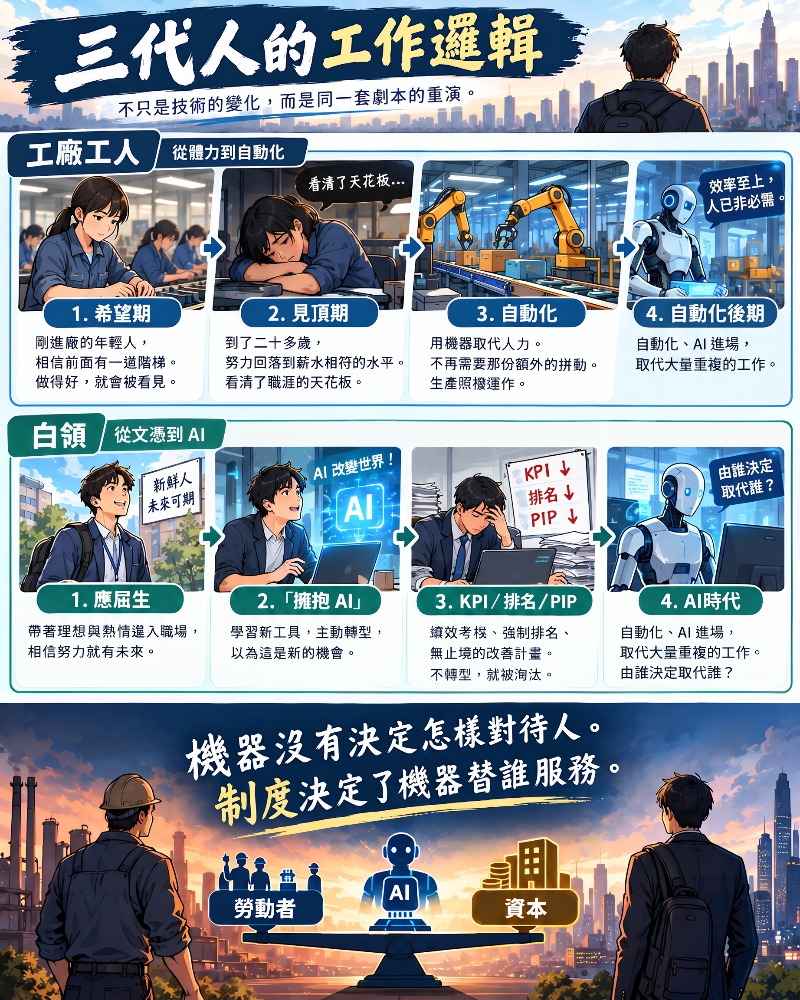

# JD 好豐滿，現實好骨感：前線部署工程師呢個「新職缺」

## 一、一則帖文，兩種美好想像

最近有位資訊系教授喺 Facebook 上面轉貼「前線部署工程師（Forward Deployed Engineer，FDE）需求暴漲」嘅消息。佢話，AI 時代能夠喺 AI 同人類之間搭橋，係非常重要嘅能力；傳統程式設計師偏向機器、唔擅長同人溝通，新一代工程師嘅溝通能力先係關鍵。留言區有人問呢種工程師要具備咩條件，有人答「識技術、識產業、識 AI、識溝通」，仲有人補一句「可能仲要識飲酒」。另一則留言問得最實在：收入水準點樣？

我將呢則帖文掟俾 AI 分析，佢畀嘅答案相當靚。佢話，FDE 唔係「程式設計師加上識講嘢」，而係能夠將一個講唔清楚嘅商業問題，轉換成可以部署、測試、驗證、維護嘅技術系統。佢仲話，FDE 真正嘅戰略價值在於佢係一個中介層：喺二十個客戶嘅混亂現實入面跑過二十次部署，從中抽出共同模式，再回饋畀產品團隊，變成產品能力。頭部 AI 公司嘅職缺描述，寫嘅都幾乎係同一套說辭。

呢啲都冇錯。淨係有一個問題：佢將 JD 當成咗職位本身。

## 二、我做過呢份工，只不過當年佢唔叫呢個名

我嘅職涯由研發開始，之後做嵌入式系統，再轉去 FAE、AE、技術行銷同業務支援，最後坐到策略規劃嘅位置。所謂「前線部署工程師」，喺我睇嚟並唔係新職種，而係我做過嘅 FAE 再加上一段策略顧問：喺客戶現場除錯，將模糊嘅需求翻譯成規格，再將現場經驗帶返研發。

做過呢種工作嘅人都知，現實通常係另一回事。業務早就答應咗客戶，你嘅工作係去填嗰個洞。你帶返產品團隊嘅回饋，大部分入咗 backlog 就冇人再睇；真正被產品化嗰日，功勞屬於產品團隊。你喺客戶面前代表公司，喺公司入面代表客戶，結果兩邊都唔完全信任你。至於「約 25% 出差」，嗰個只係 JD 上面嘅數字。

冇錯，理論上大家都吹捧呢個係新時代嘅全新職缺；但骨子入面，佢不過係將 FAE、solutions engineer、implementation engineer 呢啲舊職位重新包裝，換一個威威嘅抬頭，人工開高少少。實際上，佢好可能係一個牛頭唔搭馬嘴、折磨到死嘅地獄缺，根本稱唔上乜嘢劃時代嘅新嘢。

## 三、需求暴漲，本身就係一個訊號

FDE 呢個角色最早由 Palantir 發揚光大，原因好簡單：佢嘅產品冇辦法開箱即用，必須派工程師進駐客戶現場，用人力將產品同現實之間嘅落差補返。

今日 AI 公司大量請 FDE，道理一樣。需求暴漲說明嘅唔係呢個職業有幾光明，而係 AI 產品離「買返嚟就用到」仲有好遠。所以，目前嘅高人工本質上係過渡期溢價：公司用昂貴嘅人力，去補產品嘅唔成熟。等到模式抽得夠多、產品夠成熟，呢個職位好可能退化返做一般嘅導入或支援工程，就好似 FAE 喺成熟晶片市場入面嘅待遇咁。

呢度有一個殘酷嘅邏輯：FDE 份工做得越好，模式抽得越乾淨，就越快令自己變得唔值錢。

至於留言入面嗰句「收入水準點樣」，公開資料入面揭露薪酬嘅職缺只佔少數，媒體引用嘅嗰啲靚數字，多數係頂級公司早期搶人時開出嘅價錢，唔代表呢個職稱嘅常態。

## 四、行入客戶公司，第一個遇到嘅唔係技術

JD 話 FDE 要「理解客戶嘅 workflow」。但 workflow 入面最難搞嘅從來唔係技術，而係權力分佈。

每間公司都有一套舊系統，同埋一班靠佢維持地位嘅人。舊系統明明可以重構，佢哋淨係需要講句「冇咁簡單」，就可以無限期拖落去。呢句說話之所以有效，係因為成本極唔對稱：講呢句嘅人唔使證明自己啱，因為拖延冇即時嘅代價；主張重構嘅人卻要孭晒所有風險，改完出事，責任全部喺佢度。管理層又冇能力分辨，眼前嘅複雜究竟係真係複雜，定係畀人刻意維持嘅複雜，最後只能夠信嗰個「唯一睇得明」嘅人。複雜度，就係佢嘅護城河。

於是現場嘅人陷入雙重綁架：政治正確同績效考核都要求你盡快畀 AI 取代自己，而識拖、識將知識鎖喺自己手上嘅人，反而坐得最穩。

另一個極端同樣常見：完全唔當舊系統一回事，一刀斬斷，假設總部或者 AI 會自動補上。正確嘅做法係先抽取、先記錄，再畀舊系統退場，但呢件事又慢又貴，做好咗都冇人記你一功。諷刺嘅係，呢個正正就係 FDE 職缺描述入面「從混亂現實中抽取可重用結構」嘅嗰份工。

## 五、一段我親眼見過嘅整合

我曾經喺一間集團做嘢。我入職嗰陣，佢早就透過收購，將幾十間代工廠納入旗下。呢啲廠大部分規模唔大，由好多細廠拼湊而成，各自為政，成本、效率、品質參差不齊，總部管唔住，亦管唔到。

整合嘅第一步，其實唔需要乜嘢高深嘅技術。大部分工廠嘅產能根本冇用晒，只要將各廠嘅數字收齊、整理成一致而可以比較嘅樣，閒置產能便一目了然，合併就有咗理由。幾十間廠嘅產量，塞入少數幾間廠綽綽有餘。換句話講，真正令整合成為可能嘅，唔係流程改造，而係數字：一旦數字排得整齊，邊啲廠係多餘嘅，幾乎唔使討論。

當然，「綽綽有餘」都係計出嚟嘅。產能集中之後，保留落嚟嘅工廠改成全年無休、二十四小時運轉。原本嘅三班制改成兩班；即使表面上仍然維持三班，每一班實際上都要做十幾個鐘，因為班同班之間互相重疊。報表上面，三班制睇落正常而合理，產能利用率靚，人力配置亦似乎符合常規；但落喺每一個工人身上嘅，係遠超紙面嘅工時。數字之所以好睇，唔係因為效率真係提升咗，而係因為代價畀人搬咗去報表睇唔到嘅地方。

跟住先到流程：派核心團隊嘅左右手進駐，觀察各廠運作，再逐步將保留落嚟嘅廠拉返總部嘅標準流程，並換上一位「識得斬數字」嘅廠長。呢位廠長去到好多廠，第一件事就係斬掉當地研發，集中返總部。

對代工廠嚟講，呢一步並非毫無道理。設計嘅主人係品牌客戶，工廠嘅研發多數係喺支援量產、治具、測試同良率，集中管理確實可以減少重複。但呢一步仲有第二層作用：各廠失去咗獨立存在嘅能力，變成可以互相替換嘅產能。設計喺客戶手上，工程喺總部，訂單就可以喺廠同廠之間搬嚟搬去。

當初收購嗰陣，地價同人工都非常平。之後兩者一齊升，同一套算盤就反轉咗。人工由優勢變成成本，要減；土地由生產工具變成資產，要套現；生產就搬去下一個平嘅地方，譬如越南。空廠比仲喺運作嘅廠好賣，亦賣得到好價錢，因為買方唔使承接遣散責任、勞資糾紛同舊合約。

其中一塊地，係喺台灣北部某個鄉鎮以荒地價錢買入嘅。多年之後，嗰度因為交流道、工業區配套同科技產業聚落而地價翻漲，最後以高價賣出。嗰筆增值，幾乎全部嚟自公共建設同成個產業群聚，工廠只不過係啱啱好企喺嗰度。

## 六、兩把尺

之後我聽講，嗰間台灣廠其實唔係唔搵錢，而係規模唔夠，搵嘅仲唔夠賣地多。

呢句說話係成件事嘅核心。前線嘅人用嘅係第一把尺：呢間廠有冇做好、有冇搵錢。做決策嘅人用嘅係第二把尺：呢間廠搵嘅錢，相對於佢佔用嘅資產市值，抵唔抵。

兩把尺之間仲隔住一層會計。土地通常按當年嘅取得成本入帳，所以帳面上資產好細，搵少少錢就顯得回報唔錯。一旦將土地按市價重估，同樣嘅利潤攤喺一個大咗好幾倍嘅資產基數上面，回報率即刻變得難睇。工廠冇變差，係土地升咗值，令佢相對之下顯得「唔抵」。一間搵緊錢嘅工廠，就係咁樣畀人重新定義做浪費資本。

我後嚟諗，好嘢往往係意外。創辦人嗰一代買地建廠，係為咗生產：地平、人工平、離客戶近。土地後嚟升值，唔係佢哋計出嚟嘅，係時代送嘅。等到創辦人同佢嘅團隊退場，離開嘅唔淨止係幾個人，而係成套睇事情嘅方法：點解廠設喺呢度、點解要養呢批研發、邊啲客戶係一齊熬過嚟嘅。呢個先係最深嗰層 legacy，冇文件，全部喺人身上。

跟住商業顧問入場，帶嚟第二把尺。佢哋唔需要創造任何價值，只需要重新定價，就「發現」咗一筆隱藏資產。而將隱藏資產變現最快、最好交代嘅方法，就係賣。顧問嘅合約有期限，經營好一門生意要十年，賣一塊地幾個月就有結果。

好嘢係意外，畀人收割卻係必然。

## 七、FDE 究竟企喺邊

返轉頭睇 FDE，佢做嘅其實就係當年整合團隊做嘅嗰一步：入場收集資料、拆解現有流程，將每個客戶嘅 workflow 整理成可以比較、可以標準化嘅模式。當年呢一步令工廠變得可以互換、可以關閉；今日呢一步令崗位變得可以畀 AI 取代、可以縮減人頭。

FDE 用嘅係第一把尺嘅能力：解決現場問題、令系統真係跑得起、同人溝通、處理舊系統。佢嘅績效按「部署有冇成功」嚟計，而唔係按「幫客戶省咗幾多人事成本」。所以佢自己覺得係做緊工程，而唔係做緊資本決策。

但更準確嘅講法係：FDE 係第二把尺嘅工具，而唔係揸尺嘅人。佢負責令決策變得可行，但決策唔係佢做嘅，收益亦唔係佢攞嘅。嗰位「識得斬數字」嘅廠長，係第二把尺嘅人畀人派去坐第一把尺嘅位；FDE 就啱啱相反，係第一把尺嘅人畀人派去做第二把尺嘅工程。前者清楚自己做緊乜，後者往往唔知，或者唔想知。

實際做呢份工嘅人，有真心相信、鍾意解題嘅後生工程師，喺早期嘅 AI 公司入面，JD 描繪嘅理想版本確實會真實存在一段時間；有清楚知道、當佢做跳板嘅人，將喺二十個客戶身上見到嘅模式帶走，日後自己創業，慢慢變成揸尺嘅人；亦有換咗抬頭嘅老 FAE，最熟悉呢場遊戲，亦最冇幻想。至於「幫客戶減人」呢件事，佢哋多數唔使面對：部署嗰陣講嘅係「輔助而非取代」，真正裁員係幾個月後由客戶公司另一批人決定嘅。時間同組織都隔開咗，就好似當年收集資料嘅人，唔會喺賣地嗰日企喺現場。

## 八、該畀人追問嘅唔係機器

有位學者講過一個故事：佢見到工人用鏟挖運河，官員解釋唔用機器係為咗保住就業，佢就反問，咁點解唔派湯匙？

我信呢套道理。用自動化取代低效率，用農機取代徒手耕作，本來就係合情合理嘅社會發展。但呢個論點只答咗「工作會唔會冇咗」，完全冇答到「點對待失去工作嘅人」。按經濟學自己嘅邏輯，效率帶嚟嘅收益，本來就應該攞一部分出嚟補償畀淘汰嘅人。

工程師同科學家最唔應該忽視嘅，係資本背後打嘅算盤。既然機器可以取代人力，點解資本做嘅嘢從來唔淨止係「畀遣散費、裁員」咁乾脆，反而要冷處理、調崗、訂唔合理嘅 KPI、無限期嘅績效改善計畫，搞內耗、玩心理操控？

答案並唔神秘。第一係錢：依法裁員要畀遣散費，要行程序，規模大仲要通報；將人逼到自己辭職，呢啲成本全部歸零。呢個同工廠入面嗰套「表面三班」嘅算法如出一轍：成本冇消失，只係畀人轉嫁到帳面以外，由最冇議價能力嘅人去孭。

第二係轉移責任：畀錢請人走，等於公司承認「呢個係我哋嘅決定」；心理操控就可以將故事改寫成「你自己表現唔好」、「係你自己揀走」，決策者唔使背負愧疚，執行者亦可以說服自己冇做錯事。

第三係制度設計：強制排名、末位淘汰，令同事之間變成零和遊戲，你唔踩人，人就踩你。唔需要任何人天生殘忍，只要將位減到唔夠坐，大家自然會互相推撞，甚至畀人逼到崩潰。

執行呢啲手段嘅中層管理，大部分唔係壞人，佢哋自己都喺壓力之下，要保住位就要交差。但一套長期咁樣運作嘅制度，會逐漸篩選出對呢種做法最冇心理負擔、甚至享受權力嘅人，將佢哋推上去。所以你喺某啲組織入面見到嘅，會好似人性本惡，其實係制度篩選嘅結果。講到底，呢個係選擇，而且係非常冷靜嘅選擇。

呢套手法並唔新。我喺工廠入面見過佢嘅完整版本。

以前嘅產線，只要條件許可，就請二十出頭嘅後生女工。唔係因為佢哋平啲，而係因為新人最搏：剛入廠嗰幾年，佢哋相信前面有一道階梯，做得好就會畀人見到，付出嘅努力往往超過嗰份人工。做到廿二歲左右，喺產線上面已經到頂，亦睇清咗階梯嘅盡頭，努力便回落到同人工相符嘅水平。頻密換人，就係不斷租用每一批新人嘅「希望期」：每一批人都喺睇清天花板之前畀人換走，多出嚟嘅努力等於白攞。

之後新人搵唔到。工廠只可以用同一個價錢，留住已經到頂嘅舊人，而生產照樣運作。呢個說明嗰份額外嘅拼勁從來唔係生產所必需，而係公司白賺嘅剩餘。

換唔到人之後，就要用其他方法將舊人逼返拼命期：更嚴嘅指標、排名、淘汰，令人驚失去工作。心理操控同內耗，本質上係頻密換人嘅替代品：以前靠新人嘅希望換嚟免費嘅努力，換唔到人之後，就靠恐懼。最後一步，係自動化機器入場，連努力都唔使再要，直接唔要人。

今日 AI 入到白領職場，行嘅係同一條路。應屆生同初階職位，係白領世界嘅希望期；績效改善計畫、強制排名、無止境嘅「擁抱 AI」表態，係恐懼嘅版本；而 AI，就畀人安排入咗當年自動化機器嘅位置。但必須分清楚：將世界變成咁嘅唔係 AI，正如當年將工人逼到崩潰嘅唔係機器。機器本可以令人少做粗活，AI 本可以令人少做重複嘅工作，生產力提升帶嚟嘅收益，本可以令社會養活更多人，甚至走向全民基本收入（UBI）嘅種種可能。決定佢扮演乜嘢角色嘅，係金融化嘅資本邏輯：回報必須喺呢一季見到，成本必須先由人身上省返嚟，效益八字都未有一撇，裁員已經先攞去向市場交代。產線工人行過嘅三個階段，白領正一個一個重演。只不過呢一次，負責將人嘅經驗抽出嚟交畀機器嘅，係另一班工程師。

然而大部分人卻將呢啲資本惡行，同投入 AI 同自動化研發嘅科學家、工程師混為一談。事實上，佢哋多數只係抱住理想，做住自己應該做嘅嘢；問題在於，呢份理想畀人擺入咗邊個嘅算盤。

## 九、結語

呢種金融化同資本炒作嘅邏輯，先係 AI 同自動化浪潮底下最血淋淋嘅真相。但呢一面，我發現無論自己點寫、點分析，始終冇幾個人真正睇得透。

或者原因好簡單：大部分人一世人只揸一把尺。企喺第一把尺嘅人，只睇得到技術同努力；揸住第二把尺嘅人，唔需要其他人睇到。只有企過兩邊嘅人，先會同時睇到同一件事嘅兩個版本，亦因此兩邊都唔再完全屬於。

FDE 嘅 JD 寫得好豐滿，佢描繪嘅能力都係真嘅。但喺決定要唔要行入呢道門之前，至少應該先搞清楚一件事：你手上揸嘅係邊一把尺，定係你本身，就係某一把尺嘅工具。
