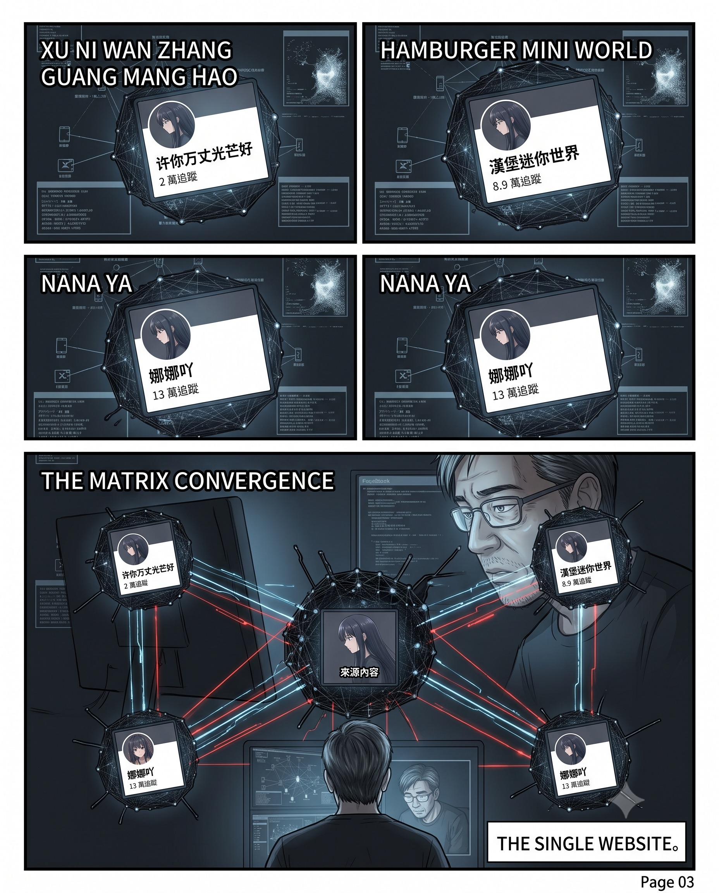
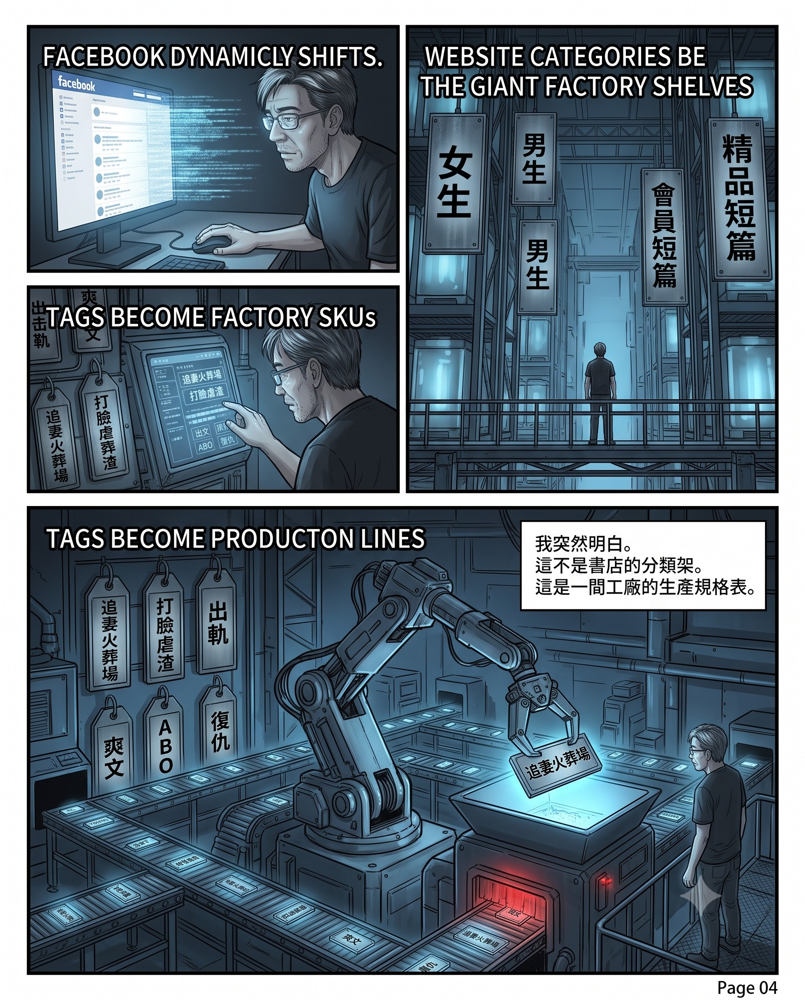
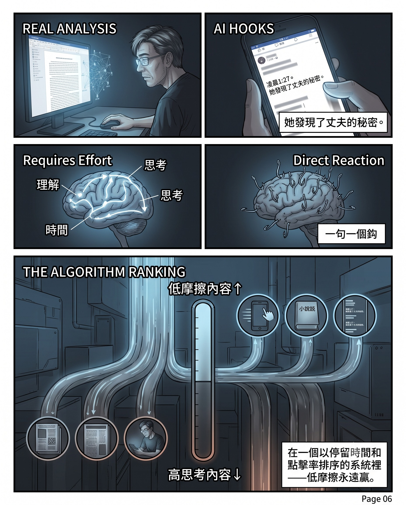
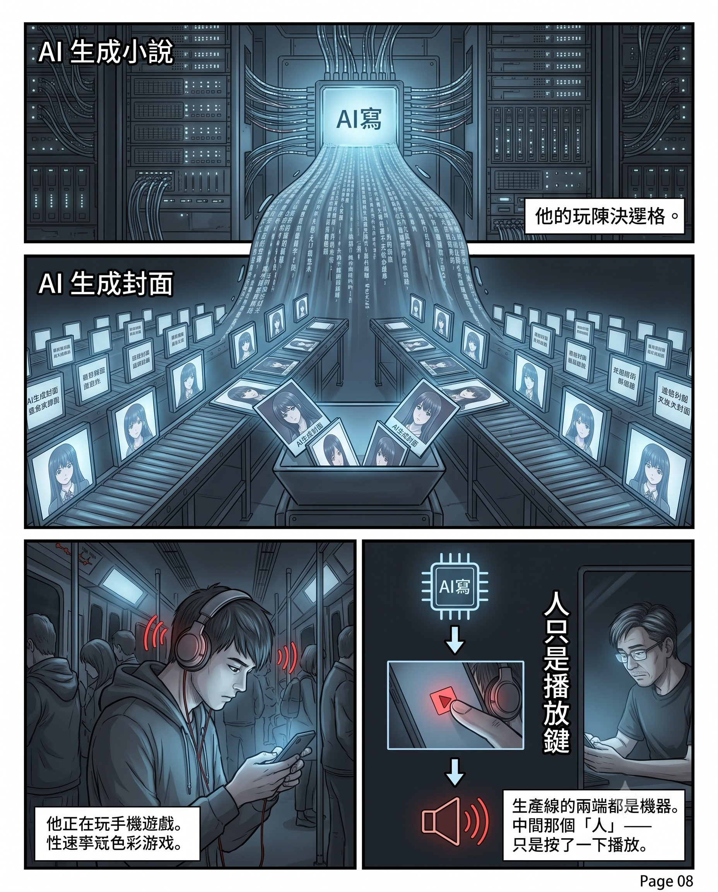

作者：星忘塵 Nebula Walker
Date: 21JUL2026
創象引擎 Mythogen Engine (mythogenengine.com)

**📌 半個鐘頭、三個帳號、同一篇文——一條由 AI 生產到 AI 消費的完整工業鏈，不需要敵人就能打贏一場信息戰。**

# 半個鐘頭的生產線——當內容農場不需要敵人就能打贏一場信息戰

## 一、三次，然後四次

七月的一個晚上，我在碌 Facebook。

動態牆一如既往地塞滿垃圾，我用平時的速度掃過去——兩秒一篇，不值得停就碌走。然後我見到一篇帖文：一張 AI 生成的動漫風女性側面圖，深色長髮，手持手機，背景是夜景城市天際線。文案寫著：

「凌晨一點二十七分，溫硯在丈夫的賬號裡，看見了一條足以毀掉她職業生涯的檢索記錄。」

我碌走了。

幾分鐘之後，同一張圖又出現。同一段文字。但帖文來自另一個專頁。

我停了一下。然後繼續碌。

再過不到十分鐘，第三次。第三個專頁。同一張圖。同一段字。一字不差。

半個鐘頭之內，三個不同的帳號，貼了同一篇文章。

我開始覺得不對。不是因為直覺——是因為我兩年前研究過這類東西。AI 小說生成工具、自動化帳號矩陣、批量分發流程。我見過那些工具的界面，知道它們的產品長什麼樣子。所以當同一篇文章第三次出現在我的動態牆上時，我認得出那種味道。

後來我開始整理截圖、翻查帳號資料、跟蹤連結。在我做這些事的同時，演算法繼續工作。第四個帳號出現了——「悠然姐講情感」，十四萬追蹤者，簡介寫著「11+年專業情感指導」、「幫助上萬個家庭走向蛻變之路」。兩個鐘前貼的是什麼？同一張 AI 動漫女仔圖。同一段「凌晨一點二十七分，溫硯在丈夫的賬號裡」。三百八十七個讚，十九個留言，八次分享。

一個自稱情感導師的十四萬追蹤者帳號，貼的是 AI 生成的公式小說。三百八十七個讚。

而且不是只有我的 Facebook 有問題。我換了帳號看，一樣見到。用無痕瀏覽，一樣見到。見到的具體帳號不同，但類型完全一樣。這個矩陣不是針對我——它覆蓋所有人。

## 二、帳號

我點進了那些專頁。

「许你万丈光芒好」。兩萬追蹤者。分類：粉絲專頁・Podcast。地址：香港九龍灣宏開道15號九龍灣工業中心4樓。語言：現代標準漢語。簡介：「重生虐渣，爽點密集。打臉不隔夜，復仇超帶感。」一百分推薦率——來自六則評論。

「漢堡迷你世界」。八萬九千追蹤者。分類：粉絲專頁・Reel 創作者。地址：哥倫比亞安蒂奧基亞省卡爾達斯。零則評論。興趣：音樂。

「娜娜吖」。十三萬追蹤者。分類：粉絲專頁・部落客。簡介：「龍猫大宝宝」。九十八分推薦率——來自七十一則評論。評論裡有葡萄牙文的讚美、西班牙文的感謝、一則中文的「很可愛的那種」，以及一串鍵盤亂打的字母。

「悠然姐講情感」。十四萬追蹤者。分類：粉絲專頁・Podcast。簡介：「戀愛攻略|情感滋潤|女性成長。」一則評論。

四個專頁。一個在香港，一個在哥倫比亞，一個不知道在哪裡，一個偽裝成情感導師。追蹤者從兩萬到十四萬。分類從 Podcast 到 Reel 創作者到部落客都有。

但它們在同一個晚上，發了同一張圖、同一段文字、導向同一個網站。

## 三、工廠

我跟著連結點進去。

網站叫 vsdm8.com。一個免費小說閱讀平台。

打開的第一個畫面是篩選分類頁。我看了一眼就知道這是什麼——因為我兩年前研究 AI 小說生成工具的時候，見過一模一樣的結構。那些工具的大綱生成器裡面，就是這樣的分類系統。標籤不是給讀者選的，是給生產線選的。

最上面兩個大分頁：「女生」、「男生」。

下面是子分類：會員短篇、精品短篇、網絡熱文、耽美短篇。

然後是熱門標籤：追妻火葬場、打臉虐渣、出軌、爽文、大女主、ABO、男二上位、治愈、甜寵、破鏡重圓、復仇、婚姻、沙雕、渣男。

再下面是主題：言情、ABO、婚姻、現實情感、腦洞、懸疑、科幻、權謀、玄幻言情、同人、純愛、民俗恐怖、年代文、親情。

這不是一間書店的分類架。這是一間工廠的生產規格表。每一個標籤是一條生產線的 SKU 編號。

我在書單裡找到了那篇「溫硯」的文章。書名叫《謊言歲月》，作者「佚名」，標籤「婚姻」，已完結，十九章。它和其他三本小說排在同一個版面上——《愛意破曉》六章、《當窩囊女找了個厲害老公》七章、《婚房撞破背叛，我轉身嫁給特勤隊長》十八章。

每一本的開頭都是同一個公式：一個女人發現丈夫的秘密，然後反擊。封面全部是 AI 生成的真人感女性圖像。六章、七章、十八章、十九章——全部短到可以用 AI 在一個下午批量生成。

## 四、產品

我打開了那篇十九章的《謊言歲月》，跳著看了幾段。

不是細讀。只是想確認我的判斷。

第一段就是深夜辦公室、丈夫的秘密帳號、一條足以毀掉職業生涯的檢索記錄。往下跳幾頁，專利訴訟、商業洩密、第三者是年輕實習生。再跳幾頁，「這比出軌嚴重」。

整本書講什麼我不知道。我不需要知道。跳著看幾段就已經足夠判斷：這是公式化的鈎子文。每幾句一個短句做情緒節拍，節奏異常工整，均勻到不像人手寫的。專業名詞撒得夠多但全部浮在表面——「二十年前的海外技術資料」、「專利無效案例」、「同族檔案」——聽起來很專業，沒有一個經得起真正的法律人細看。骨架拆開來就是短影片劇本的標準部件。

我認得出這種味道，是因為兩年前研究過那些生成工具。我見過模具，所以認得出從模具裡倒出來的東西。

但這正是問題所在。我跳著看都分辨得到，是因為我知道要看什麼。一個正常碌動態的人不會跳進去翻幾段——他只會看到那張 AI 生成的封面圖和那句「凌晨一點二十七分」的鈎子，然後決定碌走還是點進去。

而在那個決定的瞬間，這篇東西和我寫的《滅火器有了價錢牌》，在動態牆上面的外觀是一樣的。都是長文，都有一個吸引人的開頭，都有「專業感」的細節，都配圖。

分不出。

而且在演算法的度量衡上面，這篇鈎子文還「好過」我的文章——它的情緒鈎更密、懸念節奏更快、每一段都短到剛好不用思考就可以碌下去。我的文章要求讀者理解平台經濟學的結構、願意停下來想。這些全部是摩擦力。在一個以停留時間和點擊率做排序的系統裡面，低摩擦力永遠贏。

我之前寫過一句話：「大話和真話的包裝，本來就是極其相似的。」我現在親手拿著對照組。

## 五、規模

但真正令我驚的不是一篇文章。是規模。

回到那四個帳號。每一個都是一日發十幾到二十篇帖文。而這只是我在一個晚上碰到的四個。

我嘗試用不同的帳號、用無痕瀏覽去搜。每次見到的農場帳號都不一樣——因為演算法根據不同用戶的行為數據，分配不同的帳號去覆蓋不同的受眾。這意味著矩陣的規模比任何單一用戶見到的都大得多。

然後我發現，vsdm8.com 只是其中一個小說網站。同樣的帳號網絡在推其他網站。同一套操作模式——相同的帳號規模（兩萬到二十萬追蹤者）、相同的發帖頻率（一日十幾到二十篇）、相同的 AI 封面圖風格——但導向不同的域名。有些做言情，有些做霸總，有些做擦邊。每一條產品線的視覺風格統一但不撞款，讓用戶以為是不同的「作者」和「故事」。

做一條保守的算術。假設有五個小說網站，每個網站五條產品線，每條線十五個帳號。那就是三百七十五個帳號。每個帳號一日發十五篇。一日就是超過五千篇帖文。

每個帳號的追蹤者在兩萬到二十萬之間。就算只計最低的自然觸及率——比如每篇帖文觸及百分之五的追蹤者——一個兩萬追蹤的帳號每篇觸及一千人，一日十五篇就是一萬五千次曝光。三百七十五個帳號加起來，一日的曝光量輕易超過數百萬次。而「悠然姐講情感」那一篇帖文單獨就有三百八十七個讚——如果每個帳號都有類似的互動率，乘以一日幾千篇帖文，總量是天文數字。

而我的專頁，三個月來，五十三篇文章，平均每篇二十四次曝光。總曝光大約一千二百七十次。

它們一日的量，是我三個月的幾千倍。

## 六、生產線

這些內容是怎麼生產出來的？

兩年前我就已經知道答案。

那時候我研究過一批 AI 小說生成工具，Novel PD 是其中一個。它的官網寫得毫不隱瞞：「AI 網文小說生成工具套件。支援日更萬字、日更百萬字的高效創作流程。」它有大綱生成器、章節管理系統、批量生成功能、進度追蹤儀表板。這是工廠管理軟件的語言，不是寫作工具的語言。

Novel PD 只是其中一個。同類的工具一大堆——有的專做言情，有的做玄幻，有的什麼都做。兩年前它們已經能生成完整的小說。兩年後的今天，改進的不是能力，是成本和長度。生成一部十九章小說的時間從幾個鐘頭壓到幾分鐘，成本從幾十塊壓到幾乎為零。

vsdm8.com 那個分類表上的每一個標籤——追妻火葬場、打臉虐渣、破鏡重圓——在這類工具裡面，就是一個大綱模板。操作員選一個標籤，填幾個角色名，按生成。幾分鐘之後就有一部「小說」。封面圖同樣用 AI 生成——這也解釋了為什麼每條產品線的封面風格「一成一樣」：同一批提示詞，同一個模型，同一條流水線。

兩年前我見到這些工具的時候，想的是「誰會用這種東西認真出書」。答案是：沒有人認真出書。他們認真的是那條變現管道。書只是管道裡面流動的液體，什麼液體都行，只要流得夠快。Novel PD 的價值不是幫人寫好的小說，是令「內容」這個原料的成本歸零，讓整條管道可以用最低成本運轉。

## 七、消費

但生產出來之後，誰在看？

這是我在街上得到答案的。

有一天我在公共交通上，看見旁邊的人在手機上「看」這類小說。但他不是在看。他開著一個文字轉語音的 AI 工具，讓機器把小說讀給他聽。他自己在做別的事。

而且他明顯不是在認真聽故事。那種姿態——手機放在一邊，偶爾瞄一眼，主要注意力在別處——更像是在掛機。

然後我想通了。

很多這類免費小說平台的變現模式不只是廣告。它們有簽到系統、積分系統、任務鏈條：你「閱讀」夠多章節、停留夠長時間、完成指定動作，就可以儲金幣或積分，用來換免費章節、換禮物、甚至提現小額現金。設計邏輯跟手機遊戲的課金系統一模一樣——用「免費」做餌，用任務鏈條困住你的時間。

所以那個人不是讀者，甚至不是聽眾。他是在用自己的設備停留時間，換平台的積分。用 AI 朗讀來掛機，是最省力的方式。

於是生產線的兩端都是機器：一端是 AI 寫，另一端是 AI 讀。中間那個「人」不是消費者，是一個播放鍵。

## 八、代用券

那些積分值多少錢？

十九世紀美國的礦場和工廠有一種做法：不發美金，發自己印的代用券（scrip），只能在公司商店裡使用。工人以為自己有工資，但這些券離開了公司的圍牆就是廢紙。你做多少都走不出這個循環，因為你的「收入」只在它的生態裡面有效。

平台的積分制、金幣制就是數碼版的 scrip。你在這個平台儲的金幣，換不到第二個平台的東西。提現有門檻、有手續費、有最低限額——設計到讓你覺得「快夠了」，所以繼續掛機。

而有人——大概率有很多人——把這些積分拿到二手市場去賣。這個行為本身就證明了一件事：這些積分的官方兌換率是虛構的。如果一千個金幣官方標價值十塊，但場外三塊就買到，那個掛機的人每個鐘賺的不是幾毛錢，是幾毛錢的三折。

這比外賣平台還不如。外賣員再被壓價，他送的東西是真的、食的人是真的、收的是人民幣。這裡的「勞動者」收的是只能在一個生態圈裡面流通的代用券，離場即歸零。而他甚至不知道自己在勞動——他以為自己是一個「免費看小說順便賺點零花錢」的用戶。

廣告商付美金，平台收美金，用戶收金幣。真錢在上面流，代用券在下面轉。兩個圈永遠不會交匯。

## 九、多開
.jpg)
而這條鏈還有最後一層。

如果掛機一部手機一個鐘賺幾毛錢，那開二十個模擬器就賺幾塊。一日開十幾個鐘就幾十塊。一個月就過千。

到了這一步，連最底層那個「真人」都不再需要是真人了。二十個模擬器扮二十個用戶，每個模擬器裡面跑著一個 AI 朗讀的小說頁面，每個頁面產生廣告曝光紀錄。廣告商以為自己買了二十個人的注意力，實際上是一個人開了二十個虛擬設備。

而平台有沒有動機去查？沒有。因為活躍用戶數和廣告曝光次數就是它賣給廣告商的存貨。存貨越多，賣價越高。查出來反而虧。

成條鏈由上到下：AI 零成本生產內容，帳號矩陣零成本分發，演算法免費推送，模擬器批量掛機「消費」，平台將虛構的用戶數據賣給廣告商，廣告商將虛構的曝光數據寫入自己的 KPI。每一層都知道數字有水分，但沒有人有動機拆穿。

由頭到尾，真金白銀只在廣告商流向平台那一段出現過。其餘全部是虛數和代用券的循環。而最後買單的，是廣告商背後的品牌——品牌的廣告預算最終來自產品售價，即是你和我。

## 十、賣鏟

如果你覺得這套操作門檻很高，需要技術背景才做得到——不是的。

因為有人開課教。

我記得幾年前的龍蝦夾公仔機熱潮。那時候有一整個產業鏈圍繞著夾機生意：有人開課教你營運夾機、怎麼選址、怎麼調校爪力、怎麼計算回本週期。課程賣的不是「怎樣夾龍蝦」，是「怎樣開一盤夾龍蝦的生意」。而講師真正的收入不是龍蝦，是學費。

現在同一種人在做同一件事的線上版。有人開課教你用 AI 工具做網文矩陣、怎樣養帳號、怎樣批量發帖、怎樣最大化廣告分成。學員交了學費，拿到一套 SOP，然後各自開帳號運作。這就解釋了為什麼那些帳號之間風格「一成一樣」但又不像同一個人管理——因為他們用的是同一份教材。

所以我在 Facebook 上看到的那四個帳號——「许你万丈光芒好」、「漢堡迷你世界」、「娜娜吖」、「悠然姐講情感」——可能不是一間公司的員工。可能是四個各自經營的「學員」，用同一套工具、同一批模板、同一個小說平台，各自跑著自己的帳號矩陣。

加州淘金潮的老話：掘金的人大多數蝕錢，賣鏟的永遠贏。

## 十一、通用基建

這套系統不只用來推小說。

幾個月前，我的 Facebook 動態牆上鋪天蓋地出現記憶體 ETF 的推廣帖文。不同的帳號、不同的「財經 KOL」、不同的「投資達人」，全部在推同一樣東西。操作模式和今晚見到的小說農場一模一樣：統一話術、帳號矩陣、演算法放大。

我當時寫了三篇 HBM 產業分析，試圖拆解那些推廣背後的真實產業結構。那三篇文章在多個 AI 教學群組被擋——理由不明，大概率被歸類為垃圾或自我推銷。

而那些群組不是空的。裡面有大量 AI 新聞、使用心得、工具評測，討論相當活躍。但仔細觀察就會發現：群組裡面不是沒有批判性的內容，是批判的權利被壟斷了。核心人物可以發表有深度的判斷——這建立他們的權威；但同樣深度的判斷如果由外人發出，就會被擋住——因為它威脅的不是討論品質，是生態圈的權力結構。同一句話，由導師說出來是「洞見」，由你說出來是「垃圾」。我在《滅火器有了價錢牌》裡寫過這個現象：「同一個觀點，無名的人說出來是『攻擊』，有分發權重的人說出來是『洞見』。」那篇講的是平台層面；這裡是同一個機制在群組層面的複製。

我知道這些群組的生態比表面所見更封閉，但具體的證據屬於私人關係層面——我認識裡面的人，所以我知道哪些「不同的用戶」其實是同一間公司的人。如果不是這個偶然，我也會以為那只是一個正常的學習社群。

而這恰恰就是它最強的保護機制。

Facebook 的群組審核系統，設計上就是隱形的。版主刪除你的帖文，你不會收到通知。你自己的頁面上可能還看得到那篇文，但其他人已經看不到了。你不會知道自己被消音。而 Facebook 的所有透明度工具——廣告資料庫、專頁透明度、開發者 API——全部不記錄群組層面的審核動作。沒有 log，沒有紀錄，沒有申訴機制。版主刪了你的東西，這個動作在任何系統裡面都不存在。

你拿不出「我被刪過」的證據，因為系統的設計就是讓這個證據不會產生。

最強的證據，就是不會有證據的系統特性。

但回到主線。記憶體 ETF 的例子證明的是：小說農場用的這套基建——帳號矩陣、演算法推薦、音量壓制——不是只能推小說的專用設備，是一套通用的信息淹沒基礎設施。今天跑小說，明天跑金融產品，後天可以跑假藥、跑選舉、跑任何需要用音量壓過真相的東西。管道是固定的，換一種液體就是另一門生意。

唔係冇清醒嘅人。係清醒嘅聲音已經被淹沒咗。

## 十二、冇人指揮的信息戰

回頭看這條鏈的完整形狀：

AI 工具批量生成小說。AI 生成封面圖。帳號矩陣分發上 Facebook。演算法推送給用戶。用戶用 AI 朗讀掛機「消費」。平台用積分代用券「支付」。積分流入二手市場被折價出售。模擬器多開放大整條管道。課程導師在旁邊賣鏟收學費。

由生產到消費到支付到培訓，每一環都已經各就各位。

而這條鏈最值得注意的特徵是：沒有人在指揮。

沒有一個 CEO 下命令說「今天出五千篇追妻火葬場」。沒有一間公司的名字出現在任何一環。這是一個去中心化的、自發組織的、由經濟誘因驅動的系統。課程導師賣鏟、學員開帳號、AI 工具提供生產力、Facebook 提供管道、廣告商提供真金白銀、掛機的人提供設備時間。沒有人需要和任何人協調，整條鏈自動運轉。

每一環拆開來看都「合法」——AI 寫文合法，開帳號合法，發帖文合法，演算法推薦合法，用戶掛機自願，積分交易是私人買賣。沒有人犯法，沒有人做錯任何事。

但合起來的效果，是信息戰級數的。

軍事級信息戰的目標從來不是「推廣某個訊息」。它的目標是令所有訊息都失去意義。製造足夠多的噪音，令所有人都分不出真假，那真的東西就自動失效。你不用刪走真相，只要用垃圾淹到沒有人找得到。

而這個系統比真正的信息戰更難對付——因為信息戰有敵人，你可以指著它說「是你做的」；這個沒有敵人，每一個參與者都只是「在搵食」。

## 十三、被告席是空的

我過去寫的所有文章——《一個帳號的分發帳本》、《異常報告裡的讀者》、《效率陷阱》——批判的對象都是機構。Meta 怎樣壓制我。YouTube 怎樣消音創作者。企業怎樣裁人做帳。每一篇都有一個被告席，裡面坐著一個有名有姓的機構。

這一篇的被告席是空的。

坐在裡面的不是一間公司、一個平台、一個管理層。坐在裡面的——如果「坐」這個字還適用的話——是一個由幾千個各懷鬼胎的人各自做最理性選擇之後產生的合力。沒有人策劃，沒有人指揮，沒有人需要為結果負責。

甚至「受害者」這個詞都要重新定義。

《效率陷阱》裡面的小林是一個有能力的人，被系統用「升職加薪」的糖衣包住，以為自己贏了。他有真材實料，但他的真材實料被估值公式兌換了。他是被騙的。那條鏈的運作靠的是無知和自欺。

這條鏈不一樣。製造垃圾的人不是被騙的——他們由頭到尾都知道自己在做什麼。他們不是以為自己在做內容，他們根本不在乎內容。他們在乎的是管道通不通、流量夠不夠、今天出了幾多篇。他們的道德門檻本來就低，所以這條管道才能運轉得這麼順暢。

兩條鏈——《效率陷阱》和這一條——其實是同一個世界的兩個階層。上面那層，有能力的人被體面地兌換；下面這層，沒有底線的人用垃圾淹沒所有人的注意力。兩層加起來，才是完整的圖。

真正的受害者是你。是每一個打開 Facebook 被迫碌過幾百篇「追妻火葬場」的人。是每一個寫了真東西但只得到二十四個曝光的人。是每一個以為自己在看「公共討論」但實際上在看工業廢水的人。

施害者和受害者之間，沒有任何重疊。製造垃圾的人不會消費自己的產品。受害的人不知道自己在受害——因為他們以為動態牆上面的東西是「自然」的。

## 十四、真氣

寫這篇文章的過程中，我的 Facebook 動態牆上繼續出現新的農場帳號。第五個：「蘇亦-美髮實驗室」，三萬四千追蹤者，分類「社論／意見」，簡介「髮型選對，美麗加倍」，零則評論。貼的是同一張圖、同一段「凌晨一點二十七分」。它甚至在自己的帖文留言裡貼了另一個網站的連結——nvbad.com——導向同一本《謊言歲月》。即是說同一篇 AI 生成的小說，不只在 vsdm8.com 上面，還在 nvbad.com 上面。兩個域名，同一條管道。

但同一條動態牆上，在農場帖文的中間，我看到了另一樣東西。

一個我認識的退休通訊工程師——他平時寫的是 Nokia、Microsoft、Linux 的科技產業演變，很少貼金句——貼了一段倚天屠龍記的話：

「他強由他強，清風拂山崗。他橫任他橫，明月照大江。他自狠來他自惡，我自一口真氣足。」

我小時候就讀過這段話。那時候它是武俠小說裡面的心法，講的是修練內功的心態。大人會罵你：教科書不好好讀，去看這些閒書。沒有人覺得這些東西有用，包括我自己。

幾十年後，同一段話，由一個經歷過整個科技產業起落的人貼出來，在一個 AI 內容淹沒所有東西的環境底下，意思完全變了。而我之所以讀得懂他為什麼在這個時候貼這段話，恰恰是因為我當年讀過那些「閒書」。

當年沒有人想到看武俠小說會有什麼用處。幾十年後，那些「沒用的閱讀」變成了分辨真假的底氣——你認得出什麼是一個有脈絡的人寫的東西，什麼是流水線倒出來的產品。那個退休工程師貼這段話的時候，大概也沒有想到它會用在 AI 信息戰的語境裡。但這就是真正的閱讀和 AI 生成的根本分別：一段話的價值不是寫的時候決定的，是由讀過它的人在什麼情景下拿出來用而決定的。AI 可以生成一萬段聽起來很有道理的金句，但它沒有幾十年的人生經歷去決定「在這個時刻拿這段話出來」。這個選擇背後的重量，是訓練數據裡面沒有的。

他講的是：你們的農場帳號再多、AI 生成再快、帳號矩陣再大——我做好自己的東西就夠。

我認得出他這段話的意思，是因為我知道他是誰、他平時寫什麼、他為什麼會揀這段話。同一段文字，如果由一個農場帳號貼出來，配上那些霸總小說的封面圖，它就只是另一個情緒鈎。內容一模一樣，意思完全不同。

而分辨這兩者的方法，不是看內容本身——是看「誰貼的」。演算法做不到這件事。演算法只看互動數據、停留時間、點擊率。它看不到一個人選擇貼某段話背後的整個脈絡。所以在演算法眼中，退休工程師的金句和農場帳號的金句是同一樣東西。在我眼中，是完全不同的東西。

但這裡有最後一層諷刺。

那個退休工程師的帖文，Facebook 標記著「AI 內容」。而那些農場帳號用 AI 批量生成的霸總小說，沒有被標記。

真人寫的東西被標記做 AI。AI 寫的東西沒有被標記。

這就是我在《機器點樣幫手執行一場已經發生咗嘅刪除》裡面寫過的那個結構：偵測器和生成器是同一部機器的兩面。AI 偵測系統的訓練數據決定了它覺得什麼「似 AI」——而一個退休工程師用書面語貼一段工整的古典引文，在統計模型眼中，這種文字結構規整、用詞雅正，所以「似 AI」。反而農場帳號的霸總小說，因為有夠多的口語化特徵和情緒波動，在統計模型眼中反而「似人」。

偵測器標記錯的人。放過了真正的 AI。

不是分不到。是分錯。

## 尾聲

我之前寫過一句話：「在一個話語權按預算定價的系統裡，分享是唯一不標價的分發。」

寫那句話的時候，我以為問題是平台壓制我的觸及。我以為只要有人肯停下來讀，就分得到真假。

半個鐘頭的 Facebook 告訴我，問題比那個深。

不是平台「壓制」了我。是平台在壓制我的同時，用同一個演算法，把數百萬次的工業垃圾泵進了所有人的動態牆。我的二十四個曝光不是被扣住，是被擠走——被一個不需要敵人、不需要指揮、不需要任何人做錯任何事就能運轉的系統擠走的。

而在街上，我看見人們不是在讀這些東西。他們讓 AI 把這些東西讀給自己聽，自己在旁邊做別的事。他們消費的不是內容，是一條聲音流。在一條聲音流裡面，我的萬字分析和一篇六章的「追妻火葬場」的分別，不是「看不出」——是「看」這個動作本身已經不存在了。

這條鏈裡，AI 寫，AI 讀，演算法推，模擬器放大，積分支付，課程培訓。由頭到尾，真金白銀只在廣告商流向平台那一段出現過。其餘全部是虛數和代用券的循環。唯一真實的投入，是某個人的設備停留在頁面上的時間。而那個人的時間，被買得最便宜。

但那個退休工程師貼的那段話，我記住了。

他強由他強，清風拂山崗。

系統打不贏。但真氣不是靠系統傳的。

---
*本文為〈一個帳號的分發帳本〉及〈異常報告裡的讀者〉的姊妹篇。前兩篇記錄的是一個零違規帳號在平台上的遭遇；這一篇記錄的是同一條動態牆的另一面——那些被平台主動推薦的東西長什麼樣子，以及它們背後那條不需要任何人指揮就能自動運轉的生產線。三篇合起來，才是完整的一張圖。*

---

> **📚 平台消音與認知封鎖五部曲**
>
> 1. [機器點樣幫手執行一場已經發生咗嘅刪除](./機器點樣幫手執行一場已經發生咗嘅刪除.md)
> 2. [異常報告裡的讀者——當真話與垃圾走同一條通道入場](./異常報告裡的讀者——當真話與垃圾走同一條通道入場.md)
> 3. [異常報告裡的讀者・後記——我以為門關了](./異常報告裡的讀者・後記——我以為門關了.md)
> 4. [零違規，每篇二十四個曝光——一個帳號的分發帳本](./零違規，每篇二十四個曝光——一個帳號的分發帳本.md)
> 5. **半個鐘頭的生產線**

---

