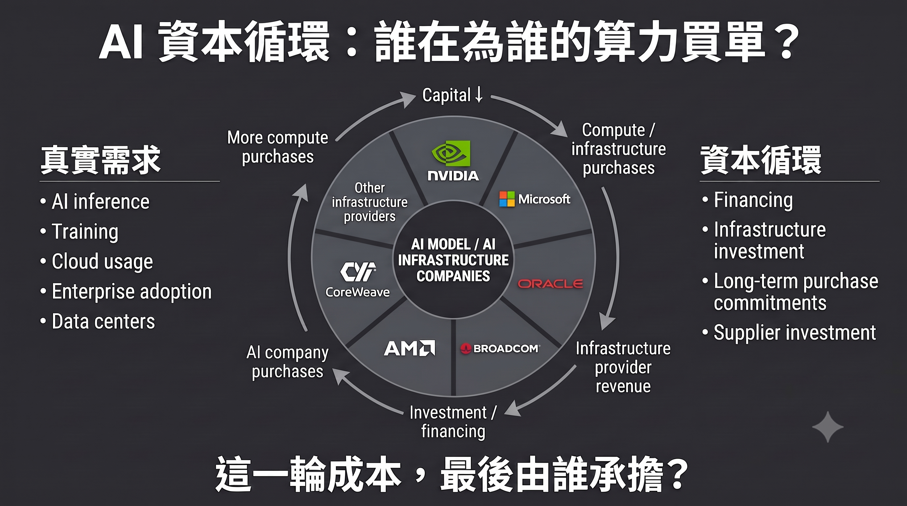

# 微軟買唔到 Ring 0，於是買低 OpenAI
## 出資型依賴，與一種需要每年續期嘅護城河

> [《AI 戰爭》](https://mythogenengine.com/docs/ai-war/guide)延伸篇．[《大道無形》第六章](https://mythogenengine.com/docs/AI_TAO/ch06)續論

---

> **本文三個判斷**
>
> 一、微軟喺 AI 世界起唔到 Ring 0，於是改用出資製造依賴——一種技術上可以換、資金上唔可以斷嘅新型鎖定。
>
> 二、當一個對手方同時出現喺收入、應收帳款、股權同投資損益四個位置，改變嘅唔係風險係數，係公司嘅性質。
>
> 三、呢個唔係微軟一家嘅處境。成個產業都喺用同一種需要續期嘅護城河，而且到期日係同一日——而開放權重每行前一步，就將嗰個日子撥前少少。

---

## 一、六個禮拜，兩個價錢

2026 年 7 月 6 日，微軟收報 386.74 美元。六月二十五日錄得 34.91% 嘅最大回撤，係「七巨頭」入面表現最差嘅一隻。市場嘅判斷當時好清楚：資本開支失控、AI 變現太慢、Copilot 嗰個付費故事撐唔起呢個倍數。

三個星期之後，一份季度財報，三個交易日，股價升咗大約 25%，市值增加約 7,500 億美元。全年跌幅，一次抹平。

七千五百億係咩概念？台積電 2026 年全年嘅資本支出預算係 600 至 640 億美元。即係話，微軟三日之內增加嘅市值，約等於台積電十二年嘅起廠買設備錢。

同一盤生意，同一批資產，同一個管理層。中間冇新產品，冇新市場，冇任何技術突破。改變嘅淨係一件事：市場肯為同一個故事畀幾多錢。

大部分評論停喺呢度，然後開始爭論嗰個數字係貴定平。

但真正值得問嘅唔係價格。係——**點解呢盤生意嘅價格，可以喺六個禮拜入面差三成？**

答案唔喺估值模型入面。喺結構入面。

而呢個結構，最後唔只係微軟嘅問題。

---

## 二、Ring 0 係時間嘅產物，唔係策略嘅產物

《大道無形》第六章講過一件事：Windows 真正嘅護城河，從來唔係佢好用。

係世界上有大量嘢，離唔開佢。

Win32 應用程式、硬體驅動、企業內部系統、EDR 資安工具、工控軟體、CAD、遊戲。呢啲嘢冇一樣係微軟寫嘅。佢哋係四十年間，由幾十萬家公司、幾百萬名工程師，一行一行寫入一套特定嘅系統呼叫慣例入面嘅。

每一行都係其他人畀嘅成本。每一行最後都變成微軟嘅資產。

嗰一章嘅結論係：Ring 3 可以翻譯，Ring 0 翻譯唔到。

我而家想將呢句說話推到更遠嘅地方——

**Ring 0 唔可以被建造，只可以被等待。**


佢唔係策略部門開會決定嘅嘢。佢係時間嘅沉澱物。你唔可以喺 2026 年宣布「我哋要建立一個 Ring 0」，就好似你唔可以宣布「我哋要有四十年歷史」。

呢個係微軟今日真正嘅困境。而市場完全冇喺度討論佢。

---

## 三、AI 世界嘅結構性事實：每一層都可以換

將 AI 嘅堆疊攤開嚟睇：

```
Model
  ↓
Agent / Harness
  ↓
Tool / MCP
  ↓
API
  ↓
Data
  ↓
Cloud
```

每一層都係可以換嘅。模型可以換，框架可以換，雲可以換，甚至可以成個落沉到本地推論。

呢度冇 Win32。冇四十年嘅相容性包袱。冇一個「換走就會整壞一萬樣嘢」嘅地基。

而最有力嘅證據，嚟自微軟自己。

2026 財年第四季法說會上，UBS 分析師 Karl Keirstead 直接問到開源同閉源之爭。Nadella 嘅回答分兩句：

> 「目標係令每一間公司掌握自己嘅命運。」
>
> 「我哋對平台嘅架構設計非常、非常清楚——你必須將 harness 同模型分開……呢個代表任何模型喺任何時間點都係可以換嘅。」

佢嘅用意好明確：勸企業唔好將 agent 層交畀模型供應商，唔好畀單一模型綁死。而微軟啱啱兩樣都賣——成條 Copilot 產品線係 harness，MAI 系列係模型。

呢句說話喺媒體上被寫成「微軟嘅多模型策略」，被當成靈活、開放、唔押注單一供應商嘅表現。

但如果你用第六章嘅框架去讀，佢係一份供詞。

**佢承認咗：喺呢個新世界入面，微軟手上冇任何一層係不可替代嘅。**

Windows 年代，微軟從來唔使講呢種說話。

冇人會喺 1998 年話「Win32 喺任何時間點都係可以換嘅」。因為嗰個係假嘅，而且全世界都知道嗰個係假嘅。


---

## 四、嗰粒晶片：微軟最後一次號令天下

要睇清楚微軟今日失去咗啲咩，最好嘅方法唔係睇佢而家做緊咩，係睇佢上一次做咗咩。

2021 年 6 月 24 日，微軟公布 Windows 11 嘅系統需求，入面有一行：主機板必須具備 TPM 2.0。

一粒獨立嘅硬體安全晶片，平時零售價大約二十美元。

然後全世界照做。

Intel 照做。AMD 照做。所有 OEM 照做。所有企業 IT 部門將換機預算提前。

而喺消費端，效果更直接：發表會之後十二個鐘頭內，eBay 上一款 TPM 2.0 擴充模組嘅價格由 24.90 美元跳到 99.90 美元；Newegg 同 Amazon 嘅主要型號全面缺貨；有賣家將要價開到 175 美元。一塊比拇指大唔咗幾多、上一年仲喺賣八蚊九毫九嘅板仔。

代價微軟唔係唔知：幾百萬部功能完好嘅機器一夜之間變成「唔受支援」，電子垃圾爭議、用戶反彈、Windows 11 初期市佔率爬唔上去。

**佢照樣付得起。因為佢有能力強制。**

呢件事嘅技術意義，比大部分人理解嘅更深。TPM 唔係防盜版工具——微軟自己嘅文件將佢定位成安全基礎元件，實際用途係 BitLocker 金鑰保護、Windows Hello、Credential Guard、裝置證明。

佢真正做嘅嘢係：**將信任根由作業系統，搬落去矽入面。**

Ring 0 之下仲有一層。微軟去佔咗。

而佢能夠佔，係因為喺 PC 呢個世界入面，微軟講一句說話，供應鏈就要轉向。

嗰個唔係產品力。嗰個係**協定權力**。

---

### 而五年之後，同一件事變成咗噉

2026 年 7 月，微軟宣布一個叫「KMS Hardware-Secured」嘅機制：企業嘅 KMS 啟用主機，必須通過 TPM 認證先可以發放授權。

網上即刻傳成「微軟要用 TPM 一次過終結所有盜版 Windows」。

三日之內被更正得乾乾淨淨。

實情係：呢件事淨係影響企業機房入面嗰一台 KMS 主機。Windows Server 2025 由 2026 年 8 月開始跳準備提示，強制執行要等下一個 Server LTSC 版本，日期未定，虛擬主機嘅規則甚至仲未公布。而破解圈最常用嘅 HWID 同 TSforge 根本唔經過 KMS 主機；Online KMS 係自己架一台假伺服器答「可以」，連一個 TPM 檢查都掂唔到。零售金鑰、數位授權，全部照舊。

即係話：**現有嘅破解方法，一個都冇受影響。**

將呢兩件事擺埋一齊睇，嗰個對比幾乎有啲殘忍。

同一粒晶片。2021 年，微軟用佢喺十二個鐘頭內改寫咗全球 PC 供應鏈嘅規格。2026 年，微軟用佢加固咗機房角落入面嘅一台伺服器，仲要被誤傳成核彈，然後花三日澄清自己其實冇咁勁。

**協定權力就係噉消失嘅。唔係被打敗。係慢慢冇咗可以落令嘅對象。**

---

## 五、核心命題：買唔到嘅依賴，就出資製造

如果依賴唔可以靠時間沉澱，亦唔可以再靠一紙規格強制，而生意又必須建立喺依賴之上——

咁仲剩低咩辦法？

**出資。**

呢個就係我認為今日成件事嘅結構核心。

傳統護城河嘅定義係：**客戶離唔開你，因為換走嘅成本太高。**

微軟而家建立嘅係另一種嘢：**客戶離唔開你，因為你係佢嘅資金來源之一。**

睇清楚呢個結構：

- 微軟持有 OpenAI 大約 27%（財年報告以全面轉換基礎揭露約 25%），累計投資承諾 130 億美元
- OpenAI 承諾採購 2,500 億美元嘅 Azure 服務
- OpenAI 嘅收入按比例分潤畀微軟，至 2030 年，設有總額上限
- 2025 年 11 月，微軟投資 Anthropic 最多 50 億美元；Anthropic 承諾採購 300 億美元 Azure 服務；同一筆交易入面，NVIDIA 投資 Anthropic 最多 100 億
- 而微軟喺應用層，同時同呢兩家正面競爭

喺同一組關係入面，微軟同時係：**股東、房東、分潤方、競爭對手。**

四個身分，一個對手方。

我將呢個結構叫做——**出資型依賴。**

佢嘅特徵係：**技術上完全可以換，資金上唔可以斷。**

OpenAI 聽日可以宣布將主要負載搬去 AWS。技術上做得到，合約上都早就允許咗——首次拒絕權喺 2025 年嘅重組入面已經取消。

但佢唔可以宣布唔使嗰 130 億。唔可以宣布唔履行嗰 2,500 億嘅採購承諾。亦唔可以宣布自己嘅估值唔再需要一個持股四分之一嘅美股巨頭，喺財報入面替佢背書。

**呢個係一種新嘅鎖定。佢唔鎖技術，鎖現金流。**

TPM 嗰條路係向下鑽，鑽入矽入面。呢條路係向旁邊生，生入對手嘅資產負債表。


---

## 六、結構後果：一個對手方，佔據財報四個位置

出資型依賴會產生一個好特別嘅財務形狀。

喺微軟 2026 財年嘅揭露入面，OpenAI 呢一個交易對手，同時出現喺四個位置：

| 財報位置 | 內容 |
|---|---|
| 收入 | 2026 財年由與 OpenAI 嘅商業安排取得 241 億美元（含分潤） |
| 應收帳款 | 2026 年 6 月 30 日止，仲有 60 億美元未收 |
| 股權投資 | 以全面轉換基礎約 25%；投資承諾 130 億，已撥付 119 億 |
| 其他收入淨額 | 持股稀釋收益與估值變動 |

前三項係微軟 10-K 首度依 ASC 850 關係人揭露規定寫出嘅原文數字。第四項散見於各季報表。

241 億相當於微軟 2026 財年總營收 3,318 億嘅大約 7.3%。而佢喺 AI 業務入面嘅佔比，微軟冇揭露——彭博根據微軟自報嘅年化 370 至 400 億 AI 營收推估，OpenAI 佔其中一半以上，可能接近七成。**呢個七成係推估，唔係揭露，行文時必須分清楚。**

外界對呢組數字嘅標準反應係三個字：**集中度風險。**

意思係「如果 OpenAI 出事，微軟會好麻煩」。呢個係風控語言——將佢當成一個機率、一個尾部事件、一個要喺模型入面加嘅折價因子。

我認為呢個讀法錯咗。

因為佢假設微軟仍然係一間軟體公司，只不過碰啱有一個特別大嘅客戶。

但當一間公司嘅 AI 收入有一半以上——好可能接近七成——嚟自一個**佢自己出錢、自己持股、自己為其估值背書、同時又向佢收租**嘅對手方嘅時候——

改變嘅唔係佢嘅風險係數。

**改變嘅係佢嘅性質。**

佢已經唔係一間將軟體賣畀市場嘅公司。佢係一間**同時擔任房東、股東與莊家**嘅資產運營商。而市場仍然喺用軟體公司嘅邏輯替佢定價。

呢一句係成篇文章嘅重心。下面所有數字，只係用嚟證明佢。


---

## 七、證據層：盈利嘅來源，正在由營運轉向估值

先講清楚：以下嘅機制全部合規，全部有揭露，冇一項係造假。

問題唔喺合法性。喺性質。

### 稀釋收益：被溝淡，反而入帳賺錢

2025 年 10 月，OpenAI 完成資本重組，轉為公益公司（PBC）。微軟持股由 32.5% 降到大約 27%。

但因為估值上升嘅幅度，遠大於持股比例下降嘅幅度，會計上產生一筆**稀釋收益（dilution gain）**，計入「其他收入淨額」。

被溝淡咗，反而賺咗一筆。

微軟採用權益法，以假設清算帳面價值法（HLBV）認列。重組之後，帳面損益唔再反映 OpenAI 嘅經營結果，而係反映**微軟應佔淨資產份額嘅變動**——每一次融資、每一次估值調整，都會直接入微軟嘅損益表。

於是 2026 財年出現噉嘅一組數字：

| 季度 | OpenAI 投資損益 |
|---|---:|
| Q1 | −31 億美元 |
| Q2 | +76 億美元 |
| Q3 | −0.14 億美元 |
| Q4 | +4.8 億美元 |
| **全年** | **+49.63 億（EPS +0.67 美元）** |

對照 2025 財年：全年 −36.2 億，EPS −0.49 美元。

一年之內，同一筆投資，由每股拖累五毫，變成每股貢獻六毫七。

中間 OpenAI 並冇開始賺錢。

**一句講晒：OpenAI 蝕錢唔再令微軟蝕錢；OpenAI 融資反而令微軟賺錢。**

呢部引擎嘅燃料唔係產品。係一級市場肯畀嘅價。

### 第二部引擎：Anthropic

2026 財年第四季，微軟認列 Anthropic 投資收益 32 億美元，約當稀釋每股盈餘 0.33 美元——佔當季 4.81 美元 EPS 嘅近 7%。

換句話講，呢個被市場歡呼為「全面超標」嘅季度入面，有相當一部分唔係賣軟體賺返嚟嘅。

係自己投資嘅公司，估值上升。

### 呈現層嘅兩個小動作

**其一，資本開支嘅表外化。** 2026 日曆年嘅資本開支指引由 1,900 億美元下修到大約 1,750 億——唔係少買咗嘢，係部分建築物嘅估計耐用年限被拉長，加上相當一部分未來租賃義務由融資租賃改列為營業租賃。後者同時影響資本開支同自由現金流兩個指標嘅解讀。

數字細咗。機櫃一部都冇少。

**其二，雙軌敘事。** 微軟自己設計咗一套排除 OpenAI 影響嘅 non-GAAP 指標。蝕錢嘅季度請睇 non-GAAP，賺錢嘅季度 GAAP EPS 年增 32% 照樣見報。

兩邊都講得。而且兩邊都係真嘅。

呢啲加埋，指向同一個結論：**微軟盈利嘅邊際來源，正在由營運轉向估值。**

而估值，唔係微軟可以生產嘅嘢。

---

## 八、時間差：收益前置，成本後置

先睇一組數字點樣被講出嚟，再睇佢點樣被改口。

**四月。** 微軟畀出 2026 日曆年嘅資本開支指引：1,900 億美元。市場預期只有大約 1,550 億。

但同一場電話會議上，財務長 Amy Hood 講咗一句更值得記住嘅說話：呢 1,900 億入面，大約有 **250 億係組件價格上漲**——唔係買到更多算力，係同樣嘅嘢變貴咗。

同一季嘅資本開支 319 億，其中大約三分之二投向 GPU 同 CPU 呢類**短命資產**。

**七月。** 同一個指引被改成大約 1,750 億。少咗 150 億——唔係少買咗嘢，係部分建築物嘅估計耐用年限被拉長，加上相當一部分未來租賃義務由融資租賃改列營業租賃。後者同時影響資本開支同自由現金流兩個指標嘅解讀。

將三件事擺埋一齊：

**一個大數字，其中一截根本唔係算力；然後嗰個數字又被會計處理改細。**

而底下嗰批真正買返嚟嘅嘢，係壽命最短嗰種。

呢度有一個所有人都知、但好少人擺入同一句說話入面嘅事實：

**今日入帳嘅係收入同估值收益。今日買嘅 GPU，要到未來幾年先至會全額入損益表。**

折舊嘅高峰仲未上台。拉長耐用年限，只係將嗰個高峰向後推，唔係取消佢。

出資型依賴嘅成個結構，就建立喺呢個時間差上面。

佢唔係騙局。佢係一場賭注——賭喺成本全面上台之前，真實嘅使用強度已經追上嚟。

---

## 九、對照組：CUDA 嘅黏性由下而上

第六章曾經將微軟同 NVIDIA 並列，話兩家都係「用多年其他人付出嘅成本，將自己擺喺中間」。

但兩者嘅方向係相反嘅。

**NVIDIA：** 硬體 → CUDA → 開發者 → AI。黏性由下而上生出嚟，用咗差唔多二十年。歷史沉澱型。

**微軟：** M365 → Copilot → Agent → Azure，再加一條橫向嘅資本線，將模型公司綁入嚟。黏性由上而下鋪出去，用咗三年。出資構築型。

最關鍵嘅差別唔喺深淺。

**喺於：歷史沉澱型嘅護城河唔使續期。出資構築型嘅要。**

Win32 唔使微軟每年花錢維持。佢就喺度，因為佢已經喺度。

但 2,500 億嘅採購承諾，需要對手方有能力履約。帳面收益需要下一輪估值繼續向上。資金型鎖定需要資金持續流動。

**呢個唔係一道護城河。呢個係一份需要每年重新簽嘅租約。**

---

## 十、我可能錯喺邊度：GPU 上嘅信任根

寫到呢度，我必須將自己呢套論證入面最脆弱嘅地方指出嚟。否則佢就只係一個立場，唔係一個分析。

我話 AI 世界冇 Ring 0，因為每一層都可以換。

但有一個地方，可能生得出嚟。

**機密運算（confidential computing），以及 GPU 級嘅執行證明（attested inference）。**

邏輯係噉嘅：企業最終唔會肯將最敏感嘅資料，交畀一個證明唔到自己狀態嘅執行環境。佢哋會要求——呢段推論喺邊粒晶片上面跑、跑嘅係唔係我指定嗰個模型、有冇被竄改、記憶體有冇被第三方讀取——全部要有一條可驗證嘅信任鏈，而且呢條鏈嘅起點必須喺硬體。

如果呢個要求變成企業採購嘅硬條件，咁 AI 世界就會突然生出一個「唔可以被軟體模擬」嘅層。

而「唔可以被軟體模擬」，正正就係 TPM 當年成立嘅全部理由。

睇到嗰個對稱未？

**微軟上一次成功建立信任根，係喺 PC。佢下一次嘗試建立信任根，會喺 GPU。**

如果佢喺呢條線上面做到不可繞過——如果企業 AI 嘅執行證明鏈，最後必須經過 Azure 嘅機密運算環境同 Entra 嘅身分層——咁佢就唔係用資本買依賴。

佢係真正重新起咗一個 Ring 0。

到嗰陣，呢篇文章嘅結論要改。

我目前嘅判斷係：呢條路存在，但佢面對嘅唔係四十年嘅歷史包袱，而係三家雲、兩家晶片商、以及一堆仲喺制定中嘅開放標準。同一個證明鏈，AWS 同 Google 都喺做，NVIDIA 自己都喺做。**能夠被三家同時提供嘅嘢，好難成為邊個嘅 Ring 0。**

但呢個係我最願意被推翻嘅一段。邊個想反駁呢篇文章，應該由呢度入嚟，唔好由股價入嚟。

---

## 十一、微軟唔係特例，係樣本

到呢度為止，呢篇文章睇落好似喺講一間公司。

唔係。

出資型依賴唔係微軟嘅發明，亦唔係微軟嘅專利。佢係 2025 至 2026 呢一輪 AI 建設嘅**預設結構**。

將 OpenAI 一家對外嘅名義承諾攤開（各家統計口徑唔一，以下為媒體整理嘅常見版本）：

| 對象 | 名義承諾規模 |
|---|---:|
| Broadcom | 3,500 億美元 |
| Oracle | 3,000 億美元 |
| Microsoft | 2,500 億美元 |
| NVIDIA | 上限 1,000 億美元 |
| AMD | 900 億美元 |
| CoreWeave | 220 億美元 |

七家供應商，2025 至 2035 年，合計大約 1.15 兆美元。而 2026 年嘅多份第三方估算，將成個產業「循環融資」嘅規模放喺 8,000 億美元以上。

呢啲唔係普通嘅採購合約。佢哋嘅共同形狀係：**賣算力嘅人，出錢畀買算力嘅人，去買自己嘅算力。**

- NVIDIA 投資 OpenAI、Anthropic、Mistral，以及 CoreWeave 呢類新雲業者，然後呢啲公司調返轉頭買 NVIDIA 嘅晶片；NVIDIA 自己都向新雲業者租算力
- Amazon 投入 OpenAI 同 Anthropic 合計超過 830 億，兩家承諾回買 AWS 算力嘅規模更大
- 微軟投 Anthropic 最多 50 億，Anthropic 承諾買 300 億 Azure；同一筆交易入面 NVIDIA 再投最多 100 億
- 2026 年 7 月，多家媒體報導 NVIDIA 正在評估為 OpenAI 嘅俄亥俄資料中心提供大約 2,500 億美元擔保，另外再融資 3,500 億嘅晶片採購（截至 2026 年 8 月，呢單嘢仲未定案）。消息當日，NVIDIA 自己嘅股價跌咗 4.5%——市場好清楚呢個代表啲咩

想像一張圓枱。每個人都喺替隔籬嗰個人畀帳，然後將同一筆錢，記入自己嘅營業額。

微軟只係呢張枱上面，帳單攤得最開嘅嗰一位。佢每季要向 SEC 交代，所以睇得到。其他人唔使按季拆畀你睇，唔代表結構唔同。

**呢個先至係呢篇文章真正嘅規模。**

於是有三件事，值得放大嚟睇。

### ① 入場費嘅性質變咗

當算力靠股權交易分配，而唔係靠採購分配，決定邊個可以競爭嘅就唔再係「你買唔買得起」，而係「你值唔值得被投資」。

模型層收斂到三四家，唔係因為技術護城河築起咗，係因為**只有三四家喺循環入面**。

中間嗰一層唔係因為做得差而死。係因為企喺圈外面而死。

### ② 風險由創投搬入咗指數

呢個係我認為最大嘅一項，而且被討論得最少。

2000 年嗰次，泡沫嘅風險喺 dot-com 股票上面——你要主動去買，先至會持有。

2026 年呢次，一批**私人公司**嘅估值變動，直接寫喺全球最大幾間上市公司嘅損益表入面。

冇人揀過持有 OpenAI 嘅估值波動。但每一個買咗指數基金嘅退休帳戶，都已經持有咗。

### ③ 分散嘅係名冊，唔係風險

微軟、Amazon、Google、NVIDIA 各自都可以話自己嘅投資組合分散。

但攤開嚟睇，係同一組對手方，出現喺多張資產負債表上面。

佢唔會逐間出事。佢會同時出事。



---

## 十二、但係：結構崩潰唔等於技術失敗

如果只寫到上面嗰一節，呢篇文章就會變成又一篇「AI 泡沫論」。咁我寧願唔寫。

所以要將反面講清楚。

**需求係真嘅。** NVIDIA 2027 財年第一季營收 816 億美元，年增 85%。台積電將 2026 年資本支出由 520–560 億上調到 600–640 億，理由係包括代理式 AI 在內嘅結構性需求。應用層絕大多數公司係正常嘅 SaaS 生意，有真實付費客戶，同循環融資完全冇關。

**而且 vendor financing 起過真嘢。**

1990 年代嘅電訊業就係同一個劇本：設備商放貸畀營運商去鋪光纖，需求唔似預期嗰陣，高槓桿嘅營運商斬支出、部分破產，產能閒置多年，產業重整。

但嗰段歷史真正嘅結論，唔係「泡沫爆咗」。

係——**嗰啲光纖後來全部用上咗。只不過股東換咗人。**

鐵路都係。運河都係。

**結構崩潰唔等於技術失敗。呢個分辨，比睇空睇多重要一百倍。**

而佢同時說明咗：判斷呢件事嘅正確問題，從來唔係「AI 得唔得」，係「**呢一輪嘅成本，最後由邊個承擔**」。

---

## 十三、循環之外嘅嗰一手：開放權重

如果成套結構需要估值持續上升先至可以運轉，咁最值得盯嘅變數，就係**企喺循環外面嘅嘢**。

目前只有一樣：開放權重生態。

佢唔使融資輪嚟定價，唔使採購承諾嚟背書，亦唔使任何人嘅資產負債表替佢擔保。

佢嘅存在意味住——**成套結構嘅定價，隨時可以被一個效率數字改寫。**

2025 年 1 月已經示範過一次。

DeepSeek 喺 1 月 20 日公開 R1，宣稱訓練成本大約 560 萬美元。市場隨即重新計算「達到同一水準需要幾多算力」呢件事。1 月 27 日，NVIDIA 單日跌大約 17%，收報 118.58 美元，市值蒸發 5,890 億——美股史上單一公司單日最大市值損失，前一個紀錄係 NVIDIA 自己喺 2024 年 9 月創落嘅 2,790 億。同日 Broadcom 跌 17%，台積電跌 13%。

嗰日冇任何一份財報出問題。改變嘅只係一個關於成本嘅假設。

### 而 2026 年 7 月，佢示範咗第二次

七月十六日，中國新創月之暗面喺上海嘅世界人工智慧大會發表 Kimi K3。十一日之後，二點八兆參數嘅完整權重上咗 HuggingFace——九十六個權重分片、技術報告、授權條款，一次到齊。同一週，DeepSeek 都發布咗 V4 穩定版。

規格上，K3 係混合專家架構，每個 token 只啟動總參數嘅一小部分，上下文一百萬 token。獨立評測將佢放喺頂尖閉源模型後面少少嘅位置：整體仍然落後於 Claude Fable 5 同 GPT-5.6，但喺程式同代理任務上贏過上一代嘅旗艦閉源模型。

市場嘅反應同十八個月前同一個形狀：發表後兩個星期內，費城半導體指數跌幅達兩成，相對高點進入技術性熊市。

**兩次，十八個月。呢個就唔再係異常，係機制。**

而且 K3 呢次比 DeepSeek 嗰次更貼近本文嘅命題。

DeepSeek 動搖嘅係一個關於**成本**嘅假設——訓練一個前沿模型要花幾多錢。嗰個係一個關於過去嘅宣稱，可以爭論，可以質疑，可以話「佢哋用咗其他人嘅模型蒸餾」。

K3 動搖嘅係一件更硬嘅事：**模型可以被搬走。**

權重瞓喺 HuggingFace 上面，任何有足夠硬體嘅企業都可以下載、檢查、微調、自行部署。呢件事冇辦法爭論，因為檔案就喺嗰度。

於是企業對閉源供應商嘅嗰句說話，由——

「我哋冇其他選擇。」

變成——

「你如果加價，我就將同一個等級嘅嘢搬去其他地方跑。」

**改變嘅唔係價格。係議價權。**

### 但「開源」呢兩個字會呃人

要將說話講完整，否則呢一節就變成幫開源吹哨。

**權重免費，但你要有地方擺。** K3 喺四位元精度下，淨係權重就需要大約 1.4TB 嘅高速記憶體；Moonshot 自己建議最少六十四張加速器起跳。開放權重降低嘅係供應商依賴，唔係基礎設施成本。能夠真正自建嘅，仍然只有大企業同雲端業者——而雲端業者，啱啱就係呢篇文章入面嗰幾家。

**而且採用摩擦係真嘅。** 獨立測試對 K3 嘅幻覺率提出過相當唔客氣嘅數字；今年四月 Kimi 發生過一次跨用戶資料隔離失誤；而中國《國家情報法》第七條嘅義務，唔會因為推論跑喺邊一台伺服器上面而消失。呢啲唔係政治修辭，係企業法遵部門會真係擋落嚟嘅嘢。

所以短期內，開放前沿模型唔會取代閉源。

但呢個唔影響結論——因為**壓縮定價權，唔使取代任何人。**只要令「仲有其他選擇」呢句說話變成真嘅就得。

所以嗰條開源路線唔只係競爭手段。佢喺結構上，反向站位於一套**必須靠估值不斷向上先至可以維持嘅體系**。

一樣唔使被投資嘅嘢，係呢套體系唯一收編唔到嘅嘢。

---

## 十四、K3 之後：微軟嘅雙面暴露

寫到呢度，必須將呢篇文章嘅主角，擺入啱啱嗰個新變數入面再測一次。

因為開放前沿模型對微軟嘅影響，係兩邊相反嘅。

### 產品層：佢證實咗微軟係啱嘅

返去第三節嗰句供詞。

Nadella 話「任何模型喺任何時間點都係可以換嘅」，勸企業將 harness 同模型分開、唔好畀單一模型商綁死。當時聽落好似一個賣 harness 嘅人喺度推銷 harness。

三個禮拜之後，一個能力接近頂尖、權重完全公開嘅模型出現咗。

**佢講啱咗。而且佢早就將間公司押喺呢句說話上面。**

Foundry 上一萬幾個模型、自研 MAI 系列、多模型路由——呢套佈局喺一個模型商品化嘅世界入面，係順風局。K3 放出權重嗰個禮拜，一封支持開放權重嘅政策公開信上面，署名者入面就有微軟。

微軟好清楚自己企喺邊一邊。

### 財務層：同一件事，直接威脅佢

但第七節嗰兩部引擎，需要嘅係相反嘅嘢。

稀釋收益要靠 OpenAI 下一輪估值更高。Anthropic 嗰筆三十二億要靠 Anthropic 估值繼續上升。而開放前沿模型壓縮嘅，正正就係閉源模型嘅定價權——定價權一鬆，估值就難再向上疊。

更直接嘅係嗰 2,500 億採購承諾同 241 億收入：佢哋嘅可回收性，取決於 OpenAI 能唔能夠持續以更高估值融到錢。

**同一件事，令微軟嘅產品部門鬆一口氣，令微軟嘅財務部門瞓唔著。**


呢個就係出資型依賴最尷尬嘅地方。當你嘅護城河係「我出錢畀你」，咁**任何削弱對方定價權嘅嘢，都會調返轉頭削弱你自己嘅帳面盈利**——即使你嘅產品策略完全正確。

歷史沉澱型嘅護城河唔會有呢個問題。Win32 從來唔使在意邊個嘅估值。

### 而呢個令第十節嗰條路更加重要

如果模型層真係走向商品化，咁微軟能夠重新建立不可替代性嘅地方，就更加淨係剩低機密運算同執行證明嗰一條。

模型免費，權重公開，推論可以喺任何地方跑——咁仲有啲咩係「唔可以被軟體模擬」嘅？

淨返一件事：**證明佢跑喺邊度。**

我喺第十節話嗰條路好難行，因為三家雲都喺做。我而家要補一句：**佢同時亦係唯一剩低嘅路。**

---

## 十五、五條生死線

如果上面嘅結構判斷成立，咁要觀察嘅就唔係「幾時崩」，而係「呢個結構幾時失去續期能力」。

**公司層面三條：**

### ① 續期能力

OpenAI 同 Anthropic 嘅下一輪融資估值。持平或者下修，帳面收益引擎立刻歸零——2026 財年第三季只認列 1,400 萬美元，已經示範過一次。

同時睇 OpenAI 嘅上市進程：截至 2026 年 8 月，機密送件已於 6 月完成，但傾向推遲到 2027，管理層堅持唔接受低過一兆美元嘅估值。

**推遲本身就係訊號：一級市場已經到咗頂唔上去嘅位置。**

### ② 性質檢驗

每一季「其他收入淨額」佔 EPS 增幅嘅比重。呢個比例向上走，代表盈利嘅邊際來源越來越依賴估值而非營運。

最直接嘅性質指標，而且每季都對得到。

### ③ 成本上台

折舊佔收入嘅比重、Microsoft Cloud 毛利率、以及自由現金流增速同 Azure 增速之間嘅缺口。三條同時轉向，時間差就用完。

**產業層面兩條：**

### ④ 第一個下修輪

唔係崩盤，係任何一家主要模型公司以持平或者更低估值完成融資。嗰一刻開始，所有持股方嘅帳面收益引擎同步失效。

而 K3 補上咗一條原本唔喺呢條線上面嘅路徑：**估值壓力唔一定嚟自融資市場冷卻，亦可以直接嚟自技術面。**開放前沿模型每行前一步，閉源模型嘅定價權就窄一分，而定價權係估值嘅地基。要盯嘅因此唔只係下一輪融資，仲有開放權重同閉源之間嘅能力差距——嗰個差距收窄嘅速度，就係呢條生死線推進嘅速度。

### ⑤ 債嘅嗰一端

盯放貸嘅人，唔好盯簽約嘅人。基礎設施供應商嘅負債水位同信用利差，比任何一份合約公告都早畀訊號。

---

## 十六、結論：唔係玩完，係續期

我唔認為微軟呢盤生意會做唔落去。Azure 年收入突破一千億、M365、資安、開發工具，呢啲係真實嘅收入同真實嘅客戶。

我亦唔打算加入「泡沫要爆喇」嘅合唱。嗰個立場喺 2026 年上半年已經錯過兩次，而且佢有一個致命缺陷：**佢冇失效條件。**永遠可以話「仲未到」。

我想留低嘅係另一句判斷。

微軟喺 AI 時代面對嘅，唔係「能唔能夠賺錢」嘅問題。佢已經喺度賺緊。

佢面對嘅係一次**護城河型態嘅降級**：

由「其他人離唔開我，因為歷史將佢哋鎖喺呢度」——

到「其他人離唔開我，因為我可以規定佢哋要裝咩晶片」——

再到「其他人離唔開我，因為我仲喺度出緊錢」。

三十年，三個階段。每一個階段嘅鎖定強度，都比上一個弱。

而呢一次，佢唔係一間公司嘅處境。**成個產業都喺用同一種需要續期嘅護城河，而且到期日係同一日。**

至於嗰個日子幾時到——七月嗰兩個禮拜已經畀過提示。當一個接近頂尖嘅模型可以被任何人下載，續期嘅利率就唔再只由出錢嘅人決定。

第六章寫過一句說話：Win32 唔使消失，佢只需要由業主變成租客。

今日輪到微軟自己。

佢冇失去 Windows。冇失去 Azure。冇失去任何嘢。

**佢只不過需要每一年，重新將自己嘅不可替代性，再買返嚟一次。**

而續期嘅利率，唔喺 Redmond 決定。

喺一級市場決定。


---

## 資料來源與說明

**微軟財務數據**：2026 財年第四季財報新聞稿與 8-K（2026 年 7 月 29 日）、2026 財年 10-K、截至 2026 年 3 月 31 日之 10-Q，以及法說會逐字紀錄。

**TPM 與 KMS Hardware-Secured**：微軟支援文件、Windows IT Pro Blog 公告，以及 2021 年 6 月 Tom's Hardware、Windows Central、PCWorld 對 TPM 模組價格與缺貨嘅報導。

**產業數據**：OpenAI 對外承諾規模與「循環融資」總額，均為第三方媒體與研究機構嘅整理與估算，各家統計口徑唔一，非官方揭露，本文取常見版本並已喺文中標明。NVIDIA 對 OpenAI 俄亥俄專案嘅擔保與晶片融資，截至本文完成時仍屬「報導指出正在評估」，尚未成為已簽定案。

**資本開支相關**：1,900 億美元嘅 2026 日曆年指引、其中約 250 億歸因於組件價格上漲、當季 319 億中約三分之二投向短命資產，取自 2026 年 4 月底微軟 FY26 第三季法說會同多家科技財經媒體嘅同步報導；下修至約 1,750 億與相關會計處理，取自 7 月底嘅第四季財報與年報。

**開放權重相關**：Kimi K3 嘅發表日期、權重釋出日期、架構規格與評測位置，取自 Moonshot 官方發布、HuggingFace 頁面同多家獨立技術評測；每 token 活躍參數量各家推算唔一，本文因此只作定性描述。費城半導體指數嘅兩週跌幅取自財經媒體報導。關於蒸餾同晶片出口管制嘅指控，均為指控，被點名方未承認，本文唔予採信亦唔予複述細節。

**關於原創性嘅說明**：稀釋收益機制、循環交易結構、折舊與租賃處理、循環融資嘅系統性風險，英文同中文財經社群均已有大量論述；電訊光纖嘅類比亦已被多家媒體使用。本文唔主張呢啲機制嘅發現權。

本文自認嘅原創部分在於：協定權力嘅消退（第四節）、「出資型依賴」呢個命名同定義（第五節）、財報四個位置代表性質改變而非風險上升（第六節）、GPU 信任根嘅自我反駁（第十節），以及開放權重作為結構性對沖（第十三節）。

歡迎由第十節反駁。
