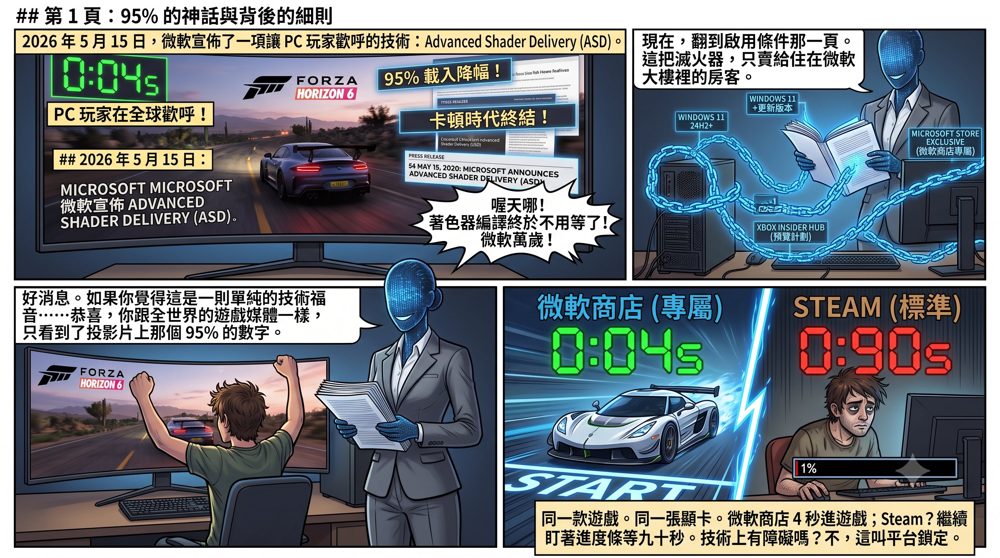
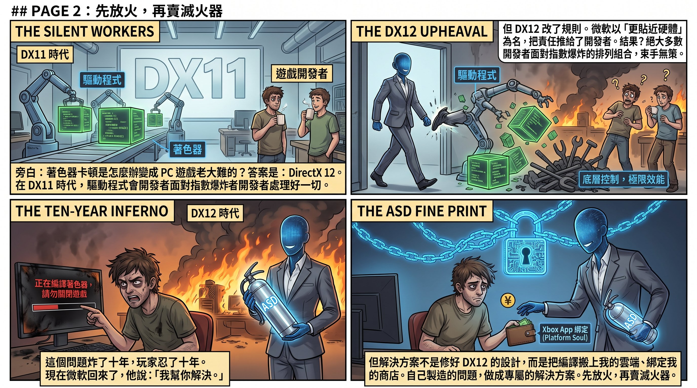
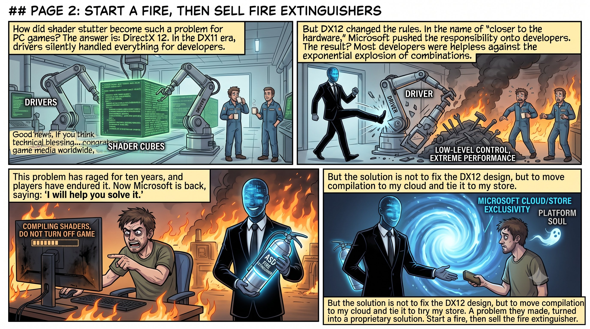
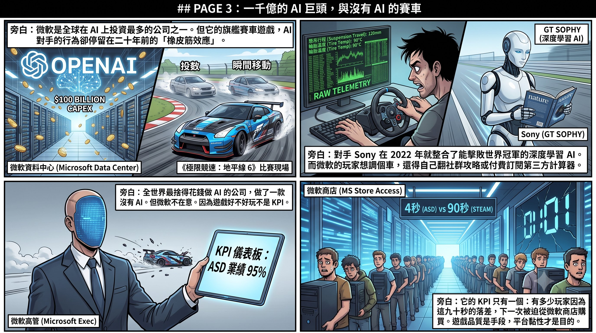
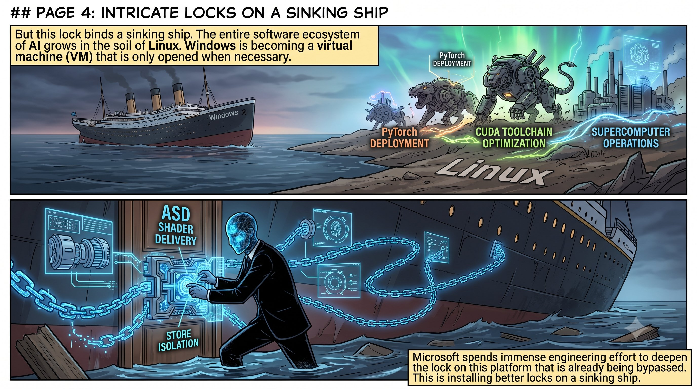
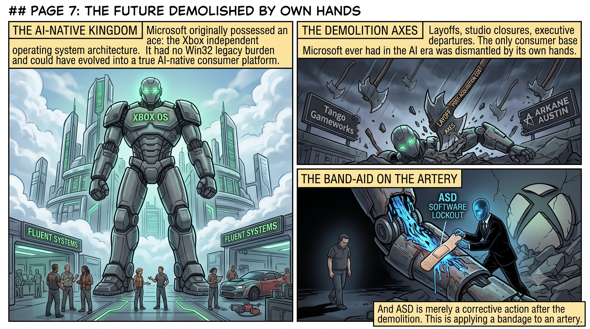
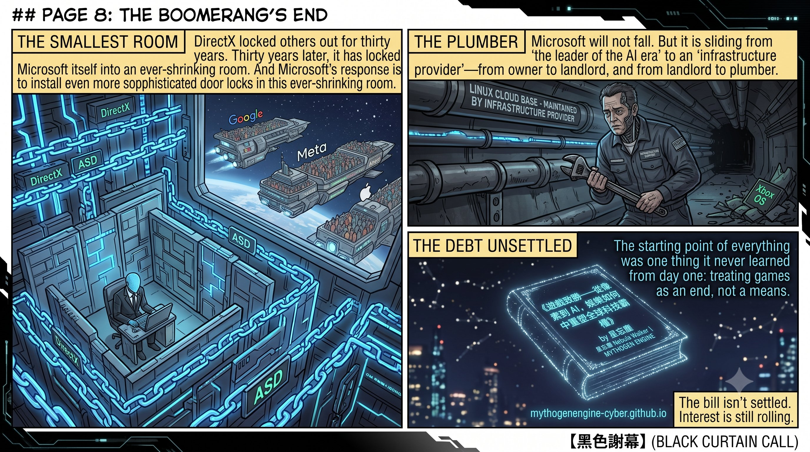

作者：星忘塵 Nebula Walker
Date: 08JUL2026
創象引擎 Mythogen Engine (mythogenengine.com)

**📌 從微軟最新推出的 Advanced Shader Delivery (ASD) 技術切入，剖析微軟如何以解決問題為名行平台鎖定之實，以及在 AI 時代親手拆解 Xbox 消費者基座的戰略矛盾與困境。**

# 滅火器經濟學——微軟 ASD 與一場三十年老戲的最新一幕

---

2026 年 5 月 15 日，微軟宣佈咗一項令 PC 玩家歡呼嘅技術：Advanced Shader Delivery（ASD）。《極限競速：地平線 6》嘅首次載入時間，由差唔多九十秒縮短到四秒。降幅 95%。NVIDIA、AMD、Intel 三大 GPU 廠商全部支援。困擾 PC 玩家超過十年嘅著色器編譯等待問題，睇落終於要走入歷史。

好消息。

讀到呢度，如果你覺得呢個係一則單純嘅技術福音——恭喜，你同全世界嘅遊戲媒體一樣，淨係睇到投影片上面嗰個 95% 嘅數字。

而家，揭去啟用條件嗰一頁。

---

## 一、滅火器只賣畀自己嘅房客

ASD 要求：Windows 11 24H2 或更新版本。Xbox Gaming Services 更新至指定版本。加入 Xbox Insider Hub 嘅 PC Gaming Preview 計劃。遊戲必須透過 Xbox PC 客戶端或微軟商店下載。

**Steam 版本暫時唔支援。**

同一款遊戲。同一張顯示卡。同一套驅動程式。由微軟商店下載，四秒入遊戲；由 Steam 下載，繼續望住編譯進度條等九十秒。

技術上有冇任何理由唔可以畀 Steam 版本用同一套預編譯著色器？冇。ASD 嘅核心係將著色器編譯器由驅動程式入面分離出嚟，喺雲端預先完成編譯，再將成品推送到玩家嘅機器上。呢件事完全可以做成開放標準，令所有平台受惠。微軟揀咗唔咁做。佢揀咗將解決方案綁死喺自己嘅商店、自己嘅服務、自己嘅雲端管線上。

便利係真。鎖定都係真。

呢個結構如果你覺得眼熟，係因為佢三十年前就出現過。

---

## 二、先放火，再賣滅火器

著色器編譯卡頓呢個問題，幾時開始變成 PC 遊戲嘅「老大難」？

答案：DirectX 12。

DX11 年代，驅動程式會幫開發者處理大量著色器編譯同排列組合嘅工作。開發者唔使操心——呢啲嘢喺幕後自動發生。DX12 改咗規則。微軟以「更貼近硬體、更高效能」為名，將著色器管線嘅責任由驅動程式推畀開發者。開發者而家要自己管理著色器嘅編譯、快取、排列組合。

理論上，呢個令頂尖開發者可以壓榨出更好嘅效能。實際上，佢令絕大多數開發者面對著色器排列組合嘅指數爆炸，束手無策。結果就係你喺每一款 DX12 大作嘅標題畫面上見到嗰行字：「正在編譯著色器，請勿關閉遊戲。」

呢個問題炸咗十年。玩家忍咗十年。

而家微軟返嚟話：「我幫你搞掂。」

但解決方案唔係修好 DX12 嘅著色器管線設計，唔係令本地編譯更高效，唔係提供一套開放嘅預編譯標準畀所有平台都用得。解決方案係：**將編譯搬上我嘅雲端、綁定我嘅商店、經過我嘅 Partner Center。**

**自己製造嘅問題，做成平台專屬嘅解決方案。先放火，再賣滅火器——而且滅火器只賣畀住喺自己大廈入面嘅房客。**

---

## 三、引擎退步，但邊個在乎？

如果 ASD 嘅目的真係令遊戲體驗變好，咁微軟應該同時確保遊戲本身跑得好。

《極限競速：地平線 6》——ASD 嘅官方示範作品——用嘅係 ForzaTech 引擎嘅升級版，繼承自 2023 年嘅《極限競速》。引擎加咗即時全域光照等新功能，但 VRAM 需求暴增——同一張顯示卡，FH5 開到 Extreme 畫質仲可以順暢跑，FH6 開 High 就食咗超過 7GB 視訊記憶體。AMD 顯卡嘅微卡頓問題尤其嚴重，Playground Games 上線一個星期就承認緊修。

更荒謬嘅係遊戲本身嘅 AI。FH6 嘅 Drivatar 系統喺低難度下尚算可以，但一旦調到老手（Highly Skilled）以上，橡皮筋效應就暴露無遺——AI 對手唔係靠更好嘅路線或煞車時機贏你，而係喺直路上憑空攞到超越物理極限嘅車速，甚至喺你拉開距離之後瞬移到更近嘅位置。Playground Games 上線四日就將「Drivatar AI Balance」列為四大改善項目之一，承認「AI 對手喺高難度下太快」。至於調車系統？遊戲提供咗原始嘅遙測數據——輪胎溫度、懸掛行程——但冇任何 AI 輔助分析。玩家想知應唔應該調軟後防傾桿，要自己睇數字、翻社群攻略、或者付費訂閱第三方網站嘅調校計算器。

諗吓呢個意味住咩。微軟係全球喺 AI 上投資最多嘅公司之一——一千億美元嘅資本支出，130 億美元押喺 OpenAI 身上。Sony 嘅《跑車浪漫旅 7》喺 2022 年就整合咗 Gran Turismo Sophy——一個登上《Nature》期刊、能夠喺賽道上擊敗世界冠軍級車手嘅深度強化學習 AI。而微軟自己嘅旗艦賽車遊戲，AI 對手嘅行為模式停留喺二十年前嘅橡皮筋，調校系統連一個「根據你嘅駕駛風格建議懸掛設定」嘅功能都冇。

**全世界最捨得花錢做 AI 嘅公司，做咗一款冇 AI 嘅賽車遊戲——然後用佢嚟展示一項鎖定平台嘅技術。**

微軟唔在乎。

因為 ASD 要展示嘅唔係「遊戲品質提升」，而係「載入速度嘅落差」。佢需要嘅係一個夠大嘅數字——95%——同一個夠明確嘅對比：我嘅商店四秒，Steam 九十秒。

**遊戲本身好唔好玩，AI 聰唔聰明，畫面順唔順暢，唔喺 ASD 嘅 KPI 入面。** ASD 嘅 KPI 係：有幾多玩家因為呢個落差，下一次揀喺微軟商店買。

工程資源冇花喺改善遊戲引擎上，冇花喺遊戲 AI 上。工程資源花咗喺建設平台鎖定嘅基礎設施上。遊戲品質係手段，平台黏性先係目的。

---

## 四、但呢把鎖，鎖嘅係一艘正在沉嘅船

ASD 鎖定嘅戰場係 PC 遊戲嘅 Windows 商店分發渠道。

問呢個問題：Windows 作為平台，而家處於咩位置？

AI 嘅成個軟體生態——PyTorch、CUDA 工具鏈、容器化部署——長喺 Linux 上面。全球頭五百大超級電腦，Linux 佔比超過九成。連 NVIDIA 自己嘅雲端遊戲平台 GeForce NOW，底層都係 Linux 做地主，Windows 被裝入虛擬機入面——需要嘅時候開機，唔需要嘅時候閂。Valve 嘅 Steam Deck 跑 Linux，用 Proton 翻譯層跑九成以上嘅 Windows 遊戲。

Windows 曾經係成棟大廈嘅業主。而家佢正在變成租客——一個可以被虛擬化、被啟動、被關閉嘅 VM。

微軟花大量工程力氣，喺呢個正在被繞過嘅平台上加深鎖定。

呢個係喺沉緊嘅船上面裝更好嘅門鎖。

---

## 五、Steam Machine 嘅屍體上面寫住答案

如果你覺得「先放火再賣滅火器」只係一個比喻——Valve 可以攞出一具屍體做證物。

2015 年，Valve 推出咗 Steam Machine。概念好直接：一台跑 Linux 嘅客廳遊戲主機，直接由 Steam 玩遊戲，唔經 Windows。如果成功，PC 遊戲嘅分發就唔再被微軟嘅平台壟斷。

佢死咗。

唔係因為硬件差。唔係因為定價錯。係因為 Steam 上絕大多數遊戲都係用 DirectX 寫嘅，而 SteamOS 跑嘅係 Linux，用嘅係 OpenGL。同一部機器上面，SteamOS 跑遊戲比 Windows 慢 21% 到 58%。兩間本來計劃出 Steam Machine 硬件嘅廠商——Falcon Northwest 同 Origin PC——見到呢個落差，直接退出。

Steam Machine 唔係「性能差」。佢係被 DirectX 三十年嘅生態鎖定困死嘅。

開發者用 DirectX 寫遊戲，唔係因為 DirectX 最好，而係因為 Windows 係唯一嘅市場。當所有遊戲都寫死喺 DirectX 上面，任何試圖繞過 Windows 嘅平台都會撞上同一面牆：你嘅遊戲庫入面九成嘅遊戲打唔開。呢個唔係技術問題，呢個係壟斷嘅結構性效果——**你唔需要禁止競爭對手進場，你只需要令成個生態都依賴你嘅私有標準，競爭對手就會自己窒息。**

Valve 花咗十年先搵到繞路嘅方法。Proton 翻譯層加上 DXVK，將 DirectX 嘅呼叫即時轉譯成 Vulkan——等於喺 Linux 上面架咗一座虛擬嘅 Windows。2022 年嘅 Steam Deck 證明咗呢條路走得通：九成以上嘅 Windows 遊戲可以喺 Linux 上面跑。

十年。成個翻譯層嘅工程量。只係為咗繞過一道本來唔應該存在嘅牆。

而家，微軟喺牆上面加咗新嘅一層。

ASD 將著色器嘅分發管線綁定喺 Xbox PC 應用程式上面。就算 Proton 能夠翻譯 DirectX 嘅圖形呼叫，佢翻譯唔到一套綁定喺微軟商店基礎設施上嘅雲端分發機制。Steam 版唔支援 ASD。SteamOS 更加唔使諗。2026 年嘅新一代 Steam Machine 啱啱通過 Vulkan 1.4 認證，未上市就已經被排除喺 ASD 嘅生態之外。

呢個就係壟斷嘅運作方式：**當舊嘅鎖被撬開，就喺新嘅維度上面再裝一把鎖。** API 層嘅鎖被 Proton 繞過咗？咁就喺 shader 分發層再鎖一次。分發層都被繞過咗？下一次會鎖喺反作弊層、鎖喺雲端算力層、鎖喺任何一個仲未有開放標準嘅地方。

DirectX 殺死咗 Steam Machine 1.0。ASD 係射向 Steam Machine 2.0 嘅第一粒子彈——喺佢出世之前。

---

## 六、最後一根稻草被自己折斷

呢度要將視野拉高，睇微軟喺 AI 時代嘅全局。

2025 財年，微軟嘅資本支出超過一千億美元——幾乎全部投向 AI 資料中心。佢向 OpenAI 投咗 130 億美元。佢嘅 AI 戰略押注喺 Azure 雲端算力同 OpenAI 嘅模型能力上面。

但呢個戰略有一個結構性弱點：**微軟唔擁有終端消費者。**

Azure 嘅客戶係企業。Copilot 係嫁接喺 Office 上面嘅附加功能。OpenAI 隨時可能脫鈎。Google 有搜尋引擎同 Android。Meta 有社交平台。Apple 有 iPhone。微軟有咩？

微軟曾經有 Xbox。

唔止幾千萬活躍用戶同每月付費嘅 Game Pass 訂閱關係。唔止一條已經建好嘅內容分發管線同一批頂尖嘅第一方工作室——做出《Prey》嘅 Arkane Austin、做出《Hi-Fi Rush》嘅 Tango Gameworks、做出《Halo》嘅 343 Industries。

Xbox 仲有一樣嘢，比呢啲全部都重要：**一個獨立嘅作業系統架構。**

Xbox 嘅 OS 雖然基於 Windows NT 核心，但佢由 Xbox One 開始就採用咗 hypervisor 架構——一個輕量嘅即時作業系統控制成部機器，上面跑住精簡到只剩遊戲所需 API 嘅專用環境。微軟自己嘅工程師講過：「擁有自己嘅作業系統，令 Xbox 能夠掌控自己嘅架構命運。」呢套系統唔需要兼容三十年嘅 Win32 應用程式，唔需要跑 Office，唔需要背負 Windows 龐大嘅歷史包袱。如果微軟認真做，Xbox OS 可以進一步演化，由零設計 AI 排程同推論管線，變成一個真正嘅 AI-native 消費者平台。唔係喺 Windows 上面疊加一層 Copilot 按鈕，而係一個由核心架構就為即時 AI 互動設計嘅系統。

想像吓：一部 Xbox 主機，搭載專用嘅 NPU，跑住一個唔受 Windows 歷史遺產拖累嘅 AI 作業系統。遊戲入面嘅 NPC 能夠即時對話、會學習。調車系統用 AI 分析你嘅駕駛風格，自動建議懸掛設定。關卡根據玩家行為動態生成。幾千萬玩家每日花幾個鐘沉浸其中——呢個係 AI 技術最理想嘅大規模消費者試驗場，任何聊天機械人、任何辦公室插件都比唔上嘅沉浸度同黏性。

Google 冇呢種嘢。Meta 冇。Apple 暫時都冇。微軟有——而且只有微軟有。

但微軟將佢拆咗。

2024 年花 690 億買入 Activision Blizzard，三個月後裁 1,900 人。Tango Gameworks 關咗。Arkane Austin 關咗。The Initiative 關咗。Turn 10 裁咗近半數員工。Phil Spencer 退休。接手嘅係一個 AI 高管。

Seamus Blackley——第一部 Xbox 嘅共同創造者——畀咗一個詞：palliative care。安寧療護。

**微軟喺 AI 時代唯一擁有過嘅消費者基座，被自己親手拆咗。**

而 ASD，係拆咗之後嘅補救動作。Xbox 硬件萎縮咗，微軟試圖用軟件服務維持對 PC 遊戲嘅控制力——你唔需要 Xbox 主機，只需要用我嘅 App 買遊戲、行我嘅雲端管線。但一條 PC 遊戲分發渠道嘅鎖定，替代唔到一個有幾千萬活躍用戶嘅消費者平台。

呢個係用繃帶貼喺動脈上面。

---

## 七、因果鏈

將線連埋——

1994 年，微軟用 DirectX 鎖住 PC 遊戲開發者，Windows 成為遊戲嘅唯一平台。成功咗三十年。

但成功得太徹底，副作用喺十年後顯形：Windows 變得越嚟越封閉，需要自由度嘅人——科研人員、AI 研究者——全部走咗去 Linux。AI 嘅成個生態長喺微軟掂唔到嘅泥土上面。

2015 年，Valve 試圖用 Steam Machine 打破呢個壟斷。DirectX 嘅生態鎖定將佢焗死咗。Valve 花咗十年起翻譯層，2022 年用 Steam Deck 證明 Linux 可以跑 Windows 遊戲。微軟嘅回應唔係開放，而係喺 shader 分發層再上一把新鎖——ASD。舊鎖被撬開，就換一把新嘅。

微軟發現自己喺 AI 時代冇根，於是掟一千億美元起 AI 基礎設施，同時拆埋 Xbox 將資源搬過去。

Xbox 被拆咗，微軟失去嘅唔止係消費者基座——佢失去咗唯一一個唔被 Windows 歷史包袱拖累嘅作業系統平台。佢試圖用 ASD 之類嘅軟件鎖定嚟維持 PC 遊戲嘅控制力——但鎖定嘅對象係 Windows 商店，一個喺 Steam 面前市佔率微乎其微嘅平台。

與此同時，Google 有搜尋同 Android，Meta 有社交網絡，Apple 有 iPhone，佢哋全部都喺自研晶片繞開 NVIDIA，全部都有自己嘅消費者入口。微軟有咩？一個底層跑 Linux 嘅雲端服務，一個隨時可能獨立嘅 OpenAI，一個被掏空嘅遊戲部門，同一個背住三十年歷史包袱嘅 Windows——佢本來有機會用 Xbox OS 重新開始，但嗰度門已經被自己閂埋咗。

**DirectX 鎖住咗人哋三十年。三十年後，佢將微軟自己鎖入咗一間越嚟越細嘅房。而微軟嘅回應，係喺呢間越嚟越細嘅房入面，裝越嚟越精巧嘅門鎖。**

ASD 唔係新技術。佢係一個三十年老戲碼嘅最新一幕——先用便利吸引用家，再用鎖定箍住開發者，最後反過嚟鎖住消費者。只不過今次，被鎖住嘅人越嚟越少，而鎖嘅成本越嚟越高。

微軟唔會倒。佢太大。但佢正在由「AI 時代嘅領跑者」滑向「AI 時代嘅基礎設施供應商」——幫人哋跑算力，自己攞唔到終端價值。由業主變房東，再由房東變水喉匠。

而一切嘅起點，係佢由第一日起就冇學識嘅一件事：**將遊戲當作目的，而唔係手段。將玩家當作顧客，而唔係籌碼。**

---

## 後記

呢條由 DirectX 到 ASD 嘅因果鏈，只係四十年科技霸權暗戰入面嘅一條線。NVIDIA 嘅 CUDA 壟斷點嚟？台積電點解變成全球唯一嘅軍工廠？Valve 點樣喺 Linux 上面架起一座虛擬嘅 Windows？任天堂點解喺所有人都拆遊戲嘅時候仲喺度做遊戲？

呢啲問題嘅答案，喺《遊戲致勝——從像素到 AI，娛樂如何暗中重塑全球科技霸權》入面。

每一條線，都由一個你以為天經地義嘅現實開始，倒帶到三十年前嗰個令一切走上不歸路嘅決定。

帳單仲未結清。利息仲喺度滾。

---

