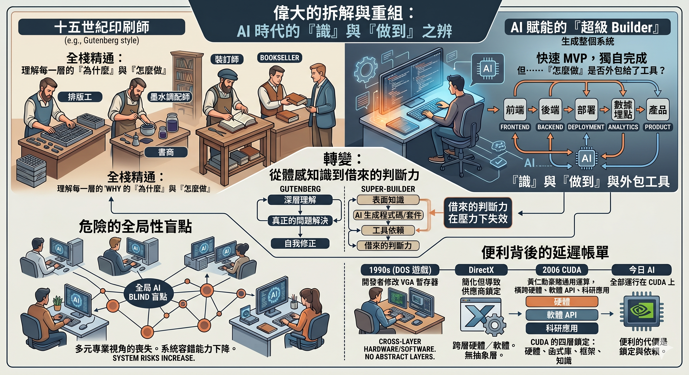

# 「識」和「做到」，從來都不是同一件事

有人用了一個漂亮的類比：十五世紀的活版印刷師，同時是排版工、墨水調配師、裝訂師、書商。工業化花了三百年把他拆成十個工種。現在 AI 正在把十個工種壓縮回一個人。

方向對了。但結論需要修正。

---

古騰堡時代的印刷師是真正的全能。他自己研發合金活字配方、自己調油墨、自己改造壓機。墨水暈了，他知道是配方的問題還是紙張吸墨性的問題——因為兩樣他都自己做過。

**他的全能，建立在「每一層都碰過」的體感之上。**

現在被追捧的「超級 Builder」，表面上也是一個人做完整條鏈——前端、後端、部署、埋點、數據、產品。3 到 7 天交出 MVP，一個人頂半支團隊。

但仔細看，這條鏈上很多環節，他不是自己「識」，而是「外包」給了工具。用 AI 寫程式碼，底層發生了什麼，他未必理解。用現成套件拼介面，設計原則背後的取捨邏輯，他未必說得清。

產出看起來一樣。甚至更快、更好看。

差別在出錯的時候。

古騰堡的印刷師出了問題，自己知道問題在哪裡。現在的超級 Builder 出了問題，需要再問一層工具。他的判斷力有一部分是借來的。而借來的判斷力，在壓力最大的時候，往往最先失效。

---

更危險的是全局性盲點。

當所有超級 Builder 都在用同一套 AI 工具，他們的盲點也會是同一個。以前十個工種各有各的專業判斷，互相交叉驗證。一個人出錯，其他環節接得住。現在一個人用 AI 做完所有環節，AI 的盲點就是他的盲點。而整個市場大量 Builder 共用同一套工具——盲點就從個人的，變成全局的。

**多元的專業視角被壓縮成對同一套工具的共同依賴。系統的容錯能力，在產能上升的同時，悄悄下降了。**

---

但真正致命的，不是盲點本身。是盲點會淘汰掉唯一看得見它的人——而且淘汰的方式，比你想像的更難辨認。

問題不是「有人問正確的問題，有人不問」這麼簡單。現實遠比這更混亂。

真正見過生產事故的工程師會問：這個 edge case 處理了沒有？這個依賴的安全更新誰負責？這個架構三年後能不能撐住十倍的流量？他問這些問題，是因為他見過不問的代價。但最擅長包裝的人，也會問一模一樣的問題——用一模一樣的術語、一模一樣的語氣。差別只在於：前者問完之後，交付物裡有對應的處理；後者問完之後，交付物裡什麼都沒變。

而外面的人——管理層、投資人、甚至隔壁團隊——根本分不出來。

這才是真正的羅生門：**能力的語言和能力本身脫鉤了。** 在 AI 工具把「說對的話」的門檻降到接近零的時代，每個人都能講出像樣的技術判斷，但背後有沒有真正的理解在支撐，從外部看是不可驗證的。

於是篩選機制就壞了。在「3 天出 MVP、7 天見數據」的節奏裡，兩種人都會說同樣的話，但真正做了防護的人交付更慢、承諾更保守。而那個只說不做的人——或者那個真心不知道自己省略了什麼的人——交付更快、報告更好看。

結果是三重淘汰：**真正識的人被嫌慢。只懂包裝的人升遷。而什麼都不問、全速衝刺的人，反而最受獎勵——因為無知消除了猶豫，而猶豫在這個環境裡是唯一可見的成本。**

**這是劣幣驅逐良幣的 AI 版本。被驅逐的不是技術能力，是判斷力。**

而一個組織一旦把有判斷力的人篩掉，剩下的人不會知道自己少了什麼——因為判斷力的價值，只有在出事之後才看得見。預防了一場事故的人，沒有 KPI 可以證明自己預防了什麼；事故沒發生，就等於什麼都沒發生。所以做預防的人不被獎勵，提出風險的人不受歡迎，而那些從不猶豫的人一路升遷——直到某一天，沒有人記得那些「多餘的擔心」到底在擔心什麼。

---

這件事讓我覺得熟悉。

因為我用數十年的工程經驗寫了《遊戲致勝》，追蹤的正是這個 pattern 在過去四十年裡的每一次變奏。

1990 年代，DOS 時代的遊戲程式設計師必須親手記住 VGA 晶片的每一個暫存器、CPU 的每一條流水線、Sound Blaster 的每一組 I/O 埠。他橫跨硬體和軟體的每一層，因為那個年代不存在幫你隔開它們的抽象層。然後 DirectX 出現了——它解決了驅動程式地獄，但也把開發者鎖進了微軟的圍牆。便利換來了鎖定。

2006 年，黃仁勳在遊戲顯示卡裡塞入通用運算核心，叫做 CUDA。他用遊戲玩家的錢養了將近十年的研發，等到 AI 來認領。這個豪賭能成功，是因為他同時看得懂硬體指令集、軟體 API、和科研應用三層之間的接縫——他是一個「每一層都碰過」的人。

今天，整個 AI 產業跑在 NVIDIA 的 CUDA 上，而 CUDA 的四層鎖定——硬體指令集、運算函式庫、框架綁定、全球學術知識庫——除了 Google 用內部規模硬建了自己的 TPU 閉環之外，沒有人撬得開。

**每一次「便利」的背後，都有一張延遲帳單。而帳單的到期日，往往在二十年後。**

---

超級 Builder 的故事，和這本書追蹤的四十年科技史，問的是同一個問題：

**當工具愈來愈強、工具背後的原理愈來愈隱形——「能做到」和「知道自己在做什麼」之間的裂縫，會不會大到無法修復？**

古騰堡的印刷師知道自己手上拿的是什麼。

John Carmack 知道。黃仁勳知道。Lisa Su 知道。

現在的超級 Builder——以及我們這一代站在無數抽象層頂端的所有人——未必知道。

這本書不是懷舊。是一份四十年的證據鏈，告訴你：**你今天覺得天經地義的每一件事——CUDA 壟斷 AI、台積電造所有人的晶片、Steam Deck 在 Linux 上跑 Windows 遊戲——全部是當年某個「每一層都碰過」的人，做了一個你不知道的決定的結果。**

而這種人，正在消失。

---

**《遊戲致勝：四十年科技霸權的隱藏算術》**
星忘塵 著 ｜ MYTHOGEN ENGINE 出品

📖 https://mythogenengine.com/

