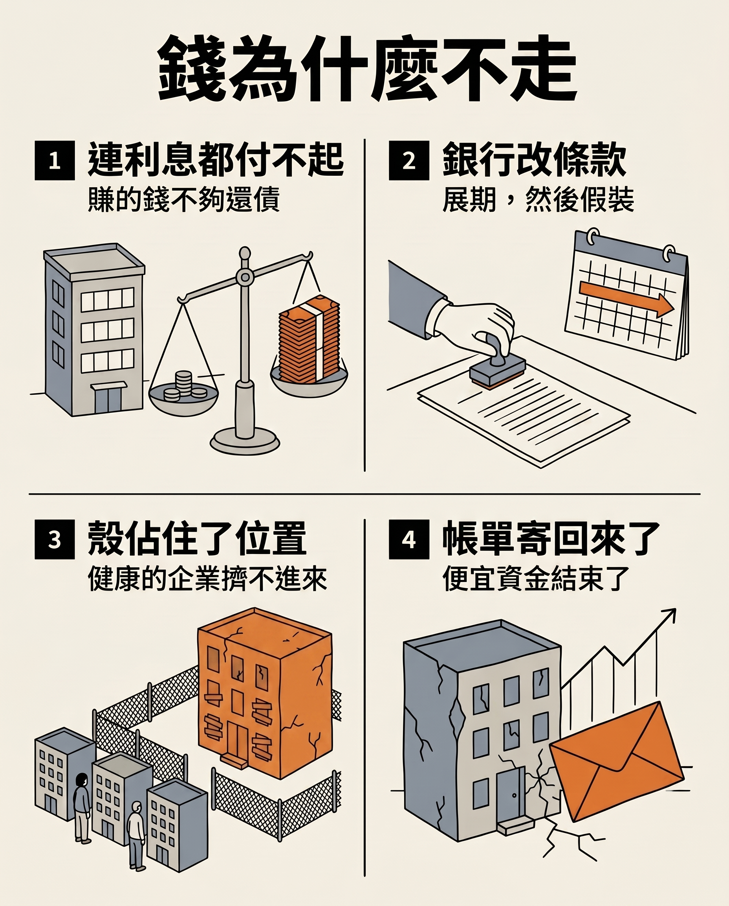

作者：星忘塵 Nebula Walker
Date: 31AUG2026
創象引擎 Mythogen Engine (mythogenengine.com)

**📌 一個經濟體真正的健康指標不是增長率，是退出率。而現在資本與人同時失去了離開的能力。**

# 錢不走，人也不走

## 一、一種很難描述的公司

你大概見過這種地方。

它沒有倒閉，但也沒有在做什麼。研發部門早就不做研發了，改為維護幾條舊產品線。每季都有新的策略簡報，每年都有重組，而每一次重組之後，做事的人變少，開會的人變多。

奇怪的是沒有人走。大家都知道這裡沒有前途，但每個人都留下來。

更奇怪的是它也沒有死。年年不賺錢，銀行年年續貸。

這種公司在全世界都變多了，多到有了自己的名字。而它之所以能維持那個「還在營運」的外觀，靠的是兩件事同時成立：**錢不走，人也不走。**

這篇文章想講的是：這兩件事其實是同一件事。

## 二、一個經濟體真正的健康指標不是增長率，是退出率

市場經濟的核心承諾從來不是「大家都會賺錢」。它的承諾是：**做不好的會退出，資源會流去做得好的人手上。**

熊彼得把這件事叫做創造性破壞。破壞不是副作用，是機制本身——沒有破壞，創造就沒有位置站。

所以退出率是這套系統的免疫功能。它讓錯誤有限度，讓資源不會永遠鎖在錯的地方。

而現在，這個功能在兩個要素市場同時失靈了。

一邊是資本：該退出的公司沒有退出。
另一邊是勞動：該流動的人沒有流動。

兩邊的原因不同，但結果咬合成一個閉環。

## 三、上半場：錢為什麼不走

虧損企業靠續貸活下去，這件事有個通用的名字——喪屍企業。

最常見的定義是：利息保障倍數連續三年低於 1，也就是營運賺到的錢連利息都付不起，靠新的借貸維持呼吸。

**銀行為什麼不斷貸？** 因為斷貸就要立刻認列損失，而續貸只需要改一改條款、延長一下到期日。這個做法有個英文說法叫 extend and pretend——展期，然後假裝。對單一家銀行來說完全理性；對整個系統來說是慢性腐蝕。

**代價落在哪裡？** OECD 的系統性研究給了答案：當喪屍企業佔據一個行業的資本份額越高，健康企業的投資與就業增長就越低。低生產力企業賴在退出邊緣不走，會堵住市場、拖慢資源重新配置，而受害最深的恰恰是生產力最高的那些企業。

換句話說，喪屍企業不只是自己沒效率——它還佔住了本來應該流向別人的資金、市場位置與人。

規模上，達拉斯聯準銀行的研究顯示，中國非金融企業的喪屍資產佔比從二〇一八年的 5% 升到二〇二四年的 16%，其中房地產從 6% 飆到 40%，製造業從 4% 升到 11%。歐洲央行的數據則顯示，疫情前歐元區的喪屍企業佔比仍高於金融危機前，而且銀行對這些企業的貸款利率幾乎沒有反映它們更高的違約風險——連風險定價這一層都失靈了。

## 四、先停下來拆一個陷阱

在繼續之前，必須把一件事講清楚，否則整篇文章會被一句話推倒。

「利息保障倍數低於 1」這個定義，分母是利息支出。**升息本身就會機械性地把一批公司推進喪屍名單**，即使它們的營運一天都沒有變差。

所以近年各國喪屍企業數字創新高這件事，有相當一部分是利率正常化的算術結果，不是新的腐壞。看到「歷年最高」四個字就直接引用，是會出事的。

不同機構的定義寬緊也差很遠。有的只看利息保障倍數，有的還要加上企業年齡與市場估值。用寬定義算出來的比例，可以是嚴定義的好幾倍。把不同來源的數字並排放進同一段，論證看起來很壯觀，但一碰就散。

**不過想清楚之後，這件事反而更重要。**

真正的變化不是企業突然變差了，是**便宜資金這件事結束了**。過去二十年，很多公司的生存條件不是「賺得到錢」，而是「借得到便宜的錢」。當利率回到正常水平，帳單就被寄了回來——而那批公司從來沒有準備過要付這筆帳。

日本是目前唯一一個真正在動手清算的主要經濟體，而它的數字值得看仔細。

日本央行結束負利率之後，政策利率在二〇二五年十二月升到 0.75%。同一年，企業破產數達到 10,300 家，是二〇一三年以來的最高，年增 2.9%，並且是連續第四年上升。

而在破產上升的同時，喪屍企業的比例下降了——帝國徵信的數據顯示，截至二〇二四年三月的財政年度，日本喪屍企業比例降到 15.5%，是七年來首次下跌。

**一升一降，就是免疫功能重新啟動的樣子。** 那不是崩潰，是積壓了三十年的退出，終於開始發生。

而 Bloomberg 的觀察補上了最關鍵的一塊：目前破產尚未蔓延到大型企業，而且失業者普遍還找得到新工作——靠的是日本長期的勞動力短缺。

**這一點決定了一切。**

其他地方大多還在 extend and pretend。

## 五、下半場：人為什麼不走

.jpg)

現在換到另一個要素市場。

理論上，人力資源的配置也該有退出機制：這裡沒有前途，你就走去有前途的地方，資源自己完成重新分配。

實際上，這件事這幾年幾乎停止了。

英文世界最近給它取了個名字：job hugging——不是因為滿意而留下，是因為離開的風險感覺太高而留下。多份業界人力調查都指向同一個方向，自認「抱住現有工作」的比例逐年上升，理由集中在經濟不確定性與對裁員的恐懼。（這類調查多由招聘平台自行發布，方法不如官方統計嚴謹，看趨勢可以，別當精確數字用。）

真正該注意的不是百分比，是機制。**人不敢走，需要三個條件同時成立**，而現在三個都成立了：

**一、外面沒有位置。** 這一點直接由上半場造成——健康企業被喪屍企業擠壓，投資與就業增長都被壓低，所以招聘變慢。你想跳的那家公司，正在被同一批喪屍搶走資金。

**二、初階職位在萎縮。** AI 目前造成的位移，主要不是把在職的人裁掉，而是讓初級崗位的招聘放緩。這對年輕人的意義是入口變窄；對在職者的意義是，你一旦離開，重新進入的難度比你離開時高。

**三、社會敘事把離開等同失敗。** 留下叫穩定，走了叫不安分。在年資制度與面子文化更重的地方，這一層特別厚。

於是出現一個很難堪的狀態：一群不想留的人留在原地，而帳面上看起來「人員穩定」。

## 六、最諷刺的一環：留下來的是誰

這裡有一個所有在企業待過的人都認得的現象。

**最沒有產出的人，通常最不會走。** 他在市場上換不到更好的位置，所以他對這份工作的估值最高。

**而有能力的人走得最早。** 他有選擇，離開的機會成本最低，忍耐的理由也最少。

所以當一間公司開始爛，它不是均勻地失血，是**選擇性地失血**——先走的永遠是你最不想放的那批。留下來的比例逐年往下滑，而每走一個能幹的人，剩下的人要扛的爛攤子就更重，於是下一個能幹的人更快走。

這就是逆向淘汰：不是好的被選上，是好的先離場。

而 job hugging 讓這件事變得更難看。當整體勞動市場凍結，能力最強的那批人的離開成本也上升了——但他們仍然是最先走的那批，因為他們的選項再少也還是有。於是公司同時失去兩樣東西：能幹的人繼續流失，而不能幹的人連流失的可能性都沒有了。

在企業內部，這通常被描述成「人才留不住」。準確的說法是：**留得住的，恰好是最不需要留的。**

## 七、我的假說：兩邊互相鎖死

.jpg)

接下來這一節是我的推論，不是實證結果。我把它明確標為假說，因為它的兩半證據強度差很遠。

**已經有實證的那一半**：喪屍企業擠壓健康企業。OECD 的研究做的就是這個方向——喪屍企業佔資本份額越高，健康企業的投資與就業增長越低。資本被鎖住，導致職缺變少。

**沒有實證的那一半，是我加上去的**：反方向。也就是人不敢走，反過來延長了喪屍企業的壽命。

我的理由是：一間長期不賺錢的公司要維持「還在營運」的外觀，需要有人繼續上班、繼續交付、繼續讓客戶和銀行看到它在動。如果裡面的人可以自由離開，殼會先從內部塌掉，銀行就算想展期也展不下去。**所以人不走，可能不只是喪屍企業的後果，也是它的存活條件之一。**

如果這兩半都成立，那就是一個閉環：

- 錢被鎖在不該待的地方 → 健康企業請不到人也擴不了張 → 外面沒有位置
- 外面沒有位置 → 人不敢走 → 殼繼續有人維持 → 錢繼續鎖在原地

兩者互為對方的存在條件。

**要驗證它，可以看幾件事**（我沒有這些數據，但它們是可以取得的）：

- 在喪屍企業比例高的行業，自願離職率是否明顯低於同期同地的健康行業
- 在清算開始加速的地方（例如現在的日本），喪屍企業的存活期是否隨著勞動市場變緊而縮短
- 企業從「開始虧損」到「實際退出」之間的時間長度，跟當地勞動市場鬆緊是否相關

如果這幾項都指向反方向，那我這半個假說就不成立，只剩 OECD 那一半——那也沒關係，那一半本來就夠嚴重。

**但如果它成立，最惡劣的地方在於它從外面看起來很像穩定**：失業率沒有暴衝，公司沒有倒閉潮，數字很平靜。

那不是穩定，那是沒有人能動。

而不能動的系統會累積兩種東西：一種是帳面上的損失，一種是人身上的損耗。前者可以展期，後者不能。一個人被放在明知沒有前途的位置上五年，那五年不會退回來。

## 八、那該怎麼看，該盯什麼

先講一句公平話：**退出是有真實代價的。** 破產不只是資產負債表事件，它是人的失業、供應商的呆帳、地方的稅收缺口。凡是主張「該倒就讓它倒」的人，如果不同時處理那些代價，那只是把痛苦說得輕鬆。

日本的做法值得看，正是因為它同時具備兩個條件：一邊推動清算，一邊有嚴重的勞動力短缺接住失業者。**清算的可行性，取決於接得住多少人。** 沒有第二個條件，第一個條件就是空話。

而日本這個條件還有一層黑色幽默：同一場勞動力短缺，一邊接住了被清算出來的人，一邊也在把公司推向倒閉——二〇二五年因為請不到人而倒閉的案例達到創紀錄的 397 宗。**缺工既是解藥，也是病因。**

這正好說明退出機制不是道德問題，是條件問題。同一件事在勞動力充裕的地方是災難，在缺工的地方是新陳代謝。

所以真正該盯的不是「哪家公司會倒」，而是這幾件事：

- **利率的方向**：便宜資金結不結束，決定殼還能站多久
- **銀行的展期行為**：不良貸款有沒有被真正認列，還是只在改條款
- **招聘結構**：初階職位的開缺數，比整體失業率更早反映凍結
- **離職的組成**：走的是誰。如果走的都是能幹的人，那間公司的問題比財報上看到的嚴重得多

最後一項不需要任何統計資料，你在自己公司裡就看得到。

## 九、結尾

有句話值得放在這裡：過剩不等於豐富。

還有一句是它的姊妹句：**穩定不等於健康。**

一個沒有人離職、沒有公司倒閉、數字很平的經濟體，聽起來像是好消息。但如果那是因為錢被鎖住、人也被鎖住，那它描述的不是健康，是麻痺。

真正健康的系統會不斷有東西死掉，然後把位置讓出來。

而我們現在遇到的問題是：**該死的沒有死，該走的沒有走，於是該來的也來不了。**

## 附註：這篇文章欠誰的

**不是我的：**

- 創造性破壞——熊彼得
- 軟預算約束，以及虧損企業為何不退出——Kornai János
- 喪屍企業擠壓健康企業投資與就業的實證——OECD
- 中國喪屍資產佔比的量級——達拉斯聯準銀行；歐元區的部分——歐洲央行
- 「job hugging」這個詞與相關調查——英語人力市場媒體與招聘平台（性質見第五節說明）

**是我的：**

- 把喪屍企業與 job hugging 讀成同一件事：兩個要素市場的退出機制同時失靈
- 兩者互為存在條件的閉環（第七節，明確標示為假說）——人不走可能不只是喪屍企業的後果，也是它的存活條件；以及三項可用來檢驗它的觀察
- 「留得住的恰好是最不需要留的」——逆向淘汰在企業內部的具體形態
- 清算的可行性取決於接得住多少人，因此日本的關鍵條件不是政策決心而是勞動力短缺

---

*本文是一組三篇的第三篇。第一篇[〈你的定期存款，補貼了德國人買車〉](/docs/TechNotes/你的定期存款，補貼了德國人買車)處理便宜商品是怎麼被造出來的；第二篇[〈四個地方，沒有一個人拿到那筆便宜〉](/docs/TechNotes/四個地方，沒有一個人拿到那筆便宜)處理那筆便宜最後流去哪裡；第三篇處理退出機制為何失靈。三篇共用同一句話：價格訊號被壓住，所以該退出的都沒有退出。系列落地頁見[《退出機制三部曲：便宜的代價》](/docs/TechNotes/退出機制三部曲)。*

