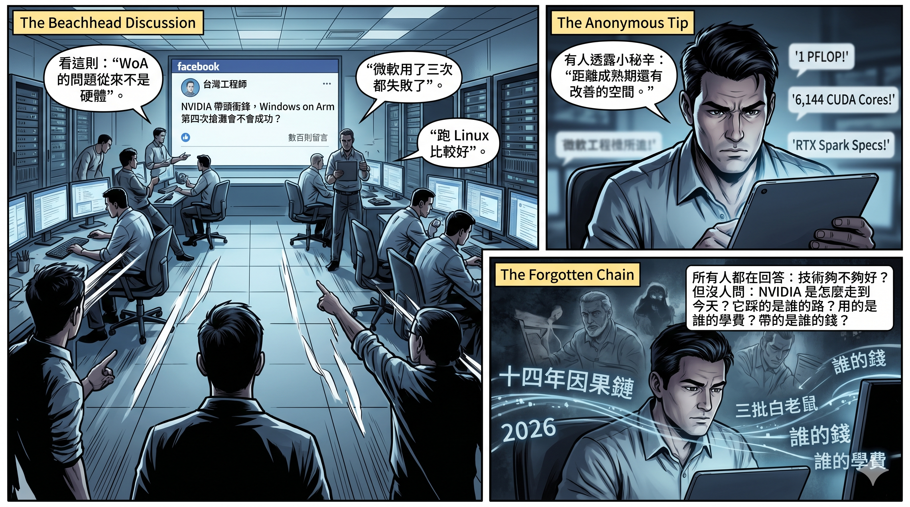
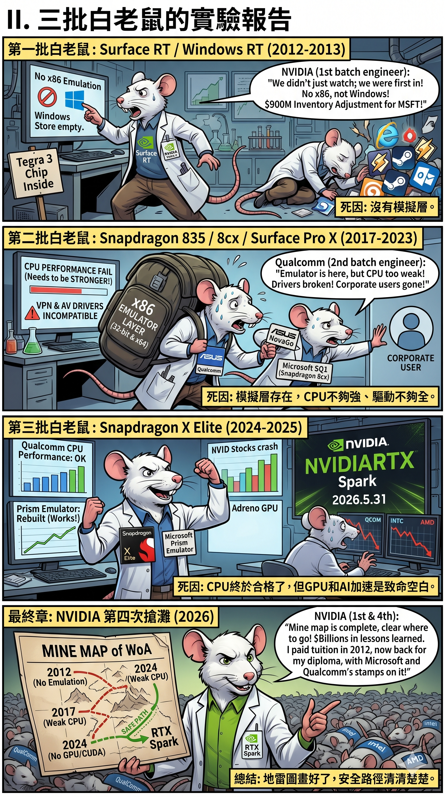
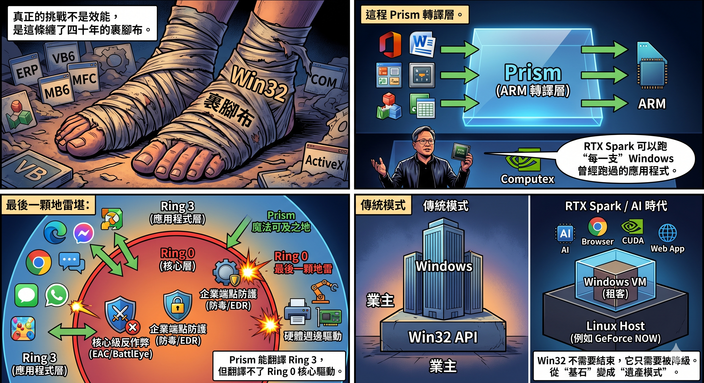
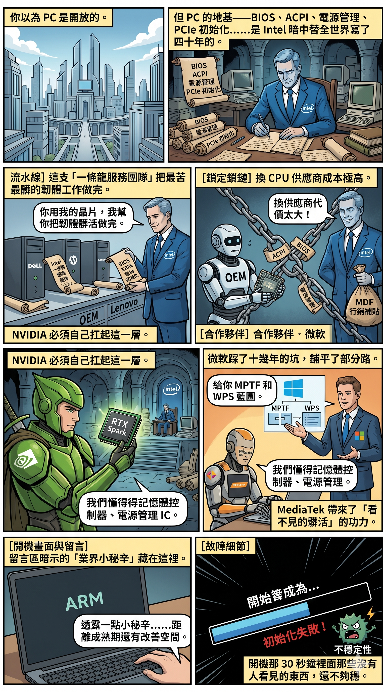
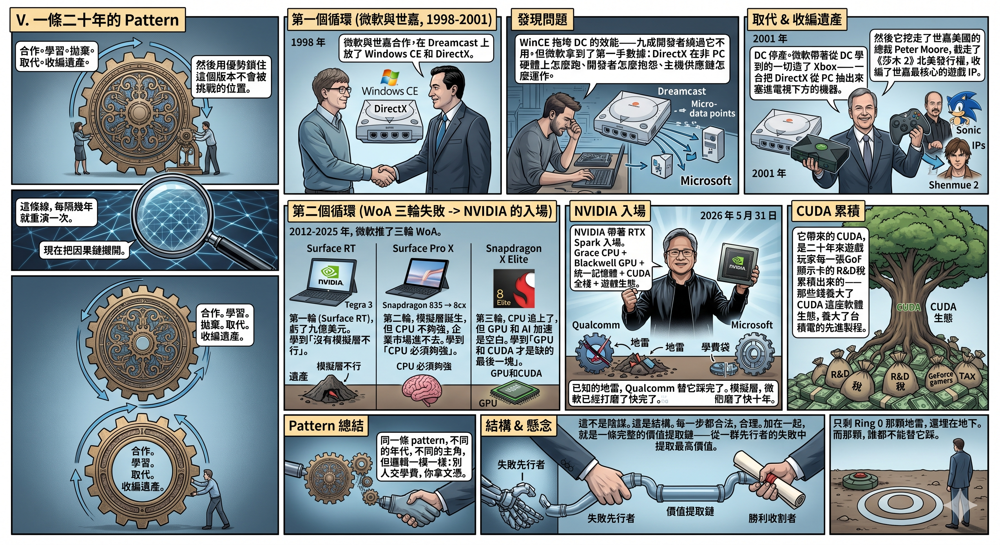
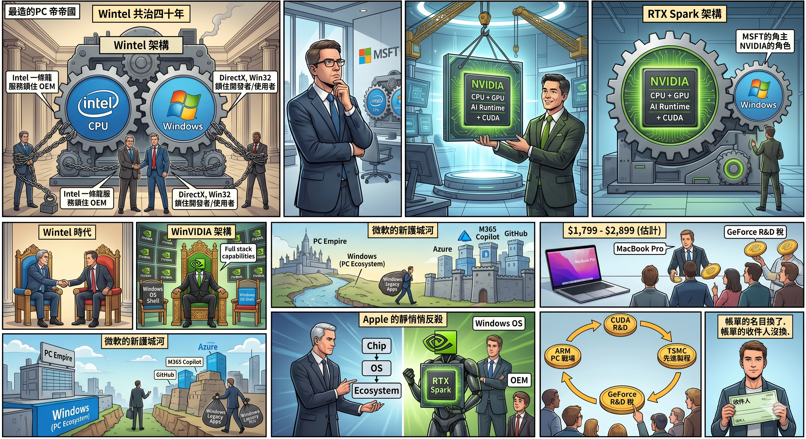

# 第四次搶灘的真相：NVIDIA RTX Spark 踩著誰的白老鼠上岸？

星忘塵 Nebula Walker · 創象引擎 MYTHOGEN ENGINE

---

## I. 數百則留言裡的盲區

> *一群工程師在辯論搶灘會不會成功。他們爭論的是技術。他們沒看到的，是一條穿越二十年的 pattern。*

2026 年 6 月，一位台灣工程師在 Facebook 上發了一篇文章：「NVIDIA 帶頭衝鋒，Windows on Arm 第四次搶灘會不會成功？」

留言區湧進數百則討論。有人說「WoA 的問題從來不是硬體」，有人說「微軟用了三次都失敗了」，有人說「跑 Linux 比較好」。最刺的一則來自一位不願多講的業界人士：「透露一點業界小秘辛……距離成熟期還有改善的空間。」

所有人都在回答同一個問題：**這一次的技術夠不夠好？**

但幾乎沒有人問另一個問題：**NVIDIA 是怎麼走到今天這一步的？它踩的是誰的路？用的是誰的學費？帶的是誰的錢？**

這篇文章不談 RTX Spark 的規格。1 PFLOP、128GB 統一記憶體、6,144 個 CUDA 核心——這些數字你可以在任何一篇科技新聞裡讀到。

這篇文章要拉出來的，是那些數字背後的因果鏈。一條穿越十四年、經過三批白老鼠的因果鏈。

---

## II. 三批白老鼠的實驗報告

> *NVIDIA 不是第一個衝上灘頭的人。前面三批白老鼠全倒下了。但它們倒下的方式，恰好為 NVIDIA 畫出了一張完整的地雷圖。而第一批白老鼠身上的晶片——是 NVIDIA 自己做的。*

Windows on ARM 的歷史，是一份連環實驗報告。每一批白老鼠死於不同的器官衰竭，而它們加在一起，恰好畫出了一張完整的人體地圖。

**第一批白老鼠：Surface RT / Windows RT（2012-2013）**

這一批的晶片，是 NVIDIA 的 Tegra 3。

記住這件事。NVIDIA 不是站在岸上看別人淹死的旁觀者——**它是第一個下水的人，而且嗆了一大口水。** 十四年前那場慘敗裡，它的名字就印在主機板上。

結果：Windows RT 不能跑任何 x86 應用程式，只能用 Windows Store 裡少得可憐的 ARM 原生 app。使用者買到的不是一台 Windows 電腦，是一台長得像 Surface 的空殼。微軟在這上面虧了九億美元，寫成財報裡一行冷冰冰的「Surface RT inventory adjustment」。

**死因：沒有模擬層。ARM 上跑不了 x86 app，等於 Windows 不是 Windows。**

這批白老鼠教會了所有後來的人：WoA 若沒有 x86 相容性，連門都進不了。

**第二批白老鼠：Snapdragon 835 / 8cx / Surface Pro X（2017-2023）**

微軟吸取了第一次的教訓，做了一件之前沒做的事：加入 x86 模擬層。2017 年底，第一批搭載 Snapdragon 835 的 WoA 筆電（ASUS NovaGo 等）出貨，可以模擬執行 32 位元 x86 app。2019 年的 Surface Pro X 搭載 Microsoft SQ1（本質是改名的 Snapdragon 8cx）。x64 模擬要等到 2021 年才補上。

但代價驚人。模擬的效能損耗讓本來就不強的 ARM CPU 雪上加霜。驅動程式相容性一塌糊塗——防毒軟體、企業端點保護、VPN 客戶端，一堆東西裝不上或裝上了功能殘缺。企業用戶試了一輪，撤了。

**死因：模擬層存在了，但 CPU 不夠強、驅動不夠全。企業市場進不去。**

這批白老鼠教會了所有後來的人：模擬層不是萬能的，你的 CPU 必須強到足以「先承受模擬的開銷，再跑贏原生 x86 的體驗」。

**第三批白老鼠：Snapdragon X Elite（2024-2025）**

Qualcomm 終於拿出了一顆真正有競爭力的 ARM CPU。X Elite 的 CPU 效能追上了 Intel/AMD 中階產品。微軟也把模擬器全面重寫、命名為 Prism——大多數日常 x86 app 已經能跑了。

但有一個洞始終堵不上：**GPU**。Qualcomm 的 Adreno GPU 在手機上是王者，放到 PC 上就變成了附贈品。它跑不了遊戲（至少不是玩家願意忍受的水準），更跑不了 CUDA。AI 開發者看一眼就搖頭。

2026 年 5 月 31 日，NVIDIA 在 Computex 發佈 RTX Spark 的那一天，Qualcomm 股價暴跌 10%，蒸發約一百億美元市值。Intel 和 AMD 各跌 5-6%。

**死因：CPU 終於合格了，但 GPU 和 AI 加速是致命空白。**

這批白老鼠教會了 NVIDIA 最重要的一件事：**WoA 的 CPU 問題已經被 Qualcomm 替你解決了七八成。缺的那一塊——GPU 和 CUDA——恰好是你的命根。**

三批白老鼠，十四年，合計數十億美元的學費。每一批死於不同的原因，每一個死因都為下一批縮小了試錯範圍。到了 NVIDIA 再次入場的時候，地雷圖已經畫好了——哪裡能走、哪裡不能走，清清楚楚。

而 NVIDIA 是唯一一家**從第一批白老鼠做到第四次搶灘**的公司。它在 2012 年付過學費，2026 年回來拿文憑——而且這張文憑上，蓋了 Qualcomm 和微軟替它踩出來的章。

---

## III. 四十年的裹腳布，與最後一顆地雷

> *WoA 最大的敵人不是 ARM 效能不夠。是一條叫 Win32 的裹腳布，纏了四十年。模擬層解開了 Ring 3 的結——但 Ring 0 的結，誰都解不開。*

Facebook 留言區裡有人說了一句到位的話：「Windows on x86 本身底層也夠混亂。」

這句話比大多數科技分析文章都精準。

WoA 的核心挑戰，不是「ARM 指令集 vs. x86 指令集」這種教科書問題。真正的挑戰是 **Win32**——一條纏了四十年的裹腳布。

Win32 不只是一個 API。它是幾十年來全球企業軟體的程式核心。ERP 系統、財務報表、醫療紀錄、工業控制、CAD 軟體——全部寫在 Win32 上面。很多甚至還帶著 Visual Basic 6、MFC、COM、ActiveX 的基因——那是九十年代的遺產，但今天每一間銀行、每一間醫院、每一條工廠生產線都還在跑。

微軟不能說「從今天開始全部重寫」。因為全世界的企業會爆炸。

所以微軟的策略是加一層轉譯：Prism。ARM 上面跑 Prism，Prism 把 x86 指令翻譯成 ARM 指令，Win32 程式以為自己還在 x86 的世界裡。

黃仁勳在 Computex 台上拍胸脯說 RTX Spark 可以跑「every single application that Windows has ever run」。

這句話需要拆開來看。因為它有一個精確的技術邊界——而那個邊界，就是還沒被引爆的最後一顆地雷。

**Prism 能翻譯的是 Ring 3，翻譯不了的是 Ring 0。**

x86 處理器的特權環架構把程式分成兩個世界：應用程式跑在 Ring 3，被作業系統隔離在一道牆後面；核心程式碼跑在 Ring 0，直接觸碰硬體。Prism 這類模擬層的工作原理，是攔截 Ring 3 的 x86 指令、翻譯成 ARM 指令——對使用者層的程式，這套魔法已經相當成熟。

但有三類東西住在 Ring 0 裡面，模擬層碰不到：

**第一類：核心級反作弊。** EAC、BattlEye 這些主流反作弊系統，為了抓外掛，把驅動程式裝進了 Windows 核心。x86 寫的核心驅動，不能被模擬執行——它必須原生重寫。這意味著一大批多人連線遊戲——恰好是最熱門的那批——在 ARM 上根本啟動不了。值得注意的是：**這也是 Valve 的 Proton 在 Steam Deck 上至今攻不下的同一面牆。** 兩條技術路線完全不同的轉譯方案，敗在同一個位置。這不是巧合——這是 Ring 0 的結構性邊界。

**第二類：企業端點防護。** 防毒軟體、EDR、DLP——企業資安的整套堆疊都是核心驅動。那位日本網友在留言區說的「防毒裝上有殘缺」，原帖作者自己也承認「資安軟體不支援 WoA 是企業止步的原因」。沒有資安軟體的原生支援，企業採購一台都不會買。

**第三類：週邊驅動。** 印表機、擷取卡、工控介面——舊硬體的驅動同樣是核心模式程式碼，同樣不能模擬。

所以黃仁勳的承諾，精確的讀法是：「每一個**跑在 Ring 3 的** Windows 應用程式」。Ring 0 的世界，需要每一家廠商各自重寫——而那不是 NVIDIA 能控制的事。

但這裡有一件事被大多數討論者忽略了。

Win32 不會結束。它也不需要結束。

它只需要**被降級**。

從「業主」變成「VM 租客」。

這不是推測。這件事已經發生過了。NVIDIA 自己的 GeForce NOW 雲端遊戲服務，伺服器的 Host OS 跑的是客製化 Linux。遊戲跑在 Linux 上面的 Windows 虛擬機裡。Windows 還在——但它已經不是房東了。它是租客。房東是 Linux。

Valve 的 Proton 做的是同一件事的另一個版本：在 Linux 上用轉譯層跑 Windows 遊戲，DirectX 翻譯成 Vulkan。結果？Steam Deck 證明了許多遊戲的效能損耗只有個位數百分比——但同時也證明了核心級反作弊那面牆，轉譯層翻不過去。

RTX Spark 的真正賭注，不是「Win32 會消失」，而是「Win32 的重要性會持續下降到不再是決策瓶頸」。當越來越多的工作變成 Browser、Web App、AI Agent、CUDA——Win32 就從「不可繞過的地基」變成「偶爾需要啟動的遺產模式」。

這不是技術革命。這是一場靜悄悄的降級。

（Ring 0 / Ring 3 這道牆如何在二十年前把整個 AI 科研社群趕出 Windows、趕進 Linux，在[《遊戲致勝》第五章〈AI 的野蠻生長與 Wintel 的盲區〉](https://mythogenengine.com/docs/GameVictory/INFO_PAGE)裡有完整的歷史；而 Windows 在 AI 時代如何從「帝國基石」變成「被整個產業繞過的搖錢樹」，[《微軟的四道緊箍咒》](https://mythogenengine.com/docs/ai-war/limitations)的第三道，正是本節論點的全景版。）

---

## IV. BIOS 暗室裡的四十年默契

> *你以為 PC 是開放的。但 PC 的地基——BIOS、ACPI、電源管理、PCIe 初始化——是 Intel 暗中替全世界寫了四十年的。NVIDIA 要做 ARM PC，不是設計一顆 CPU 這麼簡單。*

所有人都在討論 CPU 夠不夠快、GPU 夠不夠強、app 能不能跑。幾乎沒有人提到一個更底層的問題：**誰來寫 BIOS？**

過去四十年，全球每一台 PC 的 UEFI firmware、ACPI 表、電源管理、中斷系統、PCIe 初始化——這些開機之前就必須跑起來的東西——絕大多數都是跟著 Intel Reference Design 長大的。Dell、HP、Lenovo、ASUS、Acer 雖然是 OEM 廠商，但底層的平台定義有一大部分來自 Intel 的一條龍服務團隊。

這支隊伍不是 Intel 的慈善事業。它是 Intel 鎖定 OEM 的機制之一——「你用我的晶片，我幫你把最苦最髒的韌體工作做完。」一旦 OEM 習慣了這套服務，要換 CPU 供應商的成本就不只是買一顆不同的晶片——是要重建整個開機流程。（這套「一條龍服務 + MDF 行銷補貼」如何把 Intel 自己也鎖死、最終讓 Pat Gelsinger 動彈不得的完整故事，在[《遊戲致勝》第九章〈CEO 的生死時速——Lisa Su vs. Pat Gelsinger〉](https://mythogenengine.com/docs/GameVictory/INFO_PAGE)裡有詳細拆解。）

NVIDIA 做 ARM PC，意味著它必須自己扛起這一層。它不能打電話給 Intel 的一條龍團隊說「幫我寫 BIOS」——那是競爭對手的部門。

好消息是，微軟在 WoA 上踩了十幾年的坑，已經把一部分路鋪好了。微軟為 RTX Spark 做的 MPTF（Microsoft Power and Thermal Framework）和 WPS（Workload Profile Scheduling）就是這一層的產物——它們定義了 ARM 晶片在 Windows 上的電源管理和負載排程規則。

而 MediaTek 在這件事上的角色也不能忽略。RTX Spark 的 CPU 是 NVIDIA 與 MediaTek 聯合設計的。MediaTek 帶來的不只是 ARM 核心設計經驗，還有它在 Dimensity 系列手機晶片上累積了十幾年的 SoC 整合功力——記憶體控制器、電源管理 IC、高速介面——這些「看不見的髒活」正是 Intel 一條龍團隊做的那類工作。NVIDIA 自己不會做，MediaTek 會。

但即使有微軟和 MediaTek 幫忙，這一層的成熟度離 Intel 的四十年積累仍然有距離。那位業界人士在留言區暗示的「業界小秘辛」，很可能就藏在這裡——不是 CPU 不夠快，不是 GPU 不夠強，而是開機那 30 秒鐘裡面那些沒有人看見的東西，還不夠穩。

---

## V. 一條二十年的 Pattern

> *合作。學習。拋棄。取代。收編遺產。然後用優勢鎖住這個版本不會被挑戰的位置。——這條線，每隔幾年就重演一次。*

現在把因果鏈攤開。

**1998 年**，微軟與世嘉合作，在 Dreamcast 上放了 Windows CE 和 DirectX。WinCE 拖垮了 DC 的效能——九成開發者繞過它不用。但微軟拿到了第一手數據：DirectX 在非 PC 硬體上怎麼跑、開發者怎麼抱怨、主機供應鏈怎麼運作。

**2001 年**，DC 停產。微軟帶著從 DC 學到的一切造了 Xbox——一台把 DirectX 從 PC 抽出來塞進電視下方的機器。然後它挖走了世嘉美國的總裁 Peter Moore，截走了《莎木 2》的北美發行權，收編了世嘉最核心的遊戲 IP。

合作。學習。拋棄。取代。收編遺產。

（這段歷史的完整版本——包括 WinCE 如何拖垮 DC 的效能、大川功如何帶著七億美元的捐款殉道、Peter Moore 如何從世嘉跳槽到微軟——在[《遊戲之星：微軟與世嘉的跨國糾纏》](https://mythogenengine.com/docs/GameVictory/INFO_PAGE)裡有逐筆核查的陳述。而《遊戲致勝》[第三章〈微軟的恐懼與 Xbox 的誕生〉](https://mythogenengine.com/docs/GameVictory/INFO_PAGE)和[第四章〈世嘉的五百萬美元善款〉](https://mythogenengine.com/docs/GameVictory/INFO_PAGE)，分別從「Xbox 是防衛武器」和「世嘉無意中拯救了 NVIDIA」兩個角度，拉出了這條因果鏈的完整前半段。）

**2012-2025 年**，微軟推了三輪 WoA。第一輪用的是 NVIDIA 的 Tegra 3（Surface RT），虧了九億美元。第二輪從 Snapdragon 835 到 8cx（Surface Pro X），模擬層誕生了，但企業市場進不去。第三輪用的是 Qualcomm 的 Snapdragon X Elite，CPU 終於追上了，但 GPU 和 AI 加速是空白。

每一輪都死了。但每一輪都留下了遺產：第一輪證明了「沒有模擬層不行」；第二輪證明了「CPU 必須夠強」；第三輪證明了「GPU 和 CUDA 才是缺的最後一塊」。

**2026 年 5 月 31 日**，NVIDIA 帶著 RTX Spark 入場。Grace CPU + Blackwell GPU + 128GB 統一記憶體 + CUDA 全棧 + 遊戲生態。

已知的地雷，Qualcomm 替它踩完了。

模擬層，微軟已經打磨了快十年。

它帶來的 CUDA，是二十年來遊戲玩家每一張 GeForce 顯示卡的 R&D 稅累積出來的——那些錢養大了 CUDA 這座軟體生態，養大了台積電的先進製程。

**同一條 pattern。不同的年代，不同的主角，但邏輯一模一樣：別人交學費，你拿文憑。**

這不是陰謀。這是結構。每一步都合法，每一步都合理。但加在一起，就是一條完整的價值提取鏈——從一群先行者的失敗中，以最低成本提取最高價值。

只剩 Ring 0 那顆地雷，還埋在地下。而那顆，誰都不能替它踩。

---

## VI. Steam 是暗線，Xbox 是殘局

> *Valve 在 Linux 上建了一條 Win32 → Vulkan 的轉譯管線。Xbox 團隊被大規模裁員。這兩件事串在一起，指向同一個方向。*

先講 Steam 這條暗線。

Valve 這十年做的事，比大多數人意識到的更具戰略意義。Proton、DXVK、VKD3D——這些工具的本質，是在 Linux 上架起一座虛擬的 Windows 橋樑。它們解決的問題，和 WoA 上的 Prism 面對的問題是同構的——都是把 x86/Win32 寫的遊戲搬到另一個平台上跑。

Steam Deck 已經證明：轉譯未必是效能殺手。許多遊戲的效能損耗只有幾個百分點。這個數據，是 NVIDIA 敢在 RTX Spark 上押「Windows 遊戲可以在 ARM 上跑」的信心來源之一。但 Steam Deck 同時也標出了轉譯的邊界——上一節講的核心級反作弊那面牆，Proton 撞過，撞不穿。NVIDIA 的 Prism 路線，撞的會是同一面牆。

而另一邊，Xbox 正在被拆骨。

2024 年 1 月，微軟裁撤遊戲部門 1,900 人。2024 年 5 月，關閉 Arkane Austin 和 Tango Gameworks。2024 年 9 月，再裁 650 人。2025 年 7 月，又一輪九千人裁員波及 Xbox。同月，取消《Perfect Dark》和《Everwild》。Xbox 新任 CEO Asha Sharma 在 Bloomberg Tech 大會上公開說 Xbox 業務「not in a healthy spot」。

Xbox 團隊——特別是 DirectX 團隊、GPU Driver 團隊、遊戲相容層團隊——是全世界最懂「DirectX 在非標準環境下怎麼跑」的人。他們被裁之後去哪裡，外界無法確認。但方向不難推測：NVIDIA 正在建 ARM PC 的軟體棧，Valve 一直在招 Linux 圖形工程師，AMD 在擴充 ROCm 團隊。

Xbox 的解體，不是人才的消失。它是人才的重新流向。至於流向哪裡，目前只有產業方向可以推測——但那個方向，恰好指向 RTX Spark 和 Steam Deck 這兩個最需要「在非 x86 環境下跑 Windows 遊戲」技術的平台。

---

## VII. WinVIDIA：新帝國還是新帳單？

> *Wintel 時代是 Intel 提供 CPU + 微軟提供 Windows + OEM 賣電腦。NVIDIA 想做的，是把 Intel 換成自己。問題是：這一次的帳單，誰來付？*

把所有線拉在一起。

Wintel 的架構運轉了四十年：Intel 提供 CPU → 微軟提供 Windows → OEM 組裝 → 消費者買單。Intel 用一條龍服務鎖住 OEM，微軟用 DirectX 和 Win32 鎖住開發者和使用者。兩把鎖互相加固，牢不可破。

NVIDIA 的 RTX Spark 想做的事，是把這個等式裡的 Intel 換成自己——

**NVIDIA 提供 CPU + GPU + AI Runtime + CUDA → 微軟提供 Windows → OEM 組裝 → 消費者買單。**

如果你讀過微軟四十年來的 pattern，你會注意到一個微妙的位移：在 Wintel 時代，Intel 和微軟是平起平坐的夥伴。但在這個新架構裡，微軟只提供一樣東西——Windows。CPU、GPU、AI 運算框架、驅動程式全棧，全部來自 NVIDIA。

微軟的角色被壓縮了。它從「共治帝國的一半」變成了「提供一個作業系統外殼」。而那個外殼裡面跑的東西——CUDA、TensorRT、DLSS、Reflex——全部印著 NVIDIA 的商標。

這不是微軟不知道。這可能是微軟有意的讓步——因為 Windows 在 AI 時代的護城河已經從「唯一的 PC 作業系統」退化為「還有大量遺產 app 的一個相容性平台」。微軟的新護城河在 Azure、在 M365 Copilot、在 GitHub。Windows 在消費端的角色，正在從「帝國基石」變成「歷史包袱的管理者」。

而 NVIDIA 真正的對手，可能不是 Intel 或 AMD，而是 Apple。Apple Silicon 的統一記憶體架構——CPU、GPU、Neural Engine 共用同一塊高頻寬記憶體——和 RTX Spark 的統一記憶體設計在概念上幾乎一模一樣。差別在於：Apple 同時控制了晶片、作業系統、和軟體生態，能端到端地最佳化整個體驗鏈；NVIDIA 還需要微軟的 Windows 和 OEM 廠商的配合。（這場終端 AI 的暗戰，在[《Apple 的靜悄悄反殺》](https://mythogenengine.com/docs/ai-war/apple_counter)裡有完整的戰場對照。）

但這裡有一個還沒打開的帳單。

RTX Spark 的定價，目前官方未公佈——Morgan Stanley 的通路調查估計在 1,799 到 2,899 美元之間。即使取下限，這也不是大眾消費品，這是跟 MacBook Pro 正面對撞的高端市場。買得起的人不多。而 NVIDIA 的商業模式——從來都是先攻高端、壟斷定價、然後慢慢下沉——意味著第一批買單的人，又是那群二十年來持續繳「R&D 稅」的玩家和開發者。

他們的錢養大了 CUDA。他們的錢養大了台積電的先進製程。現在他們的錢，要為 NVIDIA 打開 ARM PC 這個新戰場。

（「每一個買 GeForce 的遊戲玩家，都是 AI 革命的共同出資人」——這條從玩家口袋到 CUDA 到台積電先進製程的完整資金鏈，在[《遊戲致勝》第七章〈CUDA 豪賭與遊戲玩家的 R&D 稅〉](https://mythogenengine.com/docs/GameVictory/INFO_PAGE)和[第八章〈唯一的軍工廠——台積電的終極壟斷〉](https://mythogenengine.com/docs/GameVictory/INFO_PAGE)裡被從第一分錢拉到最後一顆電晶體。）

帳單的名目換了。帳單的收件人沒換。

---

## VIII. 你看到的新聞，不是全貌

> *技術討論只看到規格。商業分析只看到估值。因果鏈的全貌，需要把二十年的決策串在一起——還要知道哪一個變數，決定這次搶灘的生死。*

回到那數百則留言。

有人說「只要黃仁勳主導就有機會」。有人說「等 WoA 市佔夠大，軟體廠商自然會支持」。有人說「乾脆跑 Linux 就好了」。

他們都沒有說錯。但他們看到的，只是大象的一條腿。

RTX Spark 不是 NVIDIA 的一次技術冒險。它是一條穿越二十年的因果鏈的最新一環：

NVIDIA 自己在 2012 年的 Tegra 3 學費 → Qualcomm 八年的 WoA 白老鼠實驗 → 微軟近十年的 x86 模擬層打磨 → Intel 四十年的 BIOS/OEM 基礎設施（NVIDIA 借 MediaTek 和微軟之手部分重建）→ Valve 十年的 Proton 遊戲轉譯實驗 → Xbox 大規模裁員後的人才流向 → 遊戲玩家二十年繳的 R&D 稅養大的 CUDA 和台積電先進製程。

每一環都由不同的人付出代價。每一環的受益者，都指向同一個方向。

這條 pattern——合作、學習、讓別人先踩坑、帶著別人的遺產入場——不是第一次出現。

在微軟踩著 Dreamcast 的遺產造 Xbox 的時候，它出現過。

在 NVIDIA 用遊戲玩家的 R&D 稅養大 CUDA、再把 CUDA 變成 AI 產業的入場券的時候，它出現過。

在 Intel 用回扣把 AMD 逼到破產邊緣、反而逼出一個更危險的競爭者的時候，它出現過。

在台積電用「不跟客戶競爭」這個簡單到不像護城河的承諾，把全球最先進的晶片設計全部吸引到自己廠房裡的時候，它出現過。

每一次的表面故事都不一樣。每一次的底層邏輯都一模一樣。

**科技史的真相，從來不是某一個天才的靈光一閃。它是一條又一條因果鏈——有人付出代價，有人收割成果——的交匯。而付出代價的人，通常不知道自己在為什麼買單。**

所以，這次搶灘會不會成功？

這篇文章不做預測。但它可以給你一張判斷清單。未來十二個月，當你再看到任何一篇 WoA 的新聞，盯住三個指標：

**一，主流核心級反作弊（EAC、BattlEye）何時推出 ARM64 原生驅動。** 沒有這個，最熱門的那批多人遊戲不會上 ARM——「遊戲生態」這張王牌就打不出來。

**二，企業資安軟體（防毒、EDR）的 ARM64 原生支援進度。** 沒有這個，企業採購一台都不會買——「商用市場」這條腿就站不起來。

**三，Intel 和 AMD 的反擊力度。** 它們只需要每一代多擠 10% 的能耗比、或者直接降價，就足以把搖擺的消費者拉回 x86。第四次搶灘的窗口，不會永遠開著。

三個指標，就是這次搶灘的生死線。Ring 3 的仗已經打完了。**剩下的戰場，全部在 Ring 0。**

這些 pattern 的完整因果鏈——從 1993 年 DOS 時代的裸機程式設計、到 DirectX 的特洛伊木馬、到 CUDA 的四層深監獄、到台積電的終極壟斷——在[《遊戲致勝》](https://mythogenengine.com/docs/GameVictory/INFO_PAGE)裡，被從第一顆像素拉到最後一張 AI 晶片。而這些 pattern 在 AI 時代如何繼續變奏——微軟的四道緊箍咒、Apple 的終端反殺、Xbox 從防禦武器到安寧療護——在[《微軟與蘋果的 AI 生態暗戰》](https://mythogenengine.com/docs/ai-war/guide)八章產業研究裡有完整的當代對照。

如果你讀完這篇文章，覺得「原來科技業的每一個『天經地義』，都是某個人在某一年做的某個決定的延遲帳單」——那本書就是為你寫的。.png)

---

*《遊戲致勝：從像素到 AI，娛樂如何暗中重塑全球科技霸權》*
*星忘塵 Nebula Walker 著*
*全書線上閱讀：mythogenengine.com*
*Facebook：facebook.com/mythogenengine*

---

*本文引用資料來源：NVIDIA Computex 2026 Keynote、Tom's Hardware、Windows Central、gagadget.com、MediaTek 官方新聞稿、Wikipedia「Nvidia RTX Spark」條目、XDA Developers、黑暗執行緒 Facebook 留言討論。所有事實經核查。*
